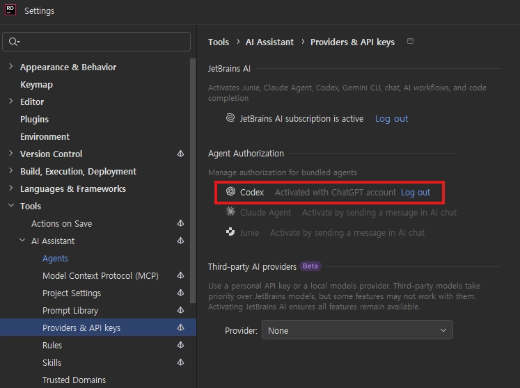

## :fireworks: 일단 적기
- 2026 개발 조합  :  **Unity + Rider + GPT + Codex (Rider Official Plugins)**
  - :airplane: [Codex Is Now Integrated Into JetBrains IDEs](https://blog.jetbrains.com/ai/2026/01/codex-in-jetbrains-ides/?utm_source=chatgpt.com)
  - 

  

## :fire: 구현을 이제는 AI에게 맡기고, 설계에 집중한다. 그리고 검토할 수 있는 능력을 만든다.   AI와 페어프로그래밍을 하며 사수라고 생각한다.