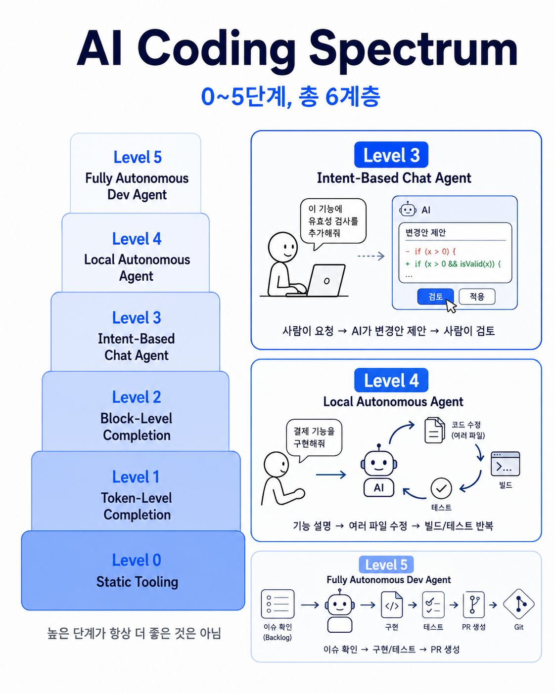

## :fire: 6단계의 AI Spectrum에서 3단계와 4단계를 병행해서 학습한다. 

- 3단계는 페어프로그래밍의 영역.
- :airplane: [The AI Coding Spectrum: 6 Levels of Assistance Developers Should Know](https://eclipsesource.com/blogs/2025/06/26/ai-coding-spectrum-levels-of-assistance/)

  

## :white_check_mark: 3단계_AI에게 질문하기
- **구현하기 전의 설계를 프롬프트로 만들고 설계 기준 강화하기**
   - 포트폴리오 작성처럼, 구현 전에 내가 무엇을 만들려는지 먼저 구조화한다.
   - 어제보다 더 좋은 질문을 할 수 있게 되었는지 확인한다.
   - 목표는 AI에게 맡기는 것이 아니라, 내가 문제를 더 정확히 정의하는 것이다.
   - AI도 결국 좋은 코드를 이해를 잘 한다.

 

- **AI가 만든 코드에서 내가 이해가 되지 않는 부분을 찾아서 공부하기**
   - 기술문서 프롬프트로 넣기
   - 목표는 답을 아는 것이 아니라, 다음에 비슷한 판단을 직접 할 수 있는 상태가 되는 것이다.

 

- **AI 시대의 개발자 방향에 대한 칼럼과 영상 보기**
   - 방향성을 넓히기 위한 보조 자료로 사용한다.
   - 단, 영상을 보는 것 자체가 공부가 되지는 않는다.
   - 영상에서 얻은 기준은 반드시 내 프로젝트, 내 코드, 내 기록으로 연결한다.

  

## :white_check_mark: 4단계_AI에게 요청하고 내가 검토하기
- **프로젝트 전체 분석 & 클래스 분석 & 메서드 분석**
   - 내가 잘한 점, 내가 못한 점을 AI에게 찾아내도록 하기
   - 앞으로의 로드맵 만들기

 

- **AI의 판단을 분석하고, 내가 직접 수정한 내용을 기록하기**
   - 왜 고쳤는지, 어떤 기준으로 판단했는지 함께 정리한다.
   - 이 기록은 GitHub에 남겨 “AI를 사용하는 개발자”가 아니라 “AI의 판단을 검증하는 개발자”를 목표한다.

 

- **시니어 개발자라면 어떻게 구현했을 지 요청하고, 분석하기**
 
  

## :fire: 4단계에 대한 고민 기록
- **개발 공부의 가치 상실**
  - 코딩 테스트를 풀어도 더 이상 의미를 찾지 못하겠다.
  - Unity 기능을 힘들게 만들어도 Codex 딸깍을 의식하게 된다.
  - 개발하기 싫은 날에도 코테 한 문제라도, 유니티 기능 하나라도 같은 생각을 더 이상하지 않게 된다.

 

- **나는 왜 개발자가 되고 싶었는가?**
  - 몇 시간 고민해서 만든 기능이 게임에서 돌아가는 걸 볼 때의 쾌감이 있다.

 

- **이제는 기존의 공부를 벗어나야 한다.**
  - 구현과 생산성은 더 이상 인간의 영역이 아닌 걸 인정하게 되었다. 
  - 그러나 AI를 잘 다루는 영역, AI를 검토할 수 있는 힘을 기르는 공부는 다시 흥미롭게 느껴졌다.
    - 여전히 내가 자신있는 부분은 AI의 답변이 아쉽게 느껴지기도 한다.

  

## 인프런_31년차 개발자가 전하는 "AI시대, 개발자로 살아가는 법"
- :airplane: [링크](https://www.inflearn.com/course/ai%EC%8B%9C%EB%8C%80-%EA%B0%9C%EB%B0%9C%EC%9E%90%EB%A1%9C-%EC%82%B4%EC%95%84%EA%B0%80%EB%8A%94%EB%B2%95?cid=338806)