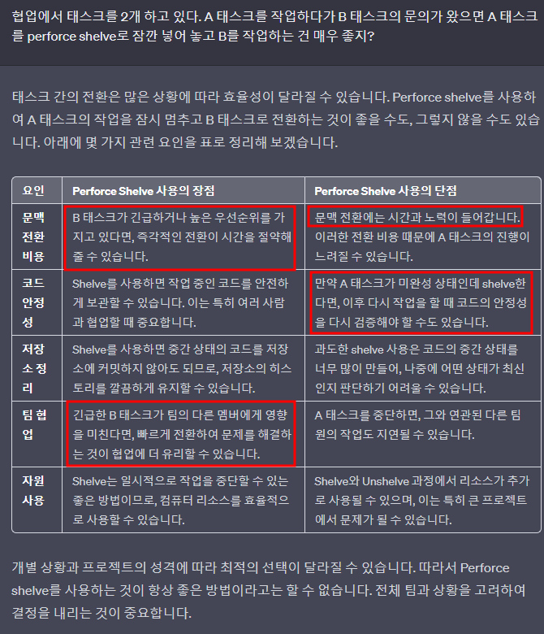

# 목차
- [목차](#목차)
- [개요](#개요)
- [P4](#p4)
- [Shelve를 사용해서 업무 효율을 높여 보자.](#shelve를-사용해서-업무-효율을-높여-보자)
- [이전 서밋과 비교하기](#이전-서밋과-비교하기)
- [서밋만 안하면 세상은 변하지 않으니 걱정하지 마라!](#서밋만-안하면-세상은-변하지-않으니-걱정하지-마라)
- [Checkout의 주의 사항](#checkout의-주의-사항)
- [Backout](#backout)

# 개요
- 성능이 좋은 Version Control System인 Perforce를 공부해보자.

# P4
- 
    - 왼쪽은 현재 파일의 로컬 버전 / 오른쪽은 현재 파일의 서버 버전
    - 숫자가 다른 것은 아직 최신화가 되지 않음을 의미
- 개발자가 prefab을 건드는 일(스크립트 붙이는)도 존재하므로 prefab도 변경 사항이 될 수 있다.
- 자주 자주 최신을 받아주자.
- 변경 사항의 파일중에 ?가 붙은 거는 충돌을 의미한다.
  - resolve -> Auto resolve multiple files -> Automatic Resolve
    - 기본적으로 Automatic resolve를 한다.
    - 여기서 성공하면 완료
    - 여기서 실패하면 accept source(server에 올라간 걸로 해당 파일을 적용하겠음) 또는 accept target (local에 저장된 내 걸로 해당 파일을 적용하겠음)
      - 별 일 없으면 accept source를 한다.
    - Interactively resolve
      - 개발자가 수동으로 비교하면서 머지를 하는 것
      - 코드는 이게 가능하나 프리팹은 알아 보기 어려우므로 불가능.
- pending
  - pending을 구분할 수 있다.

# Shelve를 사용해서 업무 효율을 높여 보자.
- 

# 이전 서밋과 비교하기
- 원하는 스크립트의 history를 보고 과거의 문서와 비교할 수 있다.
  - 
  - 1) 서밋 로그를 더블클릭해서 어떤 파일이 바뀌었는지 먼저 확인한다.
  - 2) 위의 그림처럼 누른다.
    - 지금 버전이 131이면 130과 비교해서 뭐가 바뀌었는지 볼 수 있다.
    - 단축키 : Ctrl + D
- Rider에서도 볼 수 있지만 p4에서 보는 게 간편할 때도 있다.

# 서밋만 안하면 세상은 변하지 않으니 걱정하지 마라!

# Checkout의 주의 사항
- 

# Backout
- 잘못 서밋한 Rev.149052의 내용을 되돌리고 싶어서 Backout Summitted Changelist 149052를 했다. 
- 하지만 이건 149052를 하기 전 상태로 돌리는 거기 때문에 149052의 내용을 작업하기 이전 시점으로 돌아간다.
  - 서밋 자체가 되는 것이 아니라 Pending List로 돌아온다.
- 이 상태에서 이전 상태로 돌리고 싶으면 Pending List를 그냥 올리면 되고 추가 작업이 필요하면 Pending List에서 작업하고 다시 서밋하면 된다.
