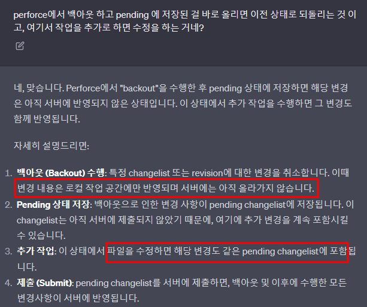
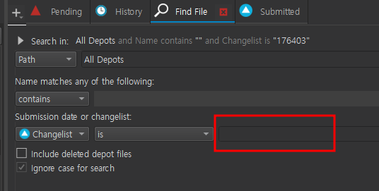
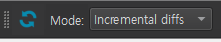
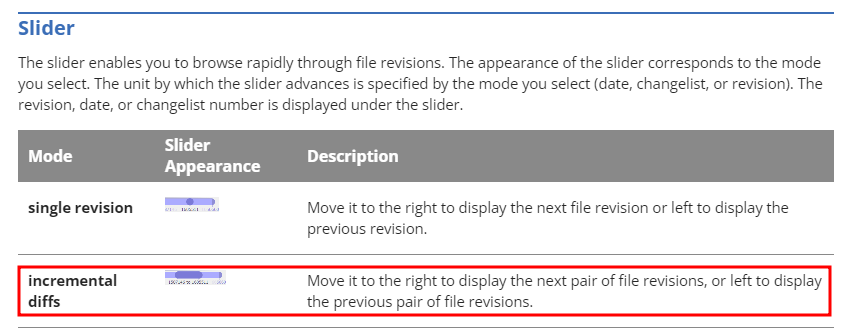

# 목차
- [목차](#목차)
- [개요](#개요)
- [과거에 적은 기초](#과거에-적은-기초)
- [Shelve : 업무 효율 높이는 최고의 기능](#shelve--업무-효율-높이는-최고의-기능)
- [Backout](#backout)
- [ChangeList 검색](#changelist-검색)
- [Time Lapse View](#time-lapse-view)

   

# 개요
- Perforce를 사용하면서 얻는 팁을 정리하자.

   

# 과거에 적은 기초
- Prefab도 버전 관리가 된다.
- ?는 merge conflict를 의미한다.
  - resolve -> Auto resolve multiple files -> Automatic Resolve
    - Automatic resolve를 한다.
      - 여기서 성공하면 끝.
      - 여기서 실패하면 손 머지...
- Ctrl + D로 변경 사항 보기.
- 서밋만 하지 않으면 세상은 변하지 않으니 걱정하지 마라!

   

# Shelve : 업무 효율 높이는 최고의 기능
- 

   

# Backout
> Perforce의 "backout"는 버전 관리에서 이전 상태로 롤백하려는 경우에 사용되는 작업입니다. 즉, 잘못된 또는 불필요한 변경을 취소하기 위해 이전 버전으로 되돌릴 수 있습니다
- 
  - 예시
    - 잘못 서밋한 Rev.149052의 내용을 되돌리고 싶어서 Backout Summitted Changelist 149052를 했다. 
    - 하지만 이건 149052를 하기 전 상태로 돌리는 거기 때문에 **149052의 내용을 작업하기 이전 시점으로 돌아간다.**
    - 서밋 자체가 되는 것이 아니라 Pending List로 돌아온다.
    - 이 상태에서 이전 상태로 돌리고 싶으면 Pending List를 그냥 올리면 되고 추가 작업이 필요하면 Pending List에서 작업하고 다시 서밋하면 된다.

   

# ChangeList 검색
- 

   

# Time Lapse View
- 
  - 모드를 선택 할 수 있다.
- 
  - Single Revision을 이용하면 'show aging of text'를 켜서 본다.
    - 초록색에 가까울수록 최근에 작성된 코드다.
  - Incremental diffs를 이용해 changelist 마다의 변화를 볼 수 있다.
