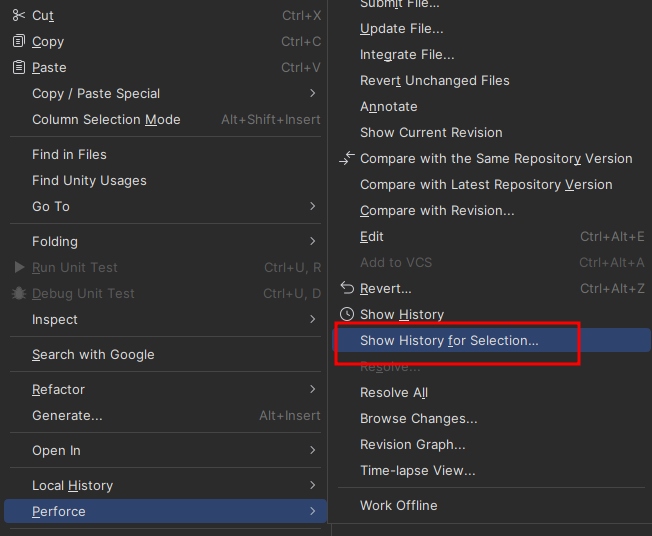

# 목차
- [목차](#목차)
- [공식 문서](#공식-문서)
- [F12 : 메서드 정의문으로 바로 이동](#f12--메서드-정의문으로-바로-이동)
- [Shift + F12 : 프로젝트에서 사용하고 있는 목록 나열](#shift--f12--프로젝트에서-사용하고-있는-목록-나열)
- [Shift + Shift : 프로젝트 폴더에서 스크립트나 XML 파일 찾기](#shift--shift--프로젝트-폴더에서-스크립트나-xml-파일-찾기)
- [Alt + Home : Base로 이동](#alt--home--base로-이동)
- [Alt + End : Derived로 이동](#alt--end--derived로-이동)
- [Ctrl + Shift + F : 프로젝트에서 해당 키워드 찾기](#ctrl--shift--f--프로젝트에서-해당-키워드-찾기)
- [Alt + Enter : Rider의 코드 리팩터링](#alt--enter--rider의-코드-리팩터링)
- [Ctrl + Alt + B : 디버깅 포인트 목록 보기](#ctrl--alt--b--디버깅-포인트-목록-보기)
- [Ctrl + Alt + Enter : Reformat Existing Code](#ctrl--alt--enter--reformat-existing-code)
- [Ctrl + G : 줄 번호 이동](#ctrl--g--줄-번호-이동)
- [Ctrl + R + R : 이름 변경](#ctrl--r--r--이름-변경)
- [라이더에서 영역 선택한 부분 Time-Lapse](#라이더에서-영역-선택한-부분-time-lapse)
- [:star:라이더에서 최신 리비전과 비교하는 것이 아니라 과거의 두 리비전끼리 비교하는 방법 : Perforce 이용하기](#star라이더에서-최신-리비전과-비교하는-것이-아니라-과거의-두-리비전끼리-비교하는-방법--perforce-이용하기)
  
    
  
# 공식 문서 
- :link:[Rider Official Docs](https://www.jetbrains.com/help/rider/Reference_Keyboard_Shortcuts_Index.html#top_shortcuts)
   

# F12 : 메서드 정의문으로 바로 이동
- Go to Declaration or Usages
- 정의를 개발자가 스스로 다른 스크립트나 현재 스크립트에 만들었다면 그 곳으로 순간이동 한다.
   

# Shift + F12 : 프로젝트에서 사용하고 있는 목록 나열
- Find Usages
- **필드나 메서드가 프로젝트에서 호출 되고 있는 위치를 보여준다.**
   

# Shift + Shift : 프로젝트 폴더에서 스크립트나 XML 파일 찾기
- Search Everywhere
   

# Alt + Home : Base로 이동
# Alt + End : Derived로 이동
   

# Ctrl + Shift + F : 프로젝트에서 해당 키워드 찾기
- Find and Replace Text in Solution
- 팀원이 작성한 코드를 찾는데 유용하다.
   

# Alt + Enter : Rider의 코드 리팩터링
- Show Intention Actions
   

# Ctrl + Alt + B : 디버깅 포인트 목록 보기
- 
- 전체 선택 하고 '-'를 누르면 디버깅 포인트 모두 날릴 수 있다.
   

# Ctrl + Alt + Enter : Reformat Existing Code
- 코드 정리
   

# Ctrl + G : 줄 번호 이동
- Go to Line/Column 
   

# Ctrl + R + R : 이름 변경
- Rename Refactoring
   

# 라이더에서 영역 선택한 부분 Time-Lapse
- 

   

# :star:라이더에서 최신 리비전과 비교하는 것이 아니라 과거의 두 리비전끼리 비교하는 방법 : Perforce 이용하기
- EX : 현재 리비전은 32인데 28이 27과 다른점을 보고 싶다.

 

- **1번 순서** : Rider Script에서 우클릭 -> Open In -> Explorer
- **2번 순서** : 경로를 Perforce의 WorkSpace에 복붙
- **3번 순서** : 파일 History 열기
- **4번 순서** : Ctrl 눌러서 비교하고 싶은 두 파일 선택하기
- **5번 순서** : 선택 -> Ctrl + D