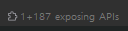
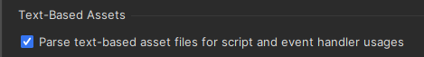

# 목차
- [목차](#목차)
- [공식문서](#공식문서)
- [Structure](#structure)
- [Exposing APIs](#exposing-apis)
- [inheritor Bold](#inheritor-bold)
- [과거에 정리한 Rider 기초](#과거에-정리한-rider-기초)
    - [1. Rider에서는 과거의 코드와 로컬을 비교할 수 있다.](#1-rider에서는-과거의-코드와-로컬을-비교할-수-있다)
    - [2. 실수로 이전의 코드를 지웠지만 라이더는 모두 기억하고 있다.](#2-실수로-이전의-코드를-지웠지만-라이더는-모두-기억하고-있다)
- [라이더 디버그 오류](#라이더-디버그-오류)
    - [Asset Usage](#asset-usage)

   

# 공식문서
- :link:[Rider Official](https://www.jetbrains.com/help/rider/Introduction.html)
  
   

# Structure
- 지금 보고 있는 스크립트의 필드, 메서드를 구조적으로 보여준다.
- 
  - 파란색 아이콘은 필드.
  - 보라색 아이콘은 메서드.
  - 자물쇠가 있고 없는 것은 public / protected / private를 나타낸다.
- 스크립트 전체의 구성을 한 눈에 볼 수 있다.
   

# Exposing APIs
- 
- 해당 클래스를 상속 받는 클래스를 계층으로 볼 수 있다.
   

# inheritor Bold
- 진하게 표시되면 직속 자식을 의미한다.
   

# 과거에 정리한 Rider 기초
### 1. Rider에서는 과거의 코드와 로컬을 비교할 수 있다.
- Perforce가 연동되어 있다면 원하는 스크립트 파일과 퍼포스의 최신 서밋 시점과 비교할 수 있다.
- 로컬과 과거의 로컬들(생각보다 잦은 텀으로 저장한다.)도 비교할 수 있다.
- :star:결론적으로 과거의 코드들이 모두 백업되어 있기 때문에 작성할 때 두려움을 느끼지 않아도 된다.
  - 다 되돌릴 수 있다.

 

### 2. 실수로 이전의 코드를 지웠지만 라이더는 모두 기억하고 있다. 
- 우클릭 -> perforce -> compare with latest repository version -> 변경 사항에 대해 관리한다.
  - 변경 사항의 라인 마다 accept를 통해 퍼포스의 최신 서밋 버전으로 덮을 수 있다.
- 우클릭 -> Local History -> Show History 
  - 어떤 주기로 기록되는지 정확히는 모르지만 내가 작업한 내용들의 변천사를 저장하고 있다.
- 결론적으로 코딩을 잘못해도 과거의 정보가 있기 때문에 두려워하지 말 것!

# 라이더 디버그 오류
- 라이더에서 디버그 포인트가 잡히지 않으면 라이더를 껐다 키지 말고 유니티를 껐다 키면 해결 된다.
- 그래도 안 되면 컴퓨터 껐다가 킨다.

### Asset Usage
- 
- 이거 세팅하면 asset Usage를 이용해서 유니티의 어떤 prefab에서 이거 쓰는 지 알 수 있음.