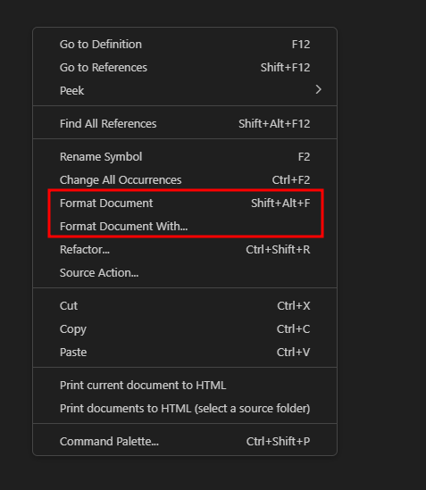

# 목차
- [목차](#목차)
- [XML 세로로 보기 : Format Document](#xml-세로로-보기--format-document)

   

# XML 세로로 보기 : Format Document
- 
- 우클릭 format document with... 누르면 format extension을 선택해서 가독성 있게 해당 파일을 볼 수 있다.
- Default를 설정하면 format document를 누르면 알아서 된다.