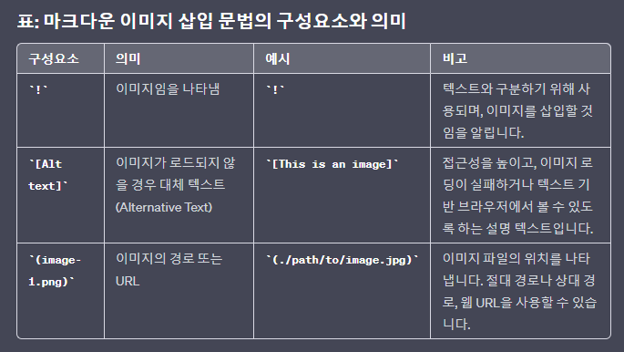

# 개행
   

# 인용
> 
- 구글링한 전문적인 글은 이걸 이용하자.

   

# 글자 색상
- $\bf{\large{\color{#ff0000}두꺼운\ 글씨체,\ 큰글씨,\ 빨간색}}$
- $\huge{\rm{\color{#6580DD}큰글씨\ 로만체\ 파란색}}$
- 
$\it{\large{\color{#5ad7b7}이텔릭체,\ 큰글씨,\ 초록색}}$

  - '\' 는 SpaceBar를 의미한다.
  - 
를 쓰면 개행이 된다.

   

# 이미지 캡처
- (1) 캡처후 markdown에 붙여 넣는다.
- (2) 현재 디렉터리에 png 파일이 생성되는데 상위 폴더(이름은 중요하지 않지만 Capture로 네이밍 할 것)로 이동 시킨다.
- (3) 형식 : 느낌표 [이름][경로]
  - 이렇게 나타난다.
  - ./Capture/image.png로 경로를 바꿔주면 된다.
  -   -> image라는 이름은 항상 독특하게 변경해주자.
- **주의 사항**
  - 기본적으로 이미지의 이름은 image다. 그런데 이전에 Capture 폴더에 image가 있으면 덮어 씌워 진다.
  - 그러므로 image라는 default 이름이 아닌 특이한 이름으로 저장한다.
  - 캡처에서 바로 복붙을 하면 이름이 image로 생성되지만 폴더에 직접 접근해서 복붙을 하면 이름이 특이하게 되니까 폴더에서 복붙을 하자.