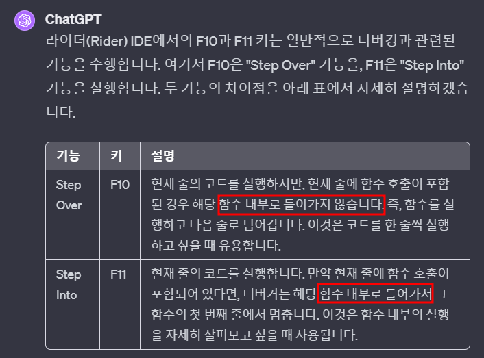
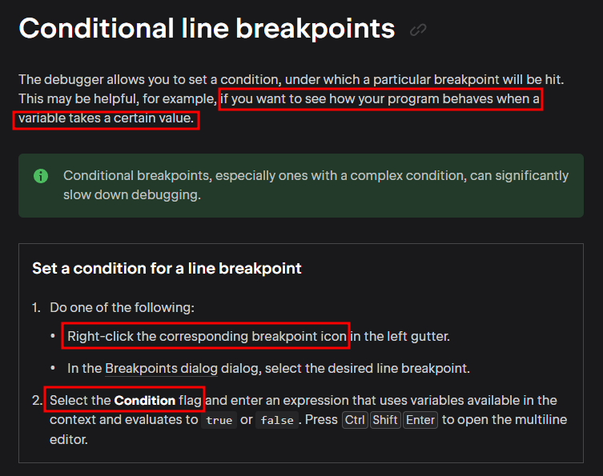
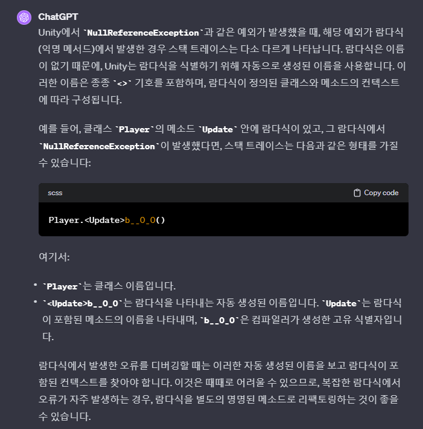

# 목차
- [목차](#목차)
- [F10 (Step Over) vs F11 (Step Into) : 코드 한 줄씩 디버깅하기](#f10-step-over-vs-f11-step-into--코드-한-줄씩-디버깅하기)
- [Conditional Line BreakPoints : Update 메서드나 For문 디버깅 하기](#conditional-line-breakpoints--update-메서드나-for문-디버깅-하기)
- [Stack Trace](#stack-trace)
    - [1. Lambda Method의 StackTrace](#1-lambda-method의-stacktrace)
    - [2. 일반적인 StackTrace](#2-일반적인-stacktrace)
- [실용주의 프로그래머](#실용주의-프로그래머)
- [:star::star::star:디버깅 과정에서 함수의 결과값 보는 법](#starstarstar디버깅-과정에서-함수의-결과값-보는-법)
- [Call Stack](#call-stack)

   

# F10 (Step Over) vs F11 (Step Into) : 코드 한 줄씩 디버깅하기
- 
- 
- 어떤 기능의 동작 흐름 자체가 이해가 가지 않는 경우가 있다. 그럴 때는 F5가 아닌 F10과 F11을 사용해서 디버깅 하는 것이 옳다고 생각한다.
  - 어떤 기능에 대해 타인이 작성한 코드를 처음 볼 때.
  - 중단점을 어디를 찍어야 할 지 모를 때.
   

# Conditional Line BreakPoints : Update 메서드나 For문 디버깅 하기
- 
> 조건부 중단점, 특히 복잡한 조건이 있는 중단점은 디버깅 속도를 크게 저하시킬 수 있습니다.
   

# Stack Trace
- 프로그램 실행 중 특정한 시점에서의 스택 프레임에 대한 리포트이다.
- $${\color{red}Welcome \space \color{lightblue}To \space \color{orange}Stackoverflow}$$
- test 
$\huge{\rm{\color{#5ad7b7}큰글씨 로만체 초록색}}$

$\bf{\large{\color{#6580DD}두꺼운\ 글씨체,\ 큰글씨,\ 파란색}}$

$\it{\large{\color{#DD6565}이텔릭체,\ 큰글씨,\ 빨간색}}$

### 1. Lambda Method의 StackTrace
~~~scss
MyNamespace.Player.<Update>b__8_0 (System.Single currentSize) (at 경로 : 70)
~~~
- MyNamespace
  - 네임스페이스 이름이다.
- Player
  - 클래스 이름이다.
- '<Update>b__8_0'
  - 람다식을 포함하고 있는 메서드와 람다식을 나타내는 이름이다. 
  - Update는 람다식이 포함된 메소드의 이름을 나타내며, b__8_0은 컴파일러가 생성한 고유 식별자다.
  - **Update 메서드에서 Null ReferenceException이 발생한 것 이 아니라 Update 메서드 내부의 람다식에서 발생한 것 이다. 디버깅 타겟을 제대로 이해해야 한다.**
- (System.Single currentSize)
~~~scss
FieldObjectMonoBattleTroop.<CreateAppearance>b__8_0 (System.Single currentSize) (at C:/Zeus/Game/Client/ZEUS/Assets/Scripts/Field/Troops/FieldObjectMonoBattleTroop.cs:70)
UniRx.Observer+Subscribe`1[T].OnNext (T value) (at
~~~
- 

### 2. 일반적인 StackTrace
~~~scss
MyNamespace.Player.<Update>b__8_0 (System.Single currentSize) (at 경로 : 70)
~~~
- NullReference가 발생한 메서드의 위치를 알려주고, Line 까지 알려준다.

# 실용주의 프로그래머
- 아무도 완벽한 소프트웨어를 작성하지 못하기 때문에, 하루의 대부분을 디버깅하는 데 보낼 것
- 버그가 여러분의 잘못인지 다른 사람의 잘못인지는 그리 중요한 게 아니다.
- 버그를 목격하거나 혹은 버그 보고서를 보는 순간 첫 반응이 "그건 불가능 해"라면 여러분은 두말할 필요 없이 틀렸다.왜냐하면 분명히 그런일은 일어날 수 있으며, 실제로도 일어났기 때문이다.
  - 기획 데이터가 변경되거나
  - 서버에서 오는 패킷의 구조가 변경되거나
  - 개발자여도 게임의 모든 시스템 구조를 알지 못하므로 내가 놓친 버그가 나올 수 있다.
- 버그를 고치기 가장 쉬운 방법은 프로그램이 다루는 데이터를 디버거를 통해 잘 살펴보는 것.
- 동일한 버그가 있을 여자기 있는 다른 코드가 있는가? 그것들을 찾아서 고쳐야 할 때는 바로 지금이다. 이 버그를 고치는 데 긴 시간이 걸린다면 왜 그런지 자문하라. 다음번에는 이 버그를 좀 더 쉽게 고칠 수 있도록 할 수 있는 뭔가가 있을까?
   

# :star::star::star:디버깅 과정에서 함수의 결과값 보는 법
- 
  - 라이더의 Threads & Variables의 우측 하단에 존재한다.
  - 여기서 메서드와 인자를 넣고 디버깅을 진행하면 해당 메서드의 결과값을 볼 수 있다.
    - 자동완성도 된다.

# Call Stack
- 메서드를 호출하는 부분을 아무리 봐도 찾을 수 없는데 호출 된 경험이 있다. 오랜 시간을 투자해서 이 호출 부분을 찾으려고 노력했으나 실패했다. 알고 보니 디버거의 콜스택을 보면 바로 파악할 수 있었다.
- 호출 순서를 LIFO로 나열해준다.
  - 중단점에 찍힌 부분이 어떻게 호출되었는 지 스택으로 쌓여서 나열된다.
- 보라색은 엔진의 메서드이고, 흰색이 작성한 메서드다.
  - 한 번 쯤은 엔진의 코드를 보면서 왜 이렇게 짰는지 파악하는 경험도 중요하다고 배웠다.
  - 디버깅 하다가 협업 코드를 보면 쉽게 쉽게 이해하지만 유니티 자체 코드로 넘어가면 은근 벙찐다.
    - 유니티 자체 코드는 구글에 자세한 설명이 있으므로 오히려 파악하기 쉬움에도 불구하고.
   