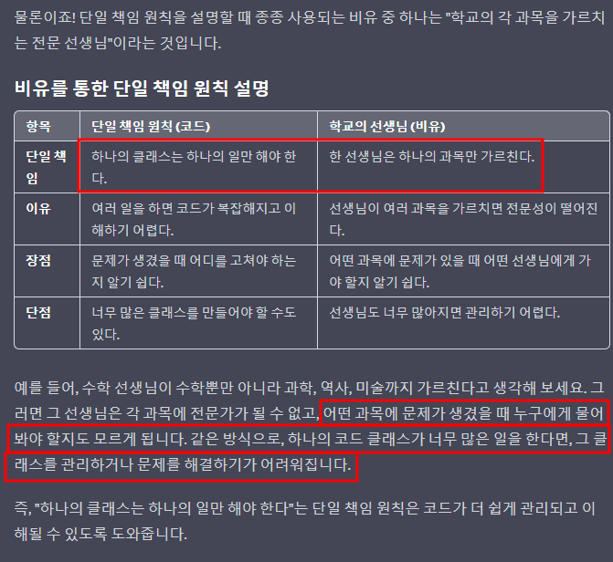
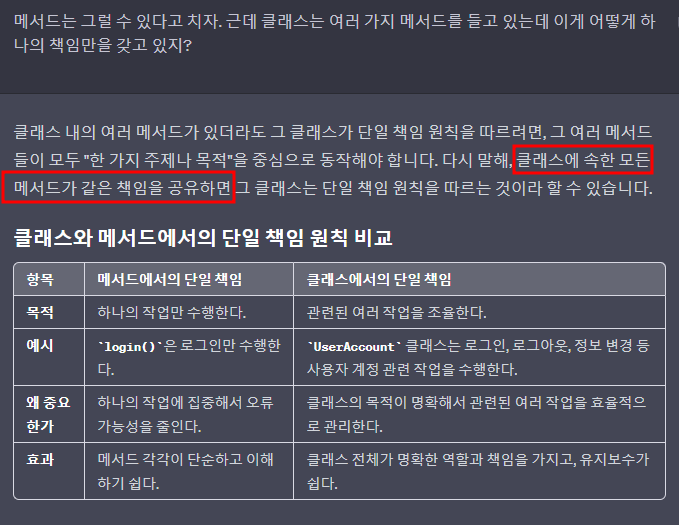
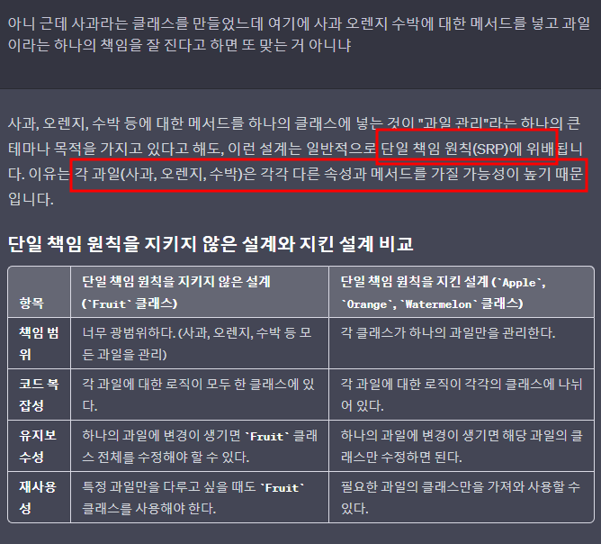
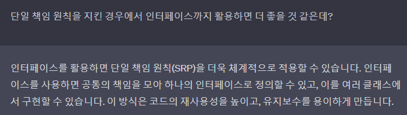

# 단일 책임 원칙
- 
- 
- 

- 좋지 못한 구조
~~~c#
public class Fruit
{
    public void AppleColor()
    {
        // 코드 구현
    }

    public void OrangeTaste()
    {
        // 코드 구현
    }

    public void WatermelonSeason()
    {
        // 코드 구현
    }
}
~~~

- 올바른 구조
- 
~~~c#
public interface IFruit
{
	void DisplayColor();
	void DisplayTaste();
}

public class Apple : IFruit
{
	public void DisplayColor()
	{
		// Apple color logic
	}

	public void DisplayTaste()
	{
		// Apple taste logic
	}
}

public class Orange : IFruit
{
	public void DisplayColor()
	{
		// Orange color logic
	}

	public void DisplayTaste()
	{
		// Orange taste logic
	}
}

public class Watermelon : IFruit
{
	public void DisplayColor()
	{
		// Watermelon color logic
	}

	public void DisplayTaste()
	{
		// Watermelon taste logic
	}
}
~~~
