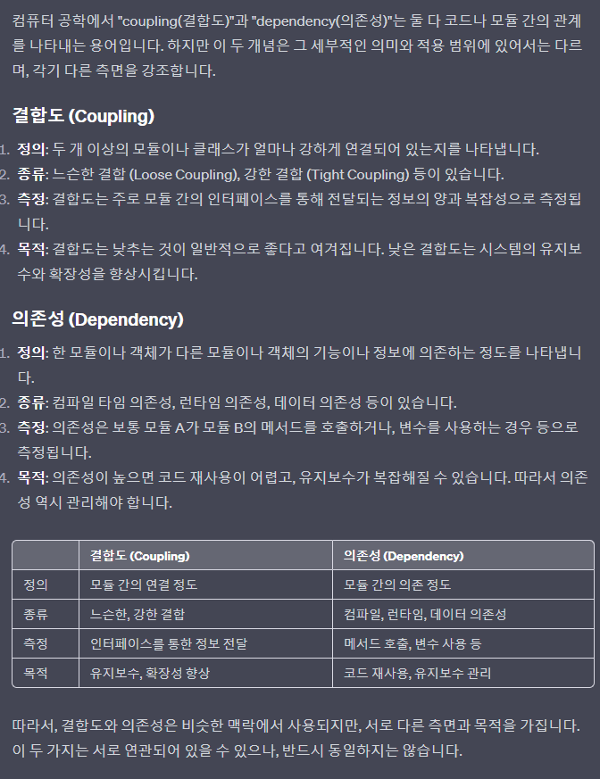
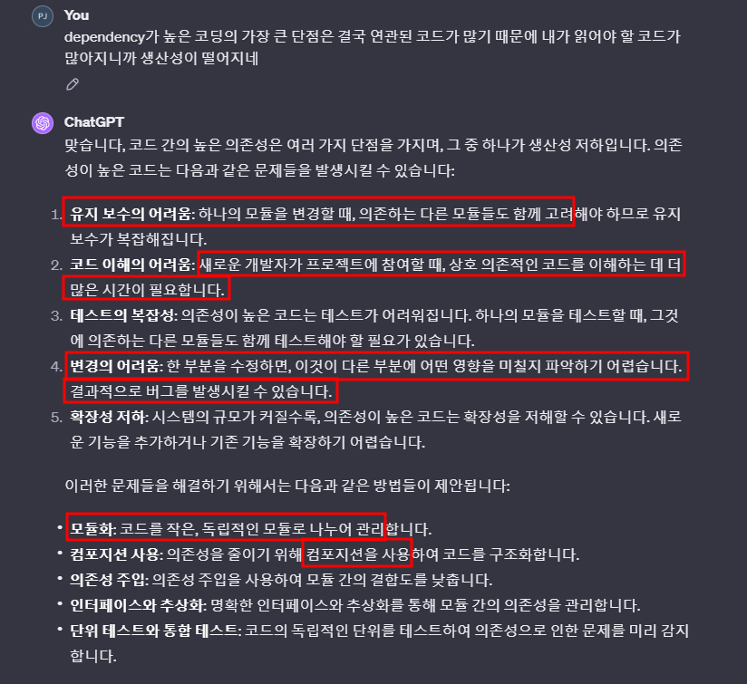

# 목차
- [목차](#목차)
- [의존성(Dependency)랑 결합도(Coupling)은 같은 건가?](#의존성dependency랑-결합도coupling은-같은-건가)
- [Coupling](#coupling)
- [Coupling의 종류](#coupling의-종류)
- [결합도가 높은 프로그램의 단점](#결합도가-높은-프로그램의-단점)

# 의존성(Dependency)랑 결합도(Coupling)은 같은 건가?
- 
    - :star:(Coupling = 결합도) = (Dependency = 의존성) != (Cohesion = 응집도)
- 

   

# Coupling 
- **유니티에서 모듈을 스크립트**라고 생각하면 스크립트간에 연관된 정도가 많으면 결합도가 높다고 한다.
- 응집도와는 반대 되는 개념이다. 
- 결합도가 높으면 다른 모듈을 찾아가며 유지 보수해야 하기 때문에 유지 보수 측면에서 좋지 않다.

   

# Coupling의 종류

   - 종류는 중요하지 않아 보인다.
   - 결국 하나의 모듈을 여러 모듈이 동시에 공유하기 때문에 값의 변경에 민감하다.
   - 멀티스레드의 공유 자원과 비슷하다고 생각한다.

   

# 결합도가 높은 프로그램의 단점
- 