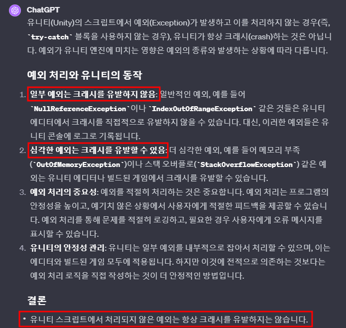
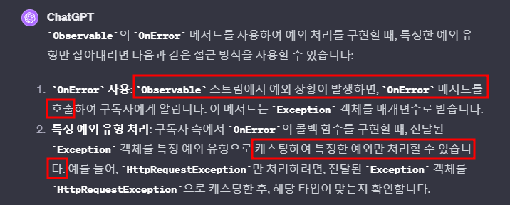
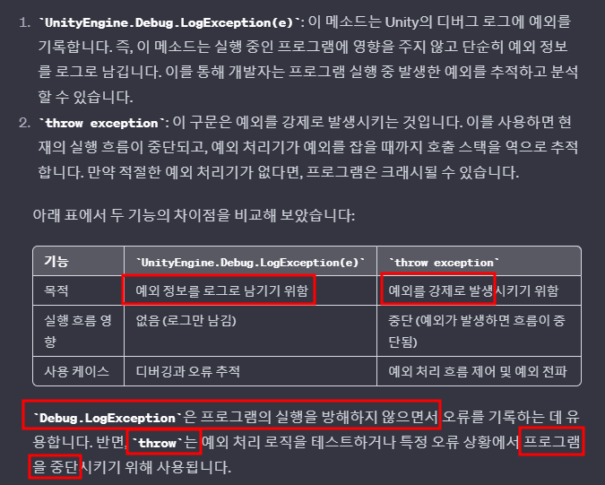
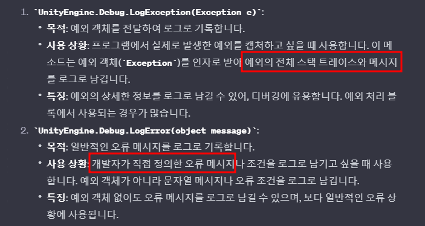
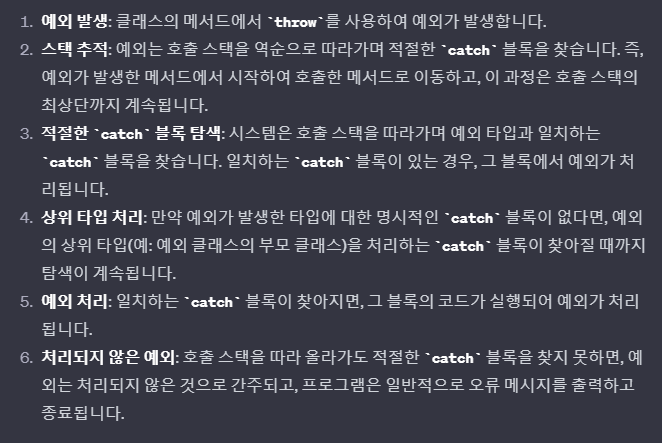

# 목차
- [목차](#목차)
- [Exception(예외)의 정의](#exception예외의-정의)
- [유니티에서 예외 처리를 해야 하는 이유](#유니티에서-예외-처리를-해야-하는-이유)
- [예외처리 기법](#예외처리-기법)
    - [1. Try-Catch를 이용한 예외처리](#1-try-catch를-이용한-예외처리)
    - [2. Try-Catch를 이용하지 않고 Throw만 하는 경우](#2-try-catch를-이용하지-않고-throw만-하는-경우)
    - [3. Observable의 OnError를 이용하는 예외처리](#3-observable의-onerror를-이용하는-예외처리)
- [자동발생 NullReferenceException VS 명시적 NullReferenceException(=Throw NullReference)](#자동발생-nullreferenceexception-vs-명시적-nullreferenceexceptionthrow-nullreference)
- [Throw Exception / UnityEngine.Debug.LogException / UnityEngine.Debug.LogError](#throw-exception--unityenginedebuglogexception--unityenginedebuglogerror)
- [예외처리 메커니즘](#예외처리-메커니즘)
- [예외처리 관련 실제 대응](#예외처리-관련-실제-대응)
- [:star:예외처리 관련 조언](#star예외처리-관련-조언)

   

# Exception(예외)의 정의
- 
- 에러와 동일하게 생각해도 무방하다.
   

# 유니티에서 예외 처리를 해야 하는 이유
- 
- **Unity Crash가 발생하여 게임이 멈출 수 있다.**
   

# 예외처리 기법
### 1. Try-Catch를 이용한 예외처리
~~~c#
using System;

class Program
{
    static void Main()
    {
        try
        {
            bool someCondition = true;

            if (someCondition)
            {
                throw new InvalidOperationException("Some error message"); //조건에 따라서 예외를 강제로 발생시킨다.
            }
        }
        catch (InvalidOperationException ex)
        {
            // 예외 처리
            Console.WriteLine($"Caught an exception: {ex.Message}");
        }
    }
}
~~~
> 'throw' 키워드는 프로그래머가 특정 조건에서 예외를 강제로 발생시킬 때 사용한다.
> 'Catch' 블록 내에서 'throw'를 사용하여 잡힌 예외를 다시 발생시키기도 합니다.
 

### 2. Try-Catch를 이용하지 않고 Throw만 하는 경우
- **해당 기법은 예외를 발생만 시키는 것**
- 목차에서 '자동발생 NullReferenceException VS 명시적 NullReferenceException(=Throw NullReference)'을 찾아서 읽어본다. 

 

### 3. Observable의 OnError를 이용하는 예외처리
- 
~~~c#
observable.Subscribe(
    onNext: item => { /* 데이터 처리 로직 */ },
    onError: ex =>
    {
        if (ex is HttpRequestException httpEx) // 캐스팅을 통해 전체 Exception을 Handle 하지 않는다.
        {
            // HttpRequestException 처리 로직
        }
        else
        {
            // 다른 예외 처리 로직
        }
    }
);
~~~
- onError의 콜백 메서드는 위와 같이 구현하고, Observable에서는 예외가 발생하는 조건에 해당 콜백 메서드를 호출해준다.
   

# 자동발생 NullReferenceException VS 명시적 NullReferenceException(=Throw NullReference)
- 
   

# Throw Exception / UnityEngine.Debug.LogException / UnityEngine.Debug.LogError
- 
- 

# 예외처리 메커니즘
- 호출 스택을 따라 상위로 이동하면서 적절한 catch 블록을 찾는다.
- 
   

# 예외처리 관련 실제 대응
- 예외 때문에 QA 테스트가 불가능 한 경우 : 일단은 Handle을 구현하지 않고 예외를 처리해야 한다. 
  - handle을 구현하지 않더라도... 일단 Error Handle 블록이라도 구현한다.
- 예외가 발생해도 QA 테스트가 가능한 경우 : Handle을 제대로 구현하여 예외를 처리한다.
  - 이제는 제대로 에러를 처리해서 해당 문제를 고쳐야 한다.
- 예외가 발생했을 때 Handle을 구현하지 않고 Handle Block으로 임시 처리하는 것의 문제점
  - 당사자 이외에 아무도 에러가 발생하지 않기 때문에 (실제로는 예외를 처리하지 않았음에도 불구하고) 문제라고 생각하지 않는다.
  - 당사자가 잊는다면 해당 Exception Handle은 평생 되지 않을 수도 있다.

   

# :star:예외처리 관련 조언
- 예외는 일찍 발견 할수록 좋다. 그래서 명시적 NullReferenceException 기법을 필요할 때는 적극적으로 사용한다. 
- 예외처리 시에 개발자가 String으로 Comment를 남길 수 있는데 이를 자세하게 쓰는 것이 예외를 대처할 때 매우 도움이 된다.
   