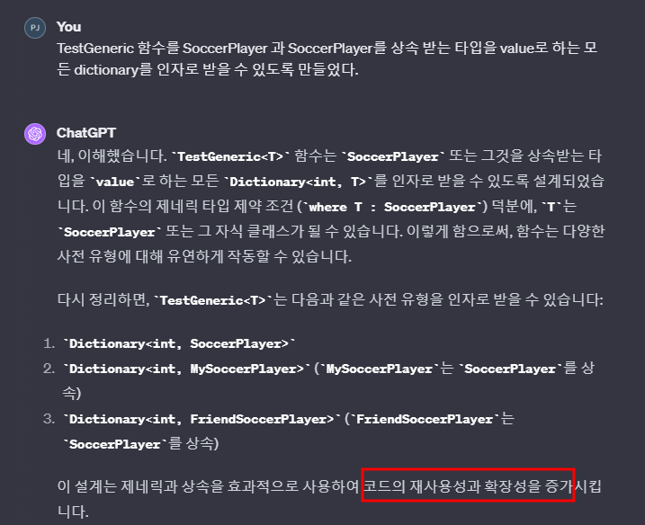
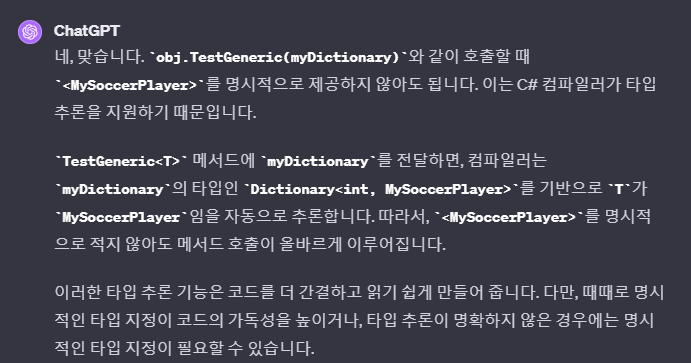

# 목차
- [목차](#목차)
- [할 일](#할-일)
- [Generic 제약 조건](#generic-제약-조건)

   

# 할 일
- Effective C#으로 좀 더 공부

   

# Generic 제약 조건 
~~~c#
public class SoccerPlayer
{
}

public class MySoccerPlayer : SoccerPlayer
{
}

public class FriendSoccerPlayer : SoccerPlayer
{
}

public class TestClass
{
	public void TestGeneric<T>(Dictionary<int, T> warriorDictionary) where T : SoccerPlayer
	{

	}
}

void Main()
{
	#region Inheritance Dictionary
	Dictionary<int, SoccerPlayer> baseDictionary = new Dictionary<int, SoccerPlayer>();
	Dictionary<int, MySoccerPlayer> myDictionary = new Dictionary<int, MySoccerPlayer>();
	Dictionary<int, FriendSoccerPlayer> friendDictionary = new Dictionary<int, FriendSoccerPlayer>();
	#endregion

	#region Testing
	TestClass obj = new TestClass();
	
	// <int, MySoccerPlayer> 타입도 인자로 받고, <int, FriendSoccerPlayer> 타입도 인자로 받고!
	obj.TestGeneric(myDictionary);
	obj.TestGeneric<MySoccerPlayer>(myDictionary);
	
	obj.TestGeneric(friendDictionary);
	obj.TestGeneric<FriendSoccerPlayer>(friendDictionary); 
	#endregion
}
~~~
- 기능 : Generic 타입이 **해당 클래스 또는 자식이면 컴파일 에러를 남기지 않고 정상 동작**하지만 그렇지 않으면 컴파일 에러를 낸다.
- 
  - **Dictionary의 Value Type이 SoccerPlayer를 상속 받는 Dictionary라면 TestGeneric의 인자로 들어올 수 있기 때문에, 자료구조의 타입 마다 메서드(예시에서의 TestGeneric)를 구현 할 필요가 없다.**
- 
  - 호출하는 구문에서 더 이상 <>로 타입을 명시해 주지 않아도 된다.
