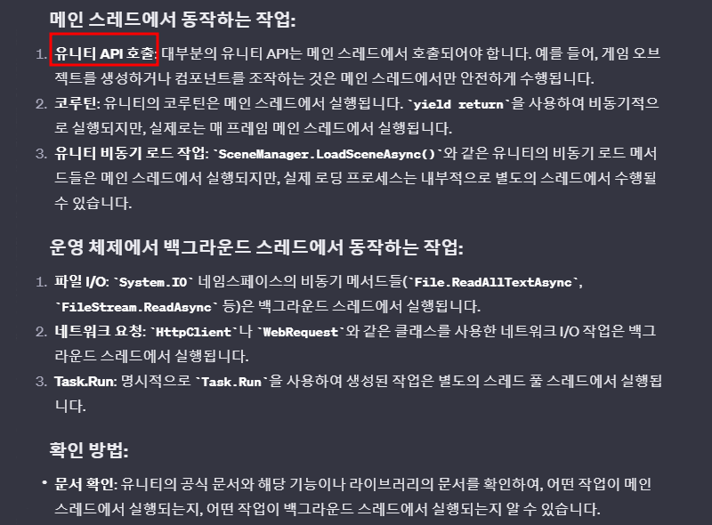
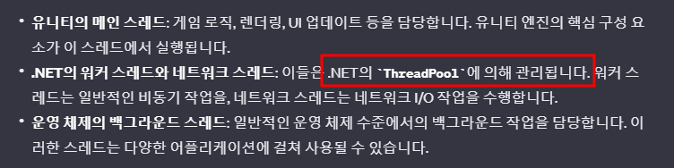

# 개요
- 스레드 개념과 Unitask를 같이 이해

   

# 유니티는 싱글스레드로 동작하기 때문에 비동기로 얻는 이득이 없는 것 아닌가? : 아니다!
- 
- 
  - async/await을 이용하면 OS에게 Main Thread에서 할 만큼 중요하지 않은 일은 Background Thread에서 처리하게 한다.

   

# Unity Main Thread vs OS Background Thread
> 유니티 개발자의 관점에서 스레드를 '유니티 메인 스레드'와 'OS 백그라운드 스레드'로 분류하는 것은 유용한 관점이 될 수 있습니다. 이 두 종류의 스레드는 유니티 개발에서 다루는 가장 일반적인 스레드 유형이며, 각각의 특성을 이해하는 것이 중요합니다
-  

   

# 좀 더 많은 Thread 개념
- 
- 직접적인 포함 관계는 없다.
- 

   
 

