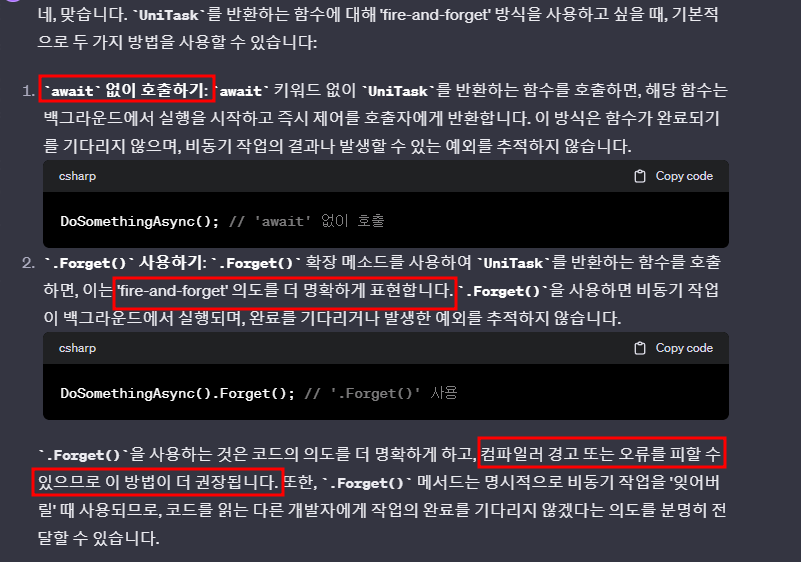
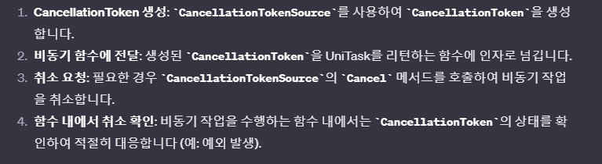
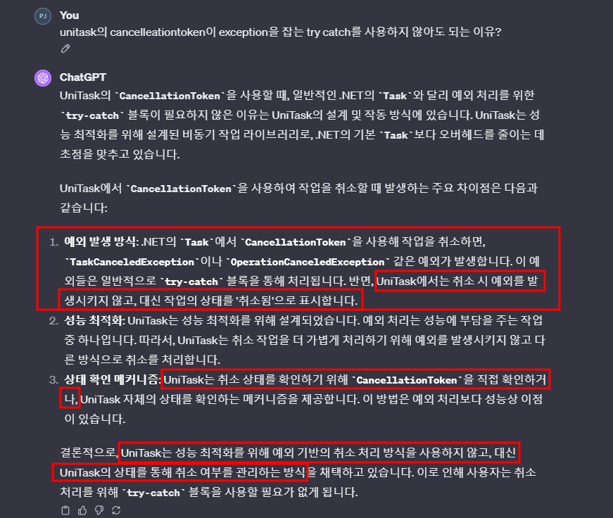

# fire-and-forget 방식
- 
- 
- 원래는 await을 붙여서 해당 함수의 결과를 기다렸다. 특히 Unitask<bool> 같이 리턴 값이 있으면
~~~c#
var result1 = await (Unitask<bool>를 리턴하는 함수)
var result2 = (Unitask<bool>를 리턴하는 함수)
~~~
  - result1은 await 걸린 함수의 실행이 모두 완료 됨을 기다리고 결과를 초기화 한다.
  - 하지만 result2는 await이 걸려 있지 않기 때문에 기다리지 않고 초기화를 한다.
  - > 반환된 UniTask<bool>가 완료될 때까지 기다리지 않으면, 함수의 결과가 필요한 코드 부분에서 오류가 발생할 수 있습니다.

   

# CancellerationToken : UniTask에서 개발자가 UniTask의 비동기 작업을 명시적으로 취소할 수 있는 기능
### 1. 기본적인 사용 방법
- 
### 2. Unitask에서는 Task와 다르게 Try-Catch로 예외를 잡지 않아도 되는 이유
- Task를 사용하면 예외가 발생하며 유니티가 종료된다.
- 
### 3. 코루틴과는 다르게 명시적으로 취소를 해야 한다.
- 코루틴을 언젠가 취소시켜야 하는 작업, 혹은 특정 상황에 취소해야하는 작업으로 생각하고 함수를 작성했다면 코루틴을 StopCoroutine을 통해 멈추거나 오브젝트를 삭제하는 방법으로 코루틴을 중단시킨다.
- 그렇기 때문에 C#의 비동기 프로그래밍에서도 Cancellation 처리는 중요하다.
  - 코루틴은 오브젝트가 삭제되거나 disable 되면 알아서 코루틴이 중단되지만, UniTask에서는 직접 Cancellation 관리를 해줘야한다.
  - CancellerationToken으로 관리하지 않은 비동기로 반복하는 태스크를 만들었다고 가정하자. 해당 게임 오브젝트를 제거해도 태스크는 계속 반복하는 경험을 한 적이 있다.
- 참고 : https://usingsystem.tistory.com/55
   

# 일반 virtual 함수를 Override했을 때 파생 함수는 async를 붙여서 비동기로 만들어도 된다. 
- 

