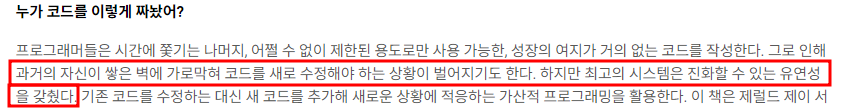
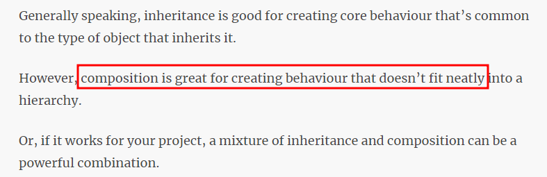
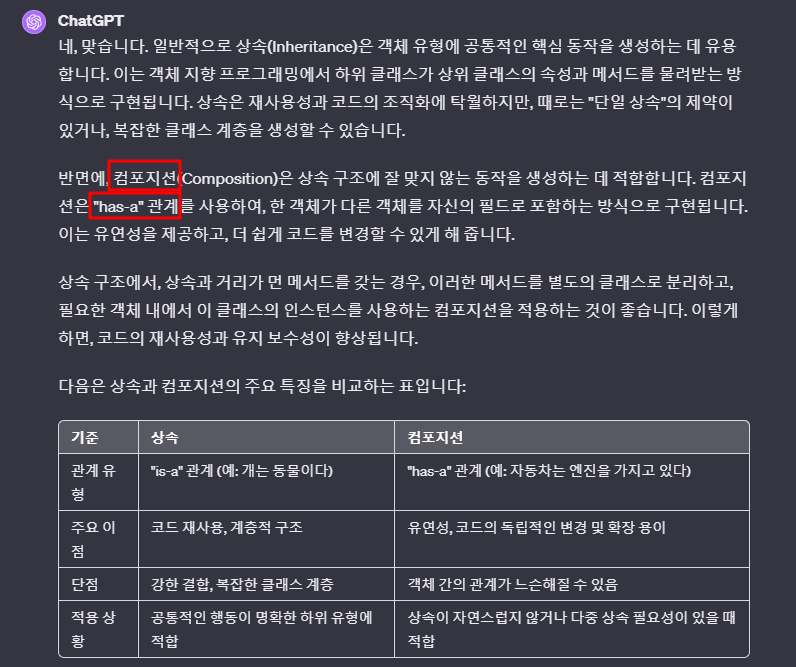

# 목차
- [목차](#목차)
- [개요](#개요)
- [Is-A 관계 vs Has-A 관계](#is-a-관계-vs-has-a-관계)
- [합성이 어제 설명 들은 모듈화와 연관 깊은 개념?](#합성이-어제-설명-들은-모듈화와-연관-깊은-개념)
- [GOF의 전략패턴과 유사.](#gof의-전략패턴과-유사)
- [공부](#공부)

   

# 개요

   

# Is-A 관계 vs Has-A 관계
- 두 클래스의 관계를 생각해서 Is-A 관계일 때만 상속 구조로 구현을 하자.
- 여기부터 제대로 구글링 해서 공부

   

# 합성이 어제 설명 들은 모듈화와 연관 깊은 개념?
- 굳이 상속 관계에서 있을 필요가 없는 기능은 클래스 외부로 빼서 모듈로 만들어라.
  - Widget화? module화?

# GOF의 전략패턴과 유사.
- https://victorydntmd.tistory.com/292
  - 참고할 좋은 글

# 공부
- 
- 