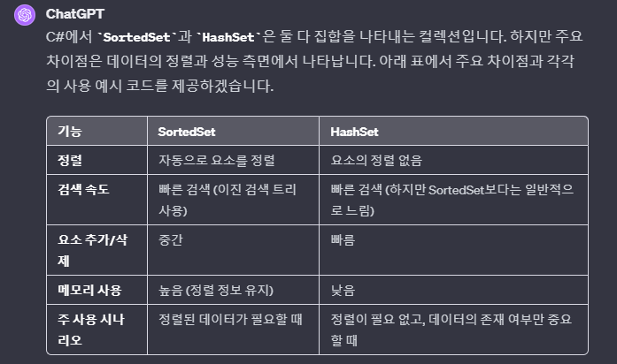
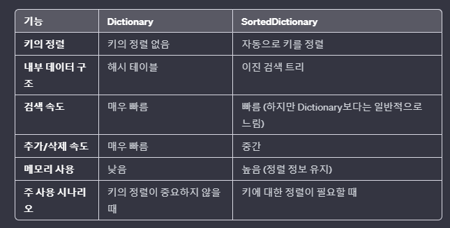
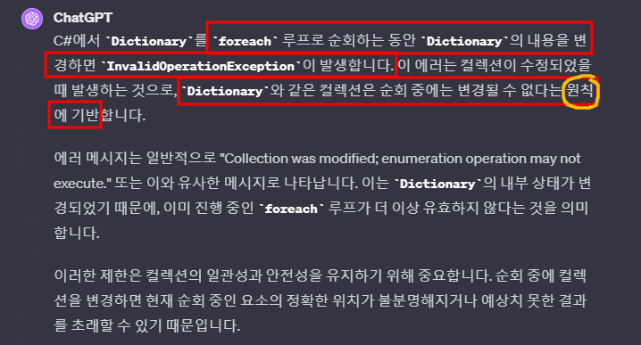
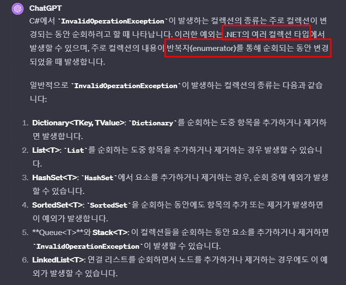
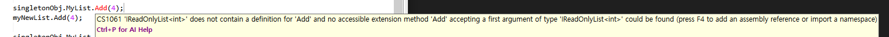
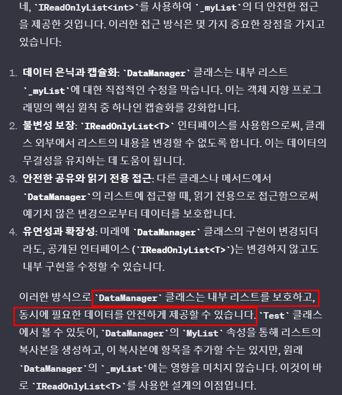
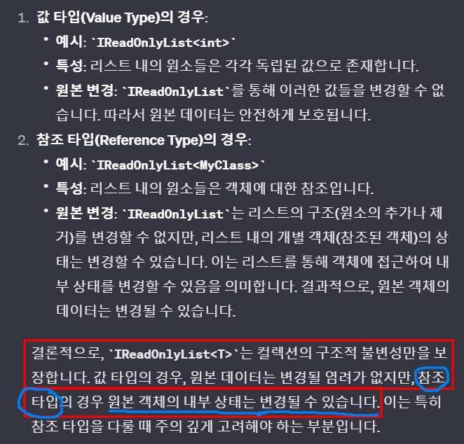

# 목차
- [목차](#목차)
- [Set](#set)
    - [1. SortedSet](#1-sortedset)
    - [2. HashSet](#2-hashset)
    - [3. SortedSet vs HashSet 정리](#3-sortedset-vs-hashset-정리)
- [Dictionary 계열](#dictionary-계열)
    - [1. Dictionary](#1-dictionary)
    - [2. SortedDictionary](#2-sorteddictionary)
    - [3. Dictionary vs SortedDictionary 정리](#3-dictionary-vs-sorteddictionary-정리)
    - [4. HashTable](#4-hashtable)
- [Collection에서 자주 발생하는 Invalid Operation Exception](#collection에서-자주-발생하는-invalid-operation-exception)
    - [1. Invalid Operation Exception은 무엇인가?](#1-invalid-operation-exception은-무엇인가)
    - [2. 해결 방법](#2-해결-방법)
    - [3. 발생하는 Collection의 종류](#3-발생하는-collection의-종류)
- [IReadonlyList](#ireadonlylist)
    - [1. IReadonlyList를 사용하지 않는 경우 : 위험하다.](#1-ireadonlylist를-사용하지-않는-경우--위험하다)
    - [2. IReadonlyList를 사용하는 경우 : 안전하다.](#2-ireadonlylist를-사용하는-경우--안전하다)
    - [3. IReadonlyList가 안전함에도 불구하고 내부 원소를 완벽하게 보호하지는 못한다.](#3-ireadonlylist가-안전함에도-불구하고-내부-원소를-완벽하게-보호하지는-못한다)

   

# Set
### 1. SortedSet
~~~c#
SortedSet<int> numbers = new SortedSet<int>();

numbers.Add(4);
numbers.Add(1);
numbers.Add(8);

foreach (int number in numbers)
{
	Console.WriteLine(number);  
}

/*
result
1 4 8
정렬됩니다.
*/
~~~
- 정렬이 된 컬렉션을 유지한다.
- Binary Search Tree를 통해 요소를 저장한다.
- 검색에 유리하다.

 

### 2. HashSet
~~~c#
HashSet<int> numbers = new HashSet<int>();

numbers.Add(4);
numbers.Add(1);
numbers.Add(8);

foreach (int number in numbers)
{
	Console.WriteLine(number);  
}

/*
result
4 1 8
정렬되지 않습니다.
*/
~~~
- 해시 테이블을 사용하여 요소를 저장한다.
- 데이터의 삽입 및 삭제에 유리하다.

 

### 3. SortedSet vs HashSet 정리
- 

   

# Dictionary 계열
### 1. Dictionary
~~~c#
Dictionary<int, string> myDictionary = new Dictionary<int, string>();

myDictionary[5] = "Five";
myDictionary[1] = "One";
myDictionary[3] = "Three";

foreach (var pair in myDictionary)
{
	Console.WriteLine($"Key: {pair.Key}, Value: {pair.Value}");
}

/*
result
Key: 5, Value: Five
Key: 1, Value: One
Key: 3, Value: Three
정렬 되지 않습니다.
*/
~~~
- 키를 기준으로 정렬 하지 않는다.
- 검색 속도가 매우 빠르다.
 

### 2. SortedDictionary
~~~c#
SortedDictionary<int, string> myDictionary = new SortedDictionary<int, string>();

myDictionary[5] = "Five";
myDictionary[1] = "One";
myDictionary[3] = "Three";

foreach (var pair in myDictionary)
{
	Console.WriteLine($"Key: {pair.Key}, Value: {pair.Value}");
}

/*
result
Key: 1, Value: One
Key: 3, Value: Three
Key: 5, Value: Five
정렬됩니다.
*/
~~~
- 키를 기준으로 정렬 한다.
- $\bf{\large{\color{#ff0000}Dictionary\ 보다는\ 느리지만}}$ 빠르다.
  - 정렬이 필요하지 않으면 사용할 이유가 없다.
 

### 3. Dictionary vs SortedDictionary 정리
- 
 

### 4. HashTable
- [Link](https://hongjinhyeon.tistory.com/87)
- 사용 해야 할 이유를 찾으면 공부.
   

# Collection에서 자주 발생하는 Invalid Operation Exception
### 1. Invalid Operation Exception은 무엇인가?
- 
 

### 2. 해결 방법 
- 
- 일단 for문의 성능이 더 좋고, 컬렉션 복사를 하는 경우는 메모리도 잡기 때문에 for문으로 변경하고는 있는데 좀 더 공부하고 좋은 방법을 선택해서 정리하자.
 

### 3. 발생하는 Collection의 종류

   

# IReadonlyList
- 예제 설명
  - DataManager는 데이터를 관리하는 중요한 싱글턴 클래스다.
  - Test 클래스는 View 단의 클래스다.
### 1. IReadonlyList를 사용하지 않는 경우 : 위험하다.
~~~c#
public class DataManager
{
	public List<int> myList; // 중요하다고 가정하자. 다른 팀원들도 접근해서 이용한다.
	
	public void Initialize()
	{
		myList = new List<int>();
		myList.Add(1);
		myList.Add(2);
		myList.Add(3);
	}
}

// View 단의 클래스
public class Test
{
	static void Main()
	{
		DataManager singletonObj = new DataManager();
		singletonObj.Initialize();

		List<int> myNewList = new List<int>();
		myNewList = singletonObj.myList; // 핵심
		myNewList.Add(4);

		singletonObj.myList.Dump();
	}
}

/* Result
1 2 3 4
*/
~~~   
- Test 클래스에서 싱글턴 클래스의 중요한 myList를 myNewList에 초기화한다.
  - 참조 타입이 되므로 myNewList에 Add(4)를 하면 원본이 변경된다.
  - 이는 매우 위험하다.

### 2. IReadonlyList를 사용하는 경우 : 안전하다.
~~~c#
public class DataManager
{
	private List<int> _myList;
	public IReadOnlyList<int> MyList => _myList;
	
	public void Initialize()
	{
		_myList = new List<int>();
		_myList.Add(1);
		_myList.Add(2);
		_myList.Add(3);
	}
}

// View 단의 클래스
public class Test
{
	static void Main()
	{
		DataManager singletonObj = new DataManager();
		singletonObj.Initialize();

		List<int> myNewList = new List<int>();
		foreach(var i in singletonObj.MyList)
		{
			myNewList.Add(i);
		}
		
		myNewList.Add(4);

		singletonObj.MyList.Dump();
		myNewList.Dump();
	}
}

/* Result
1 2 3
1 2 3 4
*/
~~~
- myNewList에 추가를 해도 중요한 원본 리스트인 _myList는 변경 되지 않는다.
- 
- 

### 3. IReadonlyList가 안전함에도 불구하고 내부 원소를 완벽하게 보호하지는 못한다.
- 

