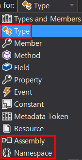
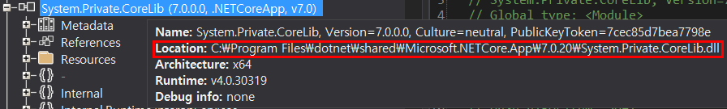
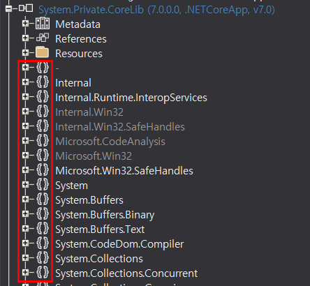
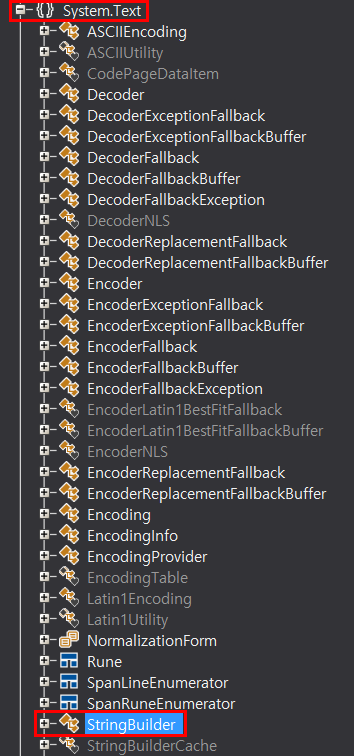

## :fire: 하나의 DLL 파일 안에 여러 namespace가 있을 수 있고,   :fire: 하나의 namespace 안에는 여러 class가 있을 수 있다.
- **ILSpy 기호**
  - 

 

- **DLL 파일 경로**
  - 

 

- **DLL 파일 하나에는 무수히 많은 NameSpace가 존재 할 수 있다.**
  - 

 

- **NameSpace 하나에는 무수히 많은 Class가 존재 할 수 있다.**
  - 
  - 우리가 사용하는 StringBuilder 클래스가 내가 구현하지 않았음에도 이 덕에 사용 할 수 있다.

 

- Using System; 과 Using System.Text가 상속관계가 아니라 사실은 서로 다른 NameSpace이었다.

  

## :fire: 아래 정리하고 한 줄 요약 해라
- DLL = Dynamic Link Library = 라이브러리
  - > A DLL is a library that contains code and data that can be used by more than one program at the same time. 
- Library
- BCL = Base Class Library = 라이브러리
- Assembly
- API = Application Programming Interface = 인터페이스

## :fire: Using System 의 두 가지 의미   :fire: 1. 이 파일에서 BCL의 System Namespace에 존재하는 class 들을 사용하겠다.   :fire: 2. System Namespace를 생략 할 수 있다.  
> C#에서 using 지시자를 사용할 것인지의 여부는 전적으로 여러분의 선택에 따르는 문제이며 필요하다면 namespace를 포함하는 전체 타입 이름을 매번 기술해주어도 상관 없다. C#의 using 지시자는 이 지시자로 선언한 namespace 참조를 각 타입 이름 앞에 자동으로 붙여서 적절한 타입을 찾아내도록 C# 컴파일러에게 지시하는 기능을 한다.

  

## :fire: namespace는 큰 게임 프로젝트 안에 존재하는  :fire: 미니게임 프로젝트에서 독립성을 위해 사용하기 좋다고 생각한다.  :fire: 또한, 모호성을 해결하기 위해 명시적으로 using OOOOO = OOOOO;로 적어주자. 

#### [Ambiguous Code]

  
 :point_up_2: 눌러서 코드를 합시다  

~~~c#
using MiniGame; // 내가 2024년에 이렇게 적어놓고 사용했다고 가정하자. 아래 코드(using BigGame)가 없다면 잘 돌아간다.
using BigGame; // 2025년에 새로 들어온 개발자가 여기다가 이렇게 적으면 ambiguous가 발생한다. 

void Main()
{
	// 아래의 타입은 MiniGame.MusicController인지 BigGame.MusicController인지 알 수 없다.
	// CS0104: 'MusicController' is an ambiguous reference between 'MiniGame.MusicController' and 'BigGame.MusicController'
	MusicController musicController = new MusicController();
	musicController.Play();
}

namespace BigGame
{
	class MusicController
	{
		public void Play(){"BigGame".Dump();}
	}
}

namespace MiniGame
{
	class MusicController
	{
		public void Play(){"MiniGame".Dump();}
	}
}
~~~

#### [Explicit Code]

  
 :point_up_2: 눌러서 코드를 합시다  

~~~c#
using MusicController = MiniGame.MusicController; //Explicit

void Main()
{
	MusicController musicController = new MusicController();
	musicController.Play();
}

namespace BigGame
{
	class MusicController
	{
		public void Play(){"BigGame".Dump();}
	}
}

namespace MiniGame
{
	class MusicController
	{
		public void Play(){"MiniGame".Dump();}
	}
}
//MiniGame
~~~

  

## :fire: .Net Library인 String vs 내가 만든 String Class의 승리는   :fire: 내가 만든 String Class이다.  
#### [코드 예제]
~~~c#
using System;

void Main()
{
	char[] charArray = { 'H', 'e', 'l', 'l', 'o' };
	String str = new String(charArray);

	if (str.GetType() == typeof(System.String))
	{
		"External Library Win".Dump();
	}
	else
	{
		"My Custom Library Win".Dump();
	}
}

public class String
{
	public String(char[] param) { }
}

// My Custom Library Win 
~~~
  

