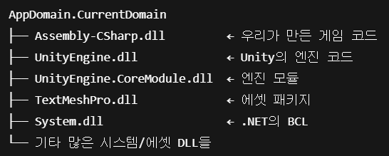
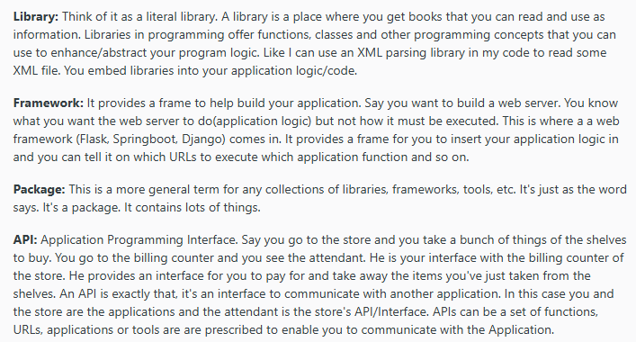
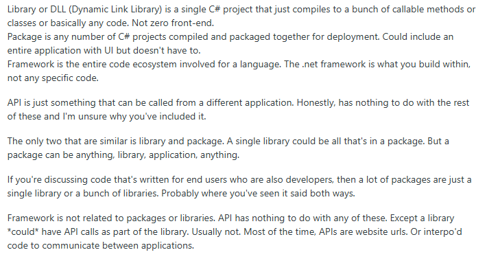

## :fireworks:   Class or Interface  ⊂  NameSpace  ⊂  Dynamic Link Library (=DLL)(=Assembly)  ⊂  AppDomain 
- Library를 여러 DLL의 묶음으로 보는 경우도 있지만, 대체로 Library랑 DLL을 같은 계층으로 묶어서 본다.

  

## :fire: 개발자 + 기획자 + 아트가 모여서 만든 하나의 유니티 프로젝트가 곧 하나의 Domain이다.   AppDomain.CurrentDomain 내부에는 여러 종류의 DLL이 포함되어 있다.   그 DLL 중에는 Assembly-CSharp.dll도 포함되어 있다.
- 
- AppDomain.CurrentDomain.GetAssemblies()에서 참조하는 여러 DLL 중 Assembly-CSharp.dll도 포함된다.
  - 
> 애플리케이션 도메인(AppDomains)은 앱을 서로 격리합니다. AppDomains는 런타임 지원이 필요하며 리소스 비용이 많이 듭니다. 더 많은 앱 도메인 만들기는 지원되지 않으며 나중에 이 기능을 추가할 계획이 없습니다. 코드 격리의 경우 별도의 프로세스 또는 컨테이너를 대안으로 사용합니다.

  

## :fire: 유니티 게임 프로젝트에서 팀원들이 작성한   <ins>모든 C# 스크립트 파일들</ins>은 보통 'Asset/Scripts'에 저장된다.   이 파일들을 컴파일 하면, 그 결과로 <ins>하나의 DLL(='Assembly-CSharp.dll`)</ins>이 생성된다.   :fire: Assembly-CSharp.dll은 곧 하나의 .NET assembly이며,   DLL과 Assembly는 .NET 환경에서 사실상 <ins>같은 개념</ins>이다.
- > larger projects can be planned so that several developers can work on separate source code files or modules, which are combined to create a single assembly.
  - larger projects = 회사 게임 프로젝트, several developers = 클라이언트 팀, source code files = 업무시에 작성하는 스크립트 파일
  - single assembly = Assembly-Csharp.dll 
  - 그러므로 Assembly == DLL로 인식해도 된다. (물론 엄밀히 말하면 좀 다르긴 한데 좀 애매하다.)
- > An assembly is a collection of types and resources that are built to work together and form a logical unit of functionality. Assemblies take the form of executable (.exe) or dynamic link library (.dll) files, and are the building blocks of .NET applications. DLL contains compiled code of functions stored in so called libraries. Programs call these functions found in the DLLs when needed from inside the program executable (or from another library).

  

## :fire: 하나의 DLL 파일 안에 여러 namespace가 있을 수 있다.   :fire: 하나의 namespace 안에는 여러 class or Interface가 있을 수 있다.
#### :one: ILSpy 기호
- 

#### :two: DLL 파일 경로
- 

#### :three: DLL 파일 하나에는 무수히 많은 NameSpace가 존재 할 수 있다.
- 

#### :four:NameSpace 하나에는 무수히 많은 Class가 존재 할 수 있다.
- 
- 우리가 사용하는 StringBuilder 클래스가 내가 구현하지 않았음에도 이 덕에 사용 할 수 있다.

#### :five:NameSpace 하나에는 무수히 많은 Interface가 존재 할 수 있다.
- 
- **'using System' 과 'using System.Text'가 상속관계가 아니라 서로 다른 NameSpace다.**

  

## :fire: Library는 class와 interface들이 모여있는 그룹이며 편하게 가져다가 쓸 수 있다.   Library에는 대표적으로 DLL과 BCL이 있다.   :fire: API는 <ins>a definition on how to write software to interface this thing</ins>로 이해한다.
- **Library**
  - **DLL** = Dynamic Link Library = 라이브러리
    - >	A DLL is a library that contains code and data that can be used by more than one program at the same time. 
  - **BCL** = Base Class Library = 기본 내장 라이브러리
    - Ex : System.IO , List<T>
 

- **API = Application Programming Interface**
  - 이 Interface가 C#의 Interface 문법은 아니다. Interface의 본질적인 의미인 설계서 느낌이다.
  - 그러므로 :star:API는 class가 될 수도 있고 library가 될 수도 있고:star:, 자기 멋대로다.
  - > An API is a specification; a library implements that specification. Theoretically, two different libraries could implement the same API. 

- #### [Reddit에서 찾은 답변]
- 
- 
- [Reference](https://www.reddit.com/r/learnprogramming/comments/1l3ekbs/is_a_library_just_an_api/)

 

- **.asmdef를 이용하면 하나의 'Assembly-Csharp.dll'이 아니라 여러 개의 dll로 나누어 진다.**
  - internal keyword가 access 영역을 하나의 assembly(=dll)로 설정하는 키워드인데, .asmdef를 사용하지 않으면 클라이언트 개발팀에서 작성하는 모든 코드는 internal일 때 접근이 가능하다고 판단 할 수 있다.

  

## :fire: DLL도 Dependency가 생긴다는 단점은 있지만, 사용 할 수 밖에 없다고 생각한다.
> When a program or a DLL uses a DLL function in another DLL, a dependency is created. The program is no longer self-contained, and the program may experience problems if the dependency is broken. For example, the program may not run if one of the following actions occurs
- 버전을 올려서 이전 버전의 DLL을 사용할 때 생기는 충돌

  

## :fire: Using System 의 두 가지 의미   :fire: 1. 이 파일에서 BCL의 System Namespace에 존재하는 class 들을 사용하겠다.   :fire: 2. System Namespace를 생략 할 수 있다.  
> C#에서 using 지시자를 사용할 것인지의 여부는 전적으로 여러분의 선택에 따르는 문제이며 필요하다면 namespace를 포함하는 전체 타입 이름을 매번 기술해주어도 상관 없다. C#의 using 지시자는 이 지시자로 선언한 namespace 참조를 각 타입 이름 앞에 자동으로 붙여서 적절한 타입을 찾아내도록 C# 컴파일러에게 지시하는 기능을 한다.

  

## :fire: namespace는 큰 게임 프로젝트 안에 존재하는 미니게임 프로젝트에서  :fire: 독립성을 위해 사용하기 좋다고 생각한다.  :fire: 또한, 모호성 해결이 필요할 때는 명시적으로 using OOOOO = OOOOO;로 적어주자. 

#### [Ambiguous Code]

~~~c#
using MiniGame; // 내가 2024년에 이렇게 적어놓고 사용했다고 가정하자. 아래 코드(using BigGame)가 없다면 잘 돌아간다.
using BigGame; // 2025년에 새로 들어온 개발자가 여기다가 이렇게 적으면 ambiguous가 발생한다. 

void Main()
{
	// 아래의 타입은 MiniGame.MusicController인지 BigGame.MusicController인지 알 수 없다.
	// CS0104: 'MusicController' is an ambiguous reference between 'MiniGame.MusicController' and 'BigGame.MusicController'
	MusicController musicController = new MusicController();
	musicController.Play();
}

namespace BigGame
{
	class MusicController
	{
		public void Play(){"BigGame".Dump();}
	}
}

namespace MiniGame
{
	class MusicController
	{
		public void Play(){"MiniGame".Dump();}
	}
}
~~~

#### [Explicit Code]
~~~c#
using MusicController = MiniGame.MusicController; //Explicit

void Main()
{
	MusicController musicController = new MusicController();
	musicController.Play();
}

namespace BigGame
{
	class MusicController
	{
		public void Play(){"BigGame".Dump();}
	}
}

namespace MiniGame
{
	class MusicController
	{
		public void Play(){"MiniGame".Dump();}
	}
}
//MiniGame
~~~

  

## :fire: .Net Library인 String vs 내가 만든 String Class의 승리는   :fire: 내가 만든 String Class이다.  
#### [코드 예제]
~~~c#
using System;

void Main()
{
	char[] charArray = { 'H', 'e', 'l', 'l', 'o' };
	String str = new String(charArray);

	if (str.GetType() == typeof(System.String))
	{
		"External Library Win".Dump();
	}
	else
	{
		"My Custom Library Win".Dump();
	}
}

public class String
{
	public String(char[] param) { }
}

// My Custom Library Win 
~~~
  

