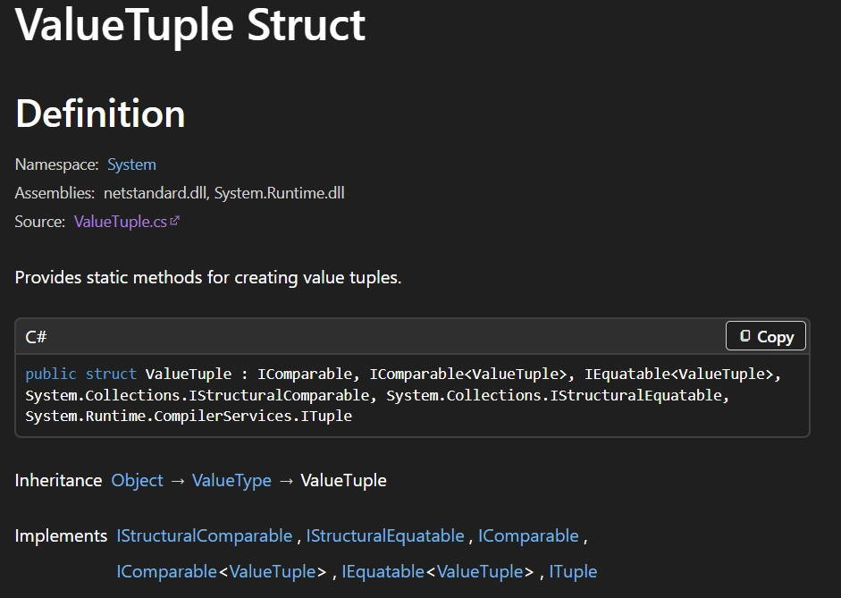
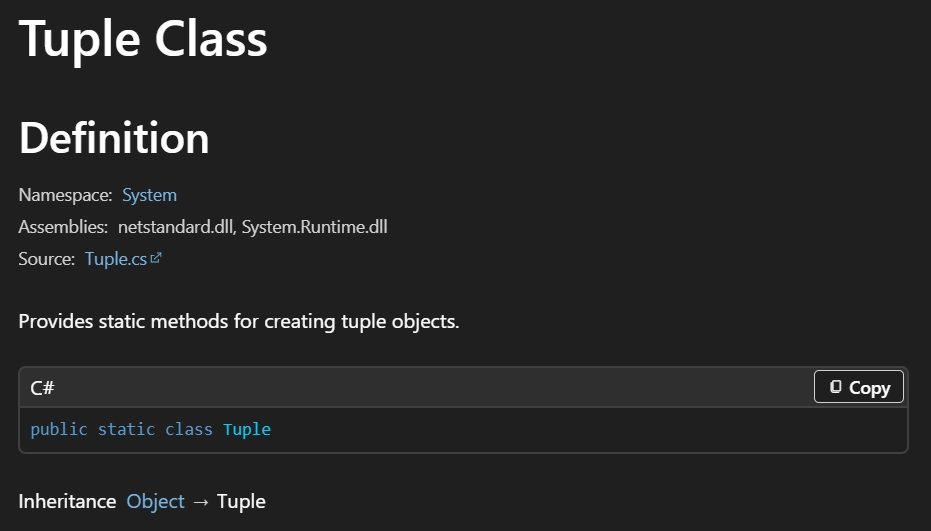

## :fire: (int,int) 처럼 선언하는 것은 C# 7.0 이후   ValueTuple과 완전히 동일하다.   :fire: ValueTuple은 struct다.
~~~c#
//1. Normal
(int,int) a = (1,2); // => ValueTuple

//2. Container Generic
List<(int,int)> list = new List<(int,int)>();
var list = new List<(int,int)>();

//3. Long Tuple
(int,String,int,int,int) b = (1,"jiwon",2,3,4);

//4. ValueTuple의 컴파일러 동일 형식
list.Add((1, 1)); 
list.Add(new ValueTuple<int, int>(1, 1));
~~~
> As mentioned, I propose to make tuple types structs rather than classes, so that no allocation penalty is associated with them. They should be as lightweight as possible. Arguably, structs can end up being more costly, because assignment copies a bigger value. So if they are assigned a lot more than they are created, then structs would be a bad choice.

> Tuples are values, so are copied by value, rather than by reference. Most of the time, this should not be an issue. However, if you are passing around tuples of large structs, this might have an impact on performance. Ref locals/returns can be used to work around these performance issues, though. Additionally, because they are values, modifying a copy remotely will not change the original copy. This is a good thing, but could catch some folk out.
- 여기서 의미하는 Tuples도 ValueTuple이다.
- 원소로 ValueTuple의 원소에 참조 타입을 넣을 수 있지만 그러지 말자.
    - ValueTuple은 매우 간단하게 사용할 원소만 저장하고 가볍게 사용하는 게 좋다.
    - 참조 타입을 원소로 사용할 거면 class로 만들자.
- :airplane:[GitHub_05-1](https://github.com/pjw960316/Unity_Client_Programmer/blob/main/1.%20Unity%20Programming/C%23%20Ver_2/05%EC%9E%A5_1%20Primitive%2C%20Reference%2C%20and%20Value%20Type.md)

  

## :fire: C# 7.0 이후, tuple 타입의 문법 은 ValueTuple (,) 사용이 표준이며   System.Tuple은 레거시 API로 간주된다.
- **우리가 사용하는 ValueTuple**

 
    
- **과거의 레거시인 Tuple**

  

## :fire: 생명주기가 길다면 Naming Tuple을 사용하자.
~~~c#
var queue = new Queue<(int id, int workTime, int entryTime)>();
queue.Enqueue((1, 10, 0)); 

int id = member.id;
int workTime = member.workTime;
int entryTime = member.entryTime;
~~~

  

## :bangbang: List<Tuple> , List<Struct> 주의점
- index로 접근해서 struct의 element를 직접 변경 할 수 없다.
  - 컴파일 에러가 발생한다.
- :airplane: [valueType 과 referenceType 혼동 포인트.md](https://github.com/pjw960316/Unity_Client_Programmer/blob/main/1.%20Unity%20Programming/C%23%20Ver_2/05%EC%9E%A5_%20Primitive%2C%20Reference%2C%20and%20Value%20Types/valueType%20%EA%B3%BC%20referenceType%20%ED%98%BC%EB%8F%99%20%ED%8F%AC%EC%9D%B8%ED%8A%B8.md#fire-%EA%B0%92-%ED%83%80%EC%9E%85int-valuetuple-struct%EC%9D%84-icollection%EC%9D%98-t%EB%A1%9C-%EC%82%AC%EC%9A%A9-%ED%95%A0-%EB%95%8C-%EC%9B%90%EB%B3%B8%EC%9D%84-%EB%B3%80%EA%B2%BD%ED%95%98%EC%A7%80-%EC%95%8A%EB%8A%94%EB%8B%A4--%EA%B0%92-%EB%B3%B5%EC%82%AC%ED%95%9C-%ED%9B%84-%EB%8C%80%EC%9E%85%EC%9D%84-%ED%95%98%EB%8A%94-%EA%B2%83-%EC%9D%B4%EB%8B%A4-%EC%9D%B4%EB%8A%94-list--dictionary%EC%9D%98-%EA%B0%80-get_accessor-%EB%A9%94%EC%84%9C%EB%93%9C-%ED%98%B8%EC%B6%9C%EC%9D%B4%EB%A9%B0--%EC%9D%B4-%EA%B3%BC%EC%A0%95%EC%97%90%EC%84%9C-%EA%B0%92-%ED%83%80%EC%9E%85%EC%9D%80-%ED%95%AD%EC%83%81-%EA%B0%92-%EB%B3%B5%EC%82%ACvalue-copy%EB%A1%9C-%EB%B0%98%ED%99%98%EB%90%98%EA%B8%B0-%EB%95%8C%EB%AC%B8%EC%9D%B4%EB%8B%A4--int%EC%9D%98-%EA%B2%BD%EC%9A%B0-%EB%88%88%EC%86%8D%EC%9E%84%EC%9D%B4-%EB%B0%9C%EC%83%9D%ED%95%98%EA%B3%A0-valuetuple%EA%B3%BC-struct%EB%8A%94-%EC%BB%B4%ED%8C%8C%EC%9D%BC%EB%9F%AC%EA%B0%80-%EC%97%90%EB%9F%AC%EB%A5%BC-%EB%B0%9C%EC%83%9D%EC%8B%9C%EC%BC%9C-%EC%82%AC%EC%A0%84-%EC%B0%A8%EB%8B%A8%ED%95%9C%EB%8B%A4)

  

## 참고 자료
- :airplane:[Language support for Tuples](https://github.com/dotnet/roslyn/issues/347)
- :airplane:[MSDN](https://learn.microsoft.com/en-us/dotnet/csharp/language-reference/builtin-types/value-tuples?utm_source=chatgpt.com)