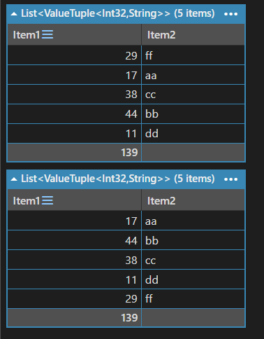

## :fire: 값 타입(int, ValueTuple, struct)을 ICollection<T>의 T로 사용 할 때 원본을 변경하지 않는다.   값 복사한 후 대입을 하는 것 이다.  이는 List / Dictionary의 []가 get_accessor 메서드 호출이며   이 과정에서 값 타입은 항상 값 복사(value copy)로 반환되기 때문이다.   (int의 경우 눈속임이 발생하고, valueTuple과 struct는 컴파일러가 에러를 발생시켜 사전 차단한다.)
#### :spiral_notepad: [int, valueTuple, struct, class -> 4가지를 List의 T로 사용]
~~~c#
public struct NumberStruct
{
    public int Num1;
    public int Num2;

	public NumberStruct(int a, int b)
	{
		Num1 = a;
		Num2 = b;
	}
}

public class NumberClass
{
	public int Num1;
	public int Num2;

	public NumberClass(int a, int b)
	{
		Num1 = a;
		Num2 = b;
	}
}

public static class MainManager
{
	public static void Main()
	{
		var testManager = new TestManager();
	}
}

public class TestManager
{
	List<int> intList = new List<int>();
	List<NumberStruct> structList = new List<NumberStruct>();
	List<(int, int)> tupleList = new List<(int, int)>();
	List<NumberClass> classList = new List<NumberClass>();

	public TestManager()
	{
		Initialize();
		
		ChangeIntList(); // 2
		ChangeStruct(); // 3,4
		ChangeTuple(); // 3,4
		ChangeClass(); // 5,2
	}

	private void Initialize()
	{
		intList.Add(1);
		structList.Add(new NumberStruct(1, 2));
		tupleList.Add((1, 2));
		classList.Add(new NumberClass(1, 2));
	}
	
	private void ChangeIntList()
	{
		intList[0] = 2;
		intList[0].Dump();
	}
	private void ChangeStruct()
	{
		// Compile ERROR
		//structList[0].Num1 == 3;
		
		structList[0] = new NumberStruct(3,4);
		structList.Dump();
	}

	private void ChangeTuple()
	{
		// compile ERROR
		//tupleList[0].Item1 = 3;
		
		tupleList[0] = (3,4);
		structList.Dump();
	}
	
	private void ChangeClass()
	{
		classList[0].Num1 = 5;
		classList[0].Dump(); // 얘는 원본이 변경된다.
	}
}
~~~
- intList[0] = 2는 사실 컴파일러가 이렇게 동작시킨다. 그러니까 **원본을 참조해서 변경하는 것 처럼 보였다.**
~~~c#
int temp = intList[0]; // 값 복사
temp = 2;              // 값 변경
intList[0] = temp;     // 다시 넣기
~~~
- 그러나 structList[0].Num1 = 3; // ❌인 이유는
~~~c#
NumberStruct temp = structList[0]; // 값 복사
temp.Num1 = 3;                     // 복사본 수정
// 여기서 모호함이 발생하기에 C#은 컴파일에러를 낸다.
~~~
- valueTuple은 struct와 동일한 원리를 갖는다.
- class는 컴파일러가 값 복사를 하지 않고 참조를 하기 때문에 원본을 실제로 변경한다.

  

## :fire: 값 복사인지 참조 복사인지 판단하는 것은 스택과 힙이 아니다.   :fire: 타겟 객체의 최종 타입이 어떤 타입인지 판단하면 된다.   (Queue -> ValueTuple -> StringBuilder니까 이 예제에서는 StringBuilder가 최종 타입)   :fire: 최종 타입이 value type이면 값이 복사되고, reference type이면 참조값(=주소, =원본)이 복사된다.
~~~c#
void Main()
{
    Queue<(StringBuilder,int)> queue = new Queue<(System.Text.StringBuilder, int)>();
    StringBuilder sb = new StringBuilder();
    
    queue.Enqueue((sb,1));
    
    sb.Append("a");
    sb.Append("b");
    queue.Peek().Item1.Append("c");
    queue.Peek().ToString().Dump();
}

// result = (abc,1)
~~~
- 결과가 (abc,1)이 나온다. queue.Peek()을 통해 ValueTuple의 값 복사로 새로운 ValueTuple이 생성되지만 그 안에는 sb의 주소를 동일하게 저장하고 있다.
- 그러므로, 결국 같은 StringBuilder 객체인 sb를 참조해서 원본이 변경된다.

  

## :fire: 참조 타입 캐싱할 때 발생하는 실수 -> LINQ는 새로운 container를 생성한다.
#### :spiral_notepad: [예제]
~~~c#
void Main()
{
    var doubleList = new List<List<(int,string)>>();
    var innerList = new List<(int,string)>();
    
    innerList.Add((29,"ff"));
    innerList.Add((17,"aa"));
    innerList.Add((38,"cc"));
    innerList.Add((44,"bb"));
    innerList.Add((11,"dd"));
    
    doubleList.Add(innerList);
    
    //예제_1 : 캐싱을 할 때. 
    var cachedList = doubleList[0];
    cachedList = innerList.OrderBy(pair => pair.Item2).ToList();
    doubleList[0].Dump(); // 변경을 의도했으나 변경이 되지 않는다.
    
    //예제_2 : 캐싱을 하지 않을 때.
    doubleList[0] = innerList.OrderBy(pair => pair.Item2).ToList();
    doubleList[0].Dump();
}
~~~
- cachedList는 참조타입이므로 원본을 변경하는데 왜 예제_1에서 변경이 되지 않는가?
  - cachedList는 참조타입이 맞다. 그리고 doubleList[0]를 가리키고 있는 것도 맞다.
  - 그러나 cachedList = innerList.OrderBy(pair => pair.Item2).ToList(); 에서 LINQ 구문은 원본 innerList를 변경하지 않고 새로운 List를 생성한다.
  - 그리고 그 새로운 List에 cachedList를 연결하므로 이제 cachedList와 doubleList[0]은 서로 다른 힙 영역을 가리키고 있다.
- 예제_2의 경우는 올바르게 변경되었다.
- 