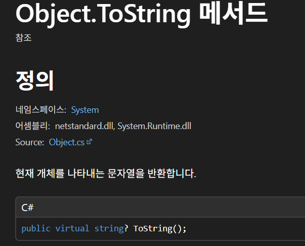
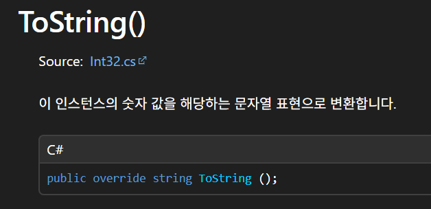
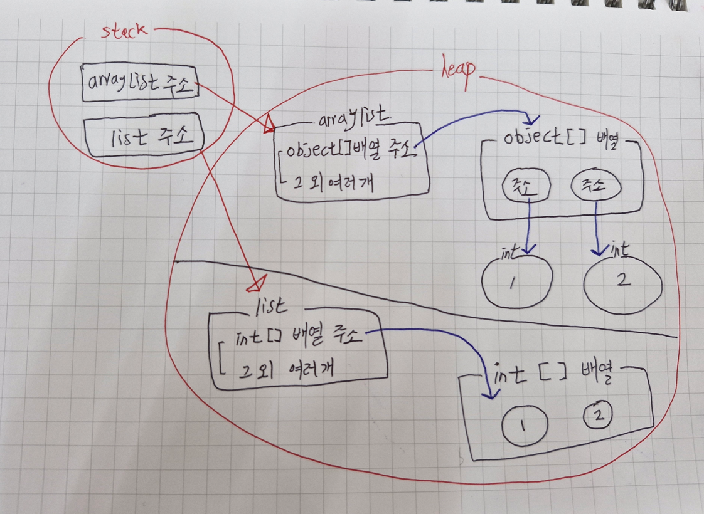
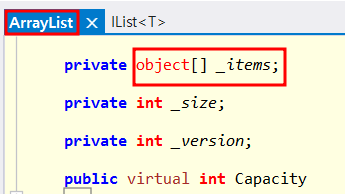
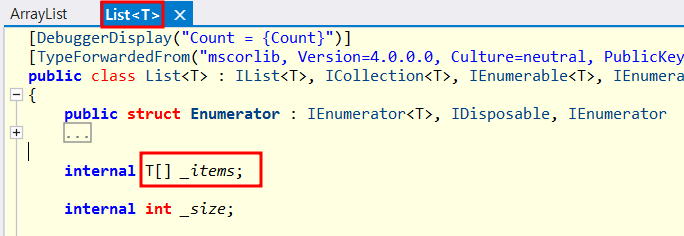
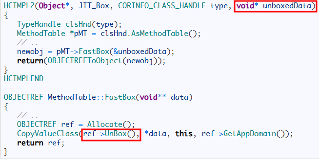

## :fireworks: 책의 내용을 05장_1에서 다룬다.   05장_2에서 valueType 과 referenceType에서 혼동을 느끼는 코드에 대해 정리한다.

 

## :fire: Built-In Type , primitiveType , valueType , referenceType 관계도 

> 일부 데이터 타입들은 너무나 일반적이고 당연한 것들이어서 많은 컴파일러들이 코드를 작성하는 동안 단순화된 문법의 형태로 이를 사용할 수 있도록 지원해주고 있다. 이 문법은 앞의 코드보다 더 읽고 이해하기 쉬우며, 당연히 System.Int32 타입을 사용하도록 지시하는 앞의 코드와 의미가 동일한 IL 코드를 만들어준다. 이와 같이 컴파일러가 직접 지원하는 데이터 타입들을 **기본 타입(Primitive Type)**이라고 부른다.
- valueType 중 primitiveType은 모두 struct다.
- 소문자 string과 대문자 String은 완벽히 동일하다.
  - C#의 string 키워드는 FCL 타입인 System.String으로 정확하게 연결되기 때문에, 둘 사이에는 전혀 차이점이 없기 때문이다.
- valueType은 System.ValueType 타입으로부터 항상 상속된다.

  

## :fireworks: primitiveType 정리   :fire: int == System.Int32   :fire: long == System.Int64   :fire: double == System.Double   :fire: 범위 이슈가 없다면 정수는 int를 사용하고, 소수는 double을 사용한다.
~~~c#
void Main()
{
	var a = 0; //int	
	var c = 0.1; //double
}
~~~
- 기본타입을 컴파일러가 위의 코드로 해석한다. 

  

## :fire: 나누기 연산에서는 모두 double로 변환해서 사용한다.
- :link:[How can I divide two integers to get a double?](https://stackoverflow.com/questions/661028/how-can-i-divide-two-integers-to-get-a-double)
- 생각하기 편하다.

  

## :fireworks: DTO를 만들 때 상황에 맞게 valueTuple 또는 struct 또는 class를 선택해서 만들 수 있어야 한다.   :fire: 데이터가 2개 or 3개고, 데이터가 모두 immutable => valueTuple   :fire: 데이터가 4개 이상이고, 데이터가 모두 immutable => struct   :fire: 데이터가 2개 이상이지만, 데이터 중 1개라도 mutable referenceType => class   :fire: string은 immutable하므로 valueTuple 과 struct의 멤버로 사용하면 된다. 

#### 1. valueTuple 내부에 존재하는 string
~~~c#
void Main()
{
	var a = (1,"hi");
	var b = a;
	b.Item2 = "bye";
	
	a.Dump(); // 1 hi -> 원본 변경 X 
	b.Dump(); // 1 bye
}
~~~
- ValueTuple b는 ValueTuple a를 깊은 복사한다.
- valueTuple a와 b는 처음에 같은 string 주소를 공유한다. string은 참조 타입이니까. 그러나, string의 immutable한 특성 때문에 문자열 변경시에 새로운 문자열("bye)을 만들고 이 문자열의 주소를 b.Item2에 교체한다. 그러므로 원본이 변경되지 않는다.

#### 2. 자료 근거 
- MSDN과 StackOverFlow 모두 이를 뒷받침 해준다.
> [MSDN] 

> AVOID defining a struct unless the type has all of the following characteristics: 

> It logically represents <ins>a single value, similar to primitive types</ins> (int, double, etc.). 

> It has an instance size under 16 bytes. 

> It is **<ins>immutable.</ins>** 

> It will not have to be boxed frequently. In all other cases, you should define your types as classes.

- :link:[Adding a reference to a list c# struct](https://stackoverflow.com/questions/13690509/adding-a-reference-to-a-list-c-sharp-struct?utm_source=chatgpt.com)

#### 3. :book: 제프리
> 값 타입의 변수를 다른 값 타입의 변수로 대입하려고 할 때, 필드 단위로 하나씩 복제가 이루어지게 된다. 그러나 참조 타입의 변수끼리 대입이 발생하면 단순히 메모리 주소만 복제된다.

> 어떤 객체 하나를 두 개 이상의 참조 타입 변수가 가리키는 일이 있을 수 있으며, 이 때 어떤 변수 하나에서 연산을 실행하면 그 결과가 다른 변수에도 그대로 영향을 주게 된다. 달리 말하면, 값 타입의 변수들은 서로 구분된 객체들이며, 상호간에 영향을 주는 것은 불가능하다. 

#### 4. Struct로 사용 할 수 있으면 struct를 사용하면 좋은 이유

- 아래는 DTO를 class로 만들었을 때, 위에는 DTO를 struct로 만들었을 때의 차이.
- 해당 문제에서 DTO instance의 값을 변경하는 시도는 하지 않았고, 모든 멤버가 int기 때문에 struct로 사용했다.
~~~c#
public class DTO
{
    public int row;
    public int col;
    public int day;
            
    public DTO(int a, int b , int c)
    {
        row = a;
        col = b;
        day = c;
    }
}

public class CSharpHabit
{
    static void Main()
    {
		// 생략

        var queue = new Queue<DTO>();

		//생략
	}
}
~~~

  

## :fireworks: 두 객체의 같음에 대해 정리한다.   :fire: 연산자 오버로딩이 되어있지 않는다고 가정한다.   '=='을 편하게 사용해라.   :fire: ValueType 끼리의 비교는 값의 동일함만 비교한다.   :fire: ReferenceType 끼리의 비교는 주소의 동일함만 비교한다.   이는 static 메서드인 Object.ReferenceEquals()와 완전히 동일하다.   당연하지만, ValueType과 ReferenceType에 대한 비교는 하지 않는다. (컴파일 에러!)
~~~c#
void Main()
{
	var num1 = 1;
	var num2 = 1;
	
	if(num1 == num2)
	{
		"Value Same".Dump();
	}
	
	var num3 = num2; //어차피 주소 공유 절대 하지 않는다.
	num3 = 3;
	
	if(num2 == num3)
	{
		"nice".Dump();
	}
	
	var list = new List<int>();
	var list2 = list;
	
	if(list == list2)
	{
		"Address Same".Dump();
	}
}
// Value Same
// Address Same
~~~
> It determines whether the two objects represent the same object reference. If they do, the method returns true. This test is equivalent to calling the ReferenceEquals method. In addition, if both objA and objB are null, the method returns true.

  

## :fireworks: .ToString()을 통해 Boxing을 이해한다.   위 그림은 Object의, 아래 그림은 Int32의 .ToString()   :fire: .ToString()의 구조를 파악하면 Boxing이 발생하지 않음을 알고 편하게 사용이 가능하다.

- 보통 타입 정도는 명시적으로 알고 사용을 하기 때문에, MS에서 제공하는 override 된 .ToString()을 사용하게 된다.
- 그러면 박싱은 발생하지 않으며, object 타입에 대한 ToString()은 발생하니 이는 주의하자.

  

## :fire: Boxing을 피하고 싶다면 arrayList 대신에 List<T>를 쓰자.   :fire: 아래 그림과 내용을 읽고, 왜 박싱이 좋지 않은 지 이해한다.   :fire: 어차피 arrayList는 Legacy다.

- ArrayList에서 최종적으로 도달한 두 개의 int 객체는 각각 값 1과 2를 저장하는 <ins>Boxing된 객체</ins>이다.
  - 이 객체들은 값 타입이 참조 타입으로 변환되면서 Heap에 생성된 것으로, <ins>메모리 낭비</ins>의 대표적인 사례를 보여준다.
- 또한, 이 int 객체들은 배열처럼 연속된 메모리에 존재하지 않고,Heap 상에서 독립적으로 흩어져 할당된다.
  - 이로 인해 추가적인 <ins>참조 비용과 캐시 비효율성</ins>이 발생한다.
- 실제 클래스 해부
  - **ArrayList**
  - 
  - **List**
  - 
- Generic이 상위호환.

  

## :fire: Boxing 된 녀석의 GetType()를 하면 UnBoxing 된 타입이 나온다.
#### [arrayList로 확인]
~~~c#
void Main()
{
	ArrayList arrayList = new ArrayList();
	int a = 1;
	int b = 2;
	arrayList.Add(a); //boxing
	arrayList.Add(b); //boxing
	
	arrayList[1].GetType().Dump(); //unboxing 아니다!!!
}
~~~
- arrayList[1]는 object 타입이지만 Int32로 출력된다.

#### [참고만 하자 : Native C++의 .Net 런타임에서 Boxing을 확인하는 코드]

- Unbox 라는 키워드를 확인 할 수 있다.

> The answer is easy to spot. Prior to calling GetType() method, the boxing of the value type occurs (while the exact type is known to the compiler). Boxing operation allocates a new object on the heap, which layout is known to us already. In particular, it contains a proper MethodTable pointer.

 

> Hence GetType() is processed as usual. Since boxed object has a typical layout, we can use the standard Object.GetType() method which get object’s MethodTable and returns the :star:corresponding(상응하는) Type object.

  

## :fire: 오버플로우가 발생할 것 같은 연산:star:(특히 돈 관련):star:에서는   checked 코드블럭과 try-catch를 이용해서 exception handling을 하자.
#### [checked 예제]

~~~c#
void Main()
{
    Byte a = 126;
    Byte b = 125;
    Byte c = 2; //만약 기획 데이터라면?

    try
  {
    checked
    {
      a = (Byte)(a + b * c); //오버플로우 날까봐 두려운 코드를 checked로 감싸자.
    }
  }
  catch (OverflowException ex) // c가 2라면 overflow가 발생하고 예외가 잡힌다.
  {
    Console.WriteLine($"오버플로 예외 발생: {ex.Message}");
    a.Dump();  //126 + 125 * 2 지만 오버플로우 발생해서 126으로 출력.
  }
}
// result
// 오버플로 예외 발생: Arithmetic operation resulted in an overflow.
// 126
~~~
