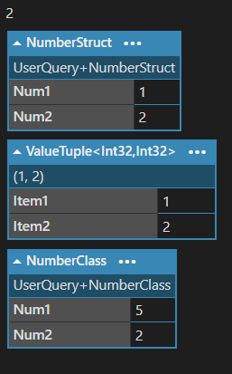

## :fire: Built-In Type , Primitive Type , Value Type , Reference Type 관계도 

- Value Type 중 Primitive Type은 모두 struct다.
- <ins>소문자 string과 대문자 String은 완벽히 동일</ins>하다.
  - > C#의 string 키워드는 FCL 타입인 System.String으로 정확하게 연결되기 때문에, 둘 사이에는 전혀 차이점이 없기 때문이다.

  

## :fireworks: DTO를 만들 때 상황에 맞게 valueTuple 또는 struct 또는 class를 선택해서 만들 수 있어야 한다.   :fire: 데이터가 2개면 ValueTuple을 사용한다. Item1과 Item2가 valueType 또는 ReferenceType 이어도 상관없다.  :fire: 데이터가 3개 이상이고, 모든 데이터가 변경이 되지 않고, valueType이면 struct를 사용한다.   :fire: 데이터가 3개 이상이지만, 데이터의 변경이 발생하고, 데이터 중 1개라도 referenceType이면 class를 사용한다. 
- MSDN과 StackOverFlow 모두 이를 뒷받침 해준다.
> [MSDN] 

> AVOID defining a struct unless the type has all of the following characteristics: 

> It logically represents <ins>a single value, similar to primitive types</ins> (int, double, etc.). 

> It has an instance size under 16 bytes. 

> It is immutable. 

> It will not have to be boxed frequently. In all other cases, you should define your types as classes.

- :link:[Adding a reference to a list c# struct](https://stackoverflow.com/questions/13690509/adding-a-reference-to-a-list-c-sharp-struct?utm_source=chatgpt.com)

  

## :fire: ValueType(int, ValueTuple, struct)를 ICollection<T>의 T로 사용 할 때 원본을 변경하지 않는다.   값 복사한 후 대입을 하는 것 이다.   (int의 경우 눈속임이 발생하고, valueTuple과 struct는 컴파일러가 에러를 발생시켜 사전 차단한다.)
#### [int, valueTuple, struct, class -> 4가지를 List의 T로 사용]
~~~c#
public struct NumberStruct
{
	public int Num1;
	public int Num2;
	
	public NumberStruct(int a , int b)
	{
		Num1 = a;
		Num2 = b;
	}
}

public class NumberClass
{
	public int Num1;
	public int Num2;

	public NumberClass(int a, int b)
	{
		Num1 = a;
		Num2 = b;
	}
}

void Main()
{
	// 1. Int
	var intList = new List<int>();
	intList.Add(1);
	intList[0] = 2;
	intList[0].Dump(); 

	//2. Struct
	var structList = new List<NumberStruct>();
	structList.Add(new NumberStruct(1, 2));
	structList[0].Dump(); 
	
	// compile ERROR
	//structList[0].Num1 = 3;  

	//3. ValueTuple
	var tupleList = new List<(int, int)>();
	tupleList.Add((1 , 2));
	tupleList[0].Dump();
	
	// compile ERROR
	//tupleList[0].Item1 = 3;

	//4. Class
	var classList = new List<NumberClass>();
	classList.Add(new NumberClass(1, 2));
	classList[0].Num1 = 5; 
	classList[0].Dump(); // 얘는 원본이 변경된다.
}
~~~

- intList[0] = 2는 사실 컴파일러가 이렇게 동작시킨다. 그러니까 **원본을 참조해서 변경하는 것 처럼 보였다.**
~~~c#
int temp = intList[0]; // 값 복사
temp = 2;              // 값 변경
intList[0] = temp;     // 다시 넣기
~~~
- 그러나 structList[0].Num1 = 3; // ❌인 이유는
~~~c#
NumberStruct temp = structList[0]; // 값 복사
temp.Num1 = 3;                     // 복사본 수정
// 여기서 모호함이 발생하기에 C#은 컴파일에러를 낸다.
~~~
- valueTuple은 struct와 동일한 원리를 갖는다.
- class는 컴파일러가 값 복사를 하지 않고 참조를 하기 때문에 원본을 실제로 변경한다.

  

## :fireworks: Queue<(StringBuilder , int)> queue로 이해하기   :fire: 값 복사인지 참조 복사인지 판단하는 것은 스택과 힙이 아니다.   타겟 객체의 최종 타입 (Queue -> ValueTuple -> StringBuilder니까 StringBuilder)이 어떤 타입인지 판단하면 된다.   :fire::star: 최종 타입이 value type이면 값이 복사되고, reference type이면 참조값(=주소, =원본)이 복사된다.
~~~c#
void Main()
{
	Queue<(StringBuilder,int)> queue = new Queue<(System.Text.StringBuilder, int)>();
	StringBuilder sb = new StringBuilder();
	
	queue.Enqueue((sb,1));
	
	sb.Append("a");
	sb.Append("b");
	queue.Peek().Item1.Append("c");
	queue.Peek().ToString().Dump();
}

// result = (abc,1)
~~~
- 결과가 (abc,1)이 나온다. queue.Peek()을 통해 ValueTuple의 값 복사로 새로운 ValueTuple이 생성되지만 그 안에는 sb의 주소를 동일하게 저장하고 있다.
- 그러므로, 결국 같은 StringBuilder 객체인 sb를 참조해서 원본이 변경된다.

  

## :fire: Boxing을 피하고 싶다면 arrayList 대신에 List<T>를 쓰자.   :fire: 아래 그림과 내용을 읽고, 왜 박싱이 좋지 않은 지 이해한다.   :fire: 어차피 arrayList는 Legacy다.

- ArrayList에서 최종적으로 도달한 두 개의 int 객체는 각각 값 1과 2를 저장하는 <ins>Boxing된 객체</ins>이다.
  - 이 객체들은 값 타입이 참조 타입으로 변환되면서 Heap에 생성된 것으로, <ins>메모리 낭비</ins>의 대표적인 사례를 보여준다.
- 또한, 이 int 객체들은 배열처럼 연속된 메모리에 존재하지 않고,Heap 상에서 독립적으로 흩어져 할당된다.
  - 이로 인해 추가적인 <ins>참조 비용과 캐시 비효율성</ins>이 발생한다.
- 실제 클래스 해부
  - **ArrayList**
  - 
  - **List**
  - 

  

## :fire: Boxing 된 녀석의 GetType()를 하면 UnBoxing 된 타입이 나온다.
#### [arrayList로 확인]
~~~c#
void Main()
{
	ArrayList arrayList = new ArrayList();
	int a = 1;
	int b = 2;
	arrayList.Add(a); //boxing
	arrayList.Add(b); //boxing
	
	arrayList[1].GetType().Dump(); //unboxing 아니다!!!
}
~~~
- arrayList[1]는 object 타입이지만 Int32로 출력된다.

#### [참고만 하자 : Native C++의 .Net 런타임에서 Boxing을 확인하는 코드]

- Unbox 라는 키워드를 확인 할 수 있다.

> The answer is easy to spot. Prior to calling GetType() method, the boxing of the value type occurs (while the exact type is known to the compiler). Boxing operation allocates a new object on the heap, which layout is known to us already. In particular, it contains a proper MethodTable pointer.

 

> Hence GetType() is processed as usual. Since boxed object has a typical layout, we can use the standard Object.GetType() method which get object’s MethodTable and returns the :star:corresponding(상응하는) Type object.

  

## :fire: 오버플로우가 발생할 것 같은 연산:star:(특히 돈 관련):star:에서는   checked 코드블럭과 try-catch를 이용해서 exception handling을 하자.
#### [checked 예제]

~~~c#
void Main()
{
    Byte a = 126;
    Byte b = 125;
    Byte c = 2; //만약 기획 데이터라면?

    try
  {
    checked
    {
      a = (Byte)(a + b * c); //오버플로우 날까봐 두려운 코드를 checked로 감싸자.
    }
  }
  catch (OverflowException ex) // c가 2라면 overflow가 발생하고 예외가 잡힌다.
  {
    Console.WriteLine($"오버플로 예외 발생: {ex.Message}");
    a.Dump();  //126 + 125 * 2 지만 오버플로우 발생해서 126으로 출력.
  }
}
// result
// 오버플로 예외 발생: Arithmetic operation resulted in an overflow.
// 126
~~~
