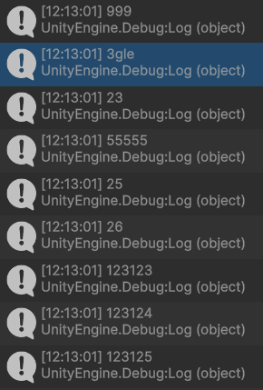
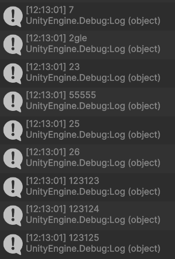

## :fire: Built-In Type , Primitive Type , Value Type , Reference Type 관계도 

- Value Type 중 Primitive Type은 모두 struct다.
- <ins>소문자 string과 대문자 String은 완벽히 동일</ins>하다.
  - > C#의 string 키워드는 FCL 타입인 System.String으로 정확하게 연결되기 때문에, 둘 사이에는 전혀 차이점이 없기 때문이다.

  

## :star::star::star: deep-copy와 shallow-copy는 무조건 params의 타입에만 집중한다. :star::star::star:   (내부 필드는 신경 쓰지 않는다.)   :fire: params가 참조 타입이면 내부 필드가 어떻든 모두 call by ref 처럼 동작해   shallow-copy가 일어난다.   :fire: params가 값 타입이면, call by value 처럼 동작해   deep-copy가 일어난다.   :fire::bangbang: 그러나 params가 struct면, struct 내부의 value type field는 deep copy가 되고,   struct 내부의 reference type field는 shallow copy가된다.   그렇기 때문에, struct 내부에 reference type 필드를 두면 무조건 실수 할 것 이다.   그러므로, struct는 value type으로만 내부 필드를 구성할 때 사용하자. (MSDN도 이를 강조한다.)
> 참조 타입은 관리되는 힙에 항상 할당된다. 

> [MSDN] 

> AVOID defining a struct unless the type has all of the following characteristics: 

> It logically represents <ins>a single value, similar to primitive types</ins> (int, double, etc.). 

> It has an instance size under 16 bytes. 

> It is immutable. 

> It will not have to be boxed frequently. In all other cases, you should define your types as classes.

  

## :fireworks: params로 전달하는 Call-by-value 와 call-by-ref를 7가지 케이스로 증명해 보았다.

### :zero: 기본 코드 구성
~~~c#
//SparrowPresenter Class와 FieldObjectSparrow Class 2개를 이용해서 테스트

//1. [SparrowPresenter Class] 호출부
TestStructAndClass(_fieldObjectSparrow.Age);

//2. [SparrowPresenter Class] params의 타입을 계속 변경하며 테스트
private void TestStructAndClass(int param)
{
  Debug.Log("Params를 받고 데이터 변경");

  //2-1. 데이터 변경 영역
  param = 11;

  //2-2. 데이터 변경 로그 확인
  Debug.Log($"{param}");

  //2-3. parameter를 제공하는 referenceType의 FieldObjectSparrow Type에서 자신의 데이터 확인 호출
  _fieldObjectSparrow.ViewTest();
}

//3. [FieldObjectSparrow Class Field]
public class FieldObjectSparrow : FieldObjectBase
{
  public class Eagle
  {
    public int Age = 7;
    public string Name = "2gle";
    public List<int> NumberList = new();

    public Eagle()
    {
        NumberList.Add(23);
        NumberList.Add(24);
        NumberList.Add(25);
        NumberList.Add(26);
    }
  }

  public struct EagleStruct
  {
    public int Age;
    public string Name;
    public List<int> NumberList;

    public EagleStruct(int age)
    {
        Age = age;
        Name = "2gle";
        NumberList = new List<int>();

        NumberList.Add(23);
        NumberList.Add(24);
        NumberList.Add(25);
        NumberList.Add(26);
    }
  }

  public int Age = 5;
  public string Name = "ChamBird";
  public List<int> NumberList = new();
  public Eagle EnemyEagle = new();
  public EagleStruct EnemyEagleStruct = new(7); 
}

//4. [FieldObjectSparrow Class] 데이터 확인
public void ViewTest()
{
  Debug.Log("Params를 넘겨준 쪽 데이터 확인"); 
  Debug.Log($"{Age}");
}
~~~

 

### :one: instance의 int field를 따로 추출해서 params로 전달하고, <ins>int field</ins>를 변경   params인 _fieldObjectSparrow.Age가 value type -> 값 복사 -> deep-copy (원본 변경 X)
~~~c#
TestStructAndClass(_fieldObjectSparrow.Age); //여기서 기존에 5임.

private void TestStructAndClass(int param)
{
    param = 11;
    Debug.Log($"{param}");

    _fieldObjectSparrow.ViewTest();
}

public void ViewTest()
{    
    Debug.Log($"{Age}");
}
~~~
- 11로 변경해도, 원본은 5로 유지된다.
- FieldObjectSparrow의 int field는 어떤 상황에도 힙에 존재하는 것은 자명한 사실이다. (값 타입도 Heap에 있을 수 있다!)

 

### :two: instance를 params로 전달하고, <ins>int field</ins>를 변경   params인 FieldObjectSparrow가 Reference type -> 참조 복사 -> shallow-copy (원본 변경 X)
~~~c#
TestStructAndClass(_fieldObjectSparrow);

private void TestStructAndClass(FieldObjectSparrow param)
{
  param.Age = 11;
  Debug.Log($"{param.Age}");
  _fieldObjectSparrow.ViewTest();
}
~~~
- 11로 변경하면 둘 다 11로 변경된다.
- FieldObjectSparrow의 int field는 단독으로 전달되면 deepCopy가 되지만 이렇게 call-by-ref에 포함되어 전달되면 shallowCopy가 된다.

 

### :three: instance를 params로 전달하고, <ins>String field</ins>를 변경   params인 FieldObjectSparrow가 Reference type -> 참조 복사 -> shallow-copy (원본 변경 X)
~~~c#
TestStructAndClass(_fieldObjectSparrow);

private void TestStructAndClass(FieldObjectSparrow param)
{
  param.Name = "Not ChamBird";
  Debug.Log($"{param.Name}");
  _fieldObjectSparrow.ViewTest();
}
~~~
- String은 Immutable 하지만, 이건 자체 변경이므로 올바르게 나온다.

 

### :four: instance를 params로 전달하고, <ins>List<int> field</ins>를 변경   params인 FieldObjectSparrow가 Reference type -> 참조 복사 -> shallow-copy (원본 변경 X)
~~~c#
TestStructAndClass(_fieldObjectSparrow);

private void TestStructAndClass(FieldObjectSparrow param)
{
  param.Name = "Not ChamBird";

  param.NumberList.Add(123123);
  param.NumberList.Add(123124);
  param.NumberList.Add(123125);
  param.NumberList[2] = 777777777;
  
  foreach (var i in param.NumberList)
  {
      Debug.Log($"{i}");
  }
  _fieldObjectSparrow.ViewTest();
}
~~~
- 둘 다 똑같이 나온다.
  - 777777777777로 바꾼거도 같고, Add 한 거도 똑같다.
- element가 int 타입이므로 값 타입이다. 하지만 FieldObjectSparrow라는 Reference Type의 Field로 있고, 또한 그 Field의 List도 Reference Type이기 때문에 당연히 heap에 존재하고 shallow-copy가 일어난다.

 

### :five: instance를 params로 전달하고, <ins>Eagle(Class) field</ins>를 변경   params인 FieldObjectSparrow가 Reference type -> 참조 복사 -> shallow-copy (원본 변경 X)
~~~c#
public class Eagle
{
  public int Age = 7;
  public string Name = "2gle";
  public List<int> NumberList = new();

  public Eagle()
  {
    NumberList.Add(23);
    NumberList.Add(24);
    NumberList.Add(25);
    NumberList.Add(26);
  }
}

TestStructAndClass(_fieldObjectSparrow);

private void TestStructAndClass(FieldObjectSparrow param)
{
  param.EnemyEagle.Age = 999;
  param.EnemyEagle.Name = "3gle";
  param.EnemyEagle.NumberList.Add(123123);
  param.EnemyEagle.NumberList.Add(123124);
  param.EnemyEagle.NumberList.Add(123125);
  param.EnemyEagle.NumberList[1] = 55555;
  
  Debug.Log($"{param.EnemyEagle.Age}");
  Debug.Log($"{param.EnemyEagle.Name}");
  foreach (var i in param.EnemyEagle.NumberList)
  {
      Debug.Log($"{i}");
  }
  
  Debug.Log("==============================================");
  _fieldObjectSparrow.ViewTest();
}
~~~
- 완전히 동일하게 나온다.
- Reference Type 끼리는 결국 Shallow-Copy가 된다.

 

### :star::six: instance를 params로 전달하고, <ins>Struct field</ins>를 변경   params인 FieldObjectSparrow가 Reference type -> 참조 복사 -> shallow-copy (원본 변경 X)
~~~c#
public struct EagleStruct
{
  public int Age;
  public string Name;
  public List<int> NumberList;

  public EagleStruct(int age)
  {
    Age = age;
    Name = "2gle";
    NumberList = new List<int>();

    NumberList.Add(23);
    NumberList.Add(24);
    NumberList.Add(25);
    NumberList.Add(26);
  }
}

public EagleStruct EnemyEagleStruct = new(7);

TestStructAndClass(_fieldObjectSparrow);

private void TestStructAndClass(FieldObjectSparrow param)
{
  param.EnemyEagleStruct.Age = 999;
  param.EnemyEagleStruct.Name = "3gle";
  param.EnemyEagleStruct.NumberList.Add(123123);
  param.EnemyEagleStruct.NumberList.Add(123124);
  param.EnemyEagleStruct.NumberList.Add(123125);
  param.EnemyEagleStruct.NumberList[1] = 55555;
  
  Debug.Log($"{param.EnemyEagleStruct.Age}");
  Debug.Log($"{param.EnemyEagleStruct.Name}");
  foreach (var i in param.EnemyEagleStruct.NumberList)
  {
    Debug.Log($"{i}");
  }
  
  Debug.Log("==============================================");
  _fieldObjectSparrow.ViewTest();
}
~~~
- 이것도 완전히 동일하게 나온다. (사실 얘는 좀 다를 거라 생각했다.)

 

### :star::seven: instance의 struct를 따로 추출해서 params로 전달하고, <ins>struct field</ins>를 변경   params인 _fieldObjectSparrow.EnemyEagleStruc가 Value type -> 값 복사 -> deep-copy + Shallow-copy (혼합 변경)
~~~c#
// EagleStruct 자체는 6번 예제와 동일하다.

TestStructAndClass(_fieldObjectSparrow.EnemyEagleStruct);

private void TestStructAndClass(FieldObjectSparrow.EagleStruct param)
{
  param.Age = 999;
  param.Name = "3gle";
  param.NumberList.Add(123123);
  param.NumberList.Add(123124);
  param.NumberList.Add(123125);
  param.NumberList[1] = 55555;
  
  Debug.Log($"{param.Age}");
  Debug.Log($"{param.Name}");
  foreach (var i in param.NumberList)
  {
      Debug.Log($"{i}");
  }
  
  Debug.Log("==============================================");
  _fieldObjectSparrow.ViewTest();
}
~~~
- 
- 
- age는 struct의 값 복사로 동작하기 때문에 deep-copy가 일어나서 원본이 바뀌지 않는다.
- Name은 immutable이라 원본이 바뀌지 않는다.
- :star: reference type의 instance 내부의 value type의 struct 내부의 reference type인 list는 shallow-copy가 일어난다.

 

#### :question: object의 address를 C#에서 얻는 방법부터 알아본다.
> But if necessary, you can track an object and get its pointer as an IntPtr, which does not require an unsafe environment. To get the pointer, the GCHandle class and its Alloc method with the GCHandleType.Pinned type are used.
- :link:[Easy memory management. Unsafe vs Safe Coding: Performance of UnsafeUtility, Marshal and GC.](https://medium.com/@DanielMcRon/easy-memory-management-unsafe-vs-safe-coding-performance-of-unsafeutility-marshal-and-gc-e659af0d3fc8)
- 이게 GC Handle의 주소이므로 실제 주소는 아니다.
- 
~~~c#
GCHandle objHandle = GCHandle.Alloc(this,GCHandleType.WeakTrackResurrection);
string address = GCHandle.ToIntPtr(objHandle).ToString("X"); 
~~~

  

## :fire: Main 함수에 있는 testobj1 인스턴스의 실제 메모리 주소는 스택에 저장된다.   그러나 인스턴스 내부에 존재하는 멤버들의 주소는 스택에 저장하지 않는다.
- stack에 저장한 인스턴스 메모리 주소를 보고 heap으로 이동을 한다.
- heap에는 인스턴스의 멤버인 value와 stringValue가 <ins>순서대로 메모리에 저장</ins>되어 있기 때문에 스택에 이 들의 메모리 주소까지 저장할 필요가 없다.
- 인스턴스는 일반적으로 각 멤버 변수가 선언된 순서대로 heap 메모리에 저장된다. 

## :fire: Boxing을 피하고 싶다면 arrayList 대신에 List<T>를 쓰자.   :fire: 아래 그림과 내용을 읽고, 왜 박싱이 좋지 않은 지 이해한다. 

- ArrayList에서 최종적으로 도달한 두 개의 int 객체는 각각 값 1과 2를 저장하는 <ins>Boxing된 객체</ins>이다.
  - 이 객체들은 값 타입이 참조 타입으로 변환되면서 Heap에 생성된 것으로, <ins>메모리 낭비</ins>의 대표적인 사례를 보여준다.
- 또한, 이 int 객체들은 배열처럼 연속된 메모리에 존재하지 않고,Heap 상에서 독립적으로 흩어져 할당된다.
  - 이로 인해 추가적인 <ins>참조 비용과 캐시 비효율성</ins>이 발생한다.
- 실제 클래스 해부
  - **ArrayList**
  - 
  - **List**
  - 

  

## :fire: Boxing 된 녀석의 GetType()를 하면 UnBoxing 된 타입이 나온다.
#### [arrayList로 확인]
~~~c#
void Main()
{
	ArrayList arrayList = new ArrayList();
	int a = 1;
	int b = 2;
	arrayList.Add(a); //boxing
	arrayList.Add(b); //boxing
	
	arrayList[1].GetType().Dump(); //unboxing 아니다!!!
}
~~~
- arrayList[1]는 object 타입이지만 Int32로 출력된다.

#### [참고만 하자 : Native C++의 .Net 런타임에서 Boxing을 확인하는 코드]

- Unbox 라는 키워드를 확인 할 수 있다.

> The answer is easy to spot. Prior to calling GetType() method, the boxing of the value type occurs (while the exact type is known to the compiler). Boxing operation allocates a new object on the heap, which layout is known to us already. In particular, it contains a proper MethodTable pointer.

 

> Hence GetType() is processed as usual. Since boxed object has a typical layout, we can use the standard Object.GetType() method which get object’s MethodTable and returns the :star:corresponding(상응하는) Type object.

  

## :fire: 오버플로우가 발생할 것 같은 연산:star:(특히 돈 관련):star:에서는   checked 코드블럭과 try-catch를 이용해서 exception handling을 하자.
#### [checked 예제]

~~~c#
void Main()
{
    Byte a = 126;
    Byte b = 125;
    Byte c = 2; //만약 기획 데이터라면?

    try
  {
    checked
    {
      a = (Byte)(a + b * c); //오버플로우 날까봐 두려운 코드를 checked로 감싸자.
    }
  }
  catch (OverflowException ex) // c가 2라면 overflow가 발생하고 예외가 잡힌다.
  {
    Console.WriteLine($"오버플로 예외 발생: {ex.Message}");
    a.Dump();  //126 + 125 * 2 지만 오버플로우 발생해서 126으로 출력.
  }
}
// result
// 오버플로 예외 발생: Arithmetic operation resulted in an overflow.
// 126
~~~
