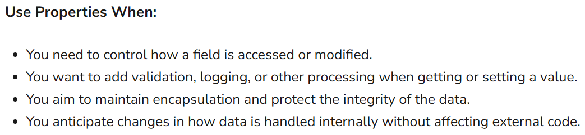

## :fireworks: Back-Field가 있는 property가 확장될 때 IDE에서 warning을 덜 나타나기에   Back-Field와 함께 property를 사용한다.   configure inspection severity에서 Auto-Property 껐다.

  

## :fire: 3가지 형식의 property
#### :one: 일반 property
~~~c#
private int _number = 3;

public int Number
{
	get => _number;
	Number = _number;
}
~~~

 

#### :two: SerializeField property
~~~c#
[SerializeField] private Canvas _canvas;

public Canvas Canvas => _canvas;
~~~

 

#### :three: Xml의 property
~~~c#
private int _budget;
    
[XmlElement(ElementName = "Budget")]
public int Budget
{
	get => _budget;
	set => _budget = value;
}
~~~

  

## :fire: property를 남용하지 말고 필요할 때만 사용한다.   Property는 Field가 아닌 Method다.   Field 보다 조금이지만 overhead가 있을 수 밖에 없다.
> 저자는 생각보다 많은 사람들이 property를 필요 이상으로 남용한다는 것에 개인적으로 많이 놀랐다.

> Property는 메서드를 호출하는 것과 비교했을 때 성능상의 이점이 있는 것도 아니다.

  

## :fire: Property 사용 규칙   :one: get은 외부에서도 가능하지만 set은 내부에서만 가능하게 하고 싶을 때   :two: 값에 대한 변경사항과 유지보수가 필요할 만큼 중요한 멤버일 때
 

  

## :fire: 자식에서 초기화 해도 부모에 올바르게 Property의 값이 세팅된다. (가끔 헷갈림)
~~~c#

// Parent
public abstract class UIPopupBase : MonoBehaviour, IView
{
    protected EPopupKey _ePopupKey;
    public EPopupKey EPopupKey => _ePopupKey;
}

// Child
public class UIAlarmTimerPopup : UIPopupBase
{
    protected override void InitializeEPopupKey()
    {
        _ePopupKey = EPopupKey.AlarmTimerPopup; //여기서만 초기화
    }
}

// 외부
public abstract class UIPresenterBase : PresenterBase
{
    private UIPopupBase _popupBase;

    public override void Initialize(IView view)
    {
        base.Initialize(view);

        _popupBase = _view as UIPopupBase;
        ExceptionHelper.CheckNullException(_popupBase, "_popupBase is null");
    }

    protected void Close()
    {
        RequestUpdateLivedPopup(_popupBase.EPopupKey);
    }
}
~~~
- RequestUpdateLivedPopup(_popupBase.EPopupKey) 에서 올바르게 EPopupKey.AlarmTimerPopup로 초기화되어 params를 넘긴다.
> 부모 클래스의 필드는 자식 인스턴스 안에도 그대로 포함된다.

> 자식에서 초기화만 제대로 하면, 부모 타입으로 참조해도 값은 잘 보인다.

> 메서드는 virtual/override로 흐름이 명확한 반면, 필드는 초기화 순서만 조심하면 끝이다.

  

## :fire: Unity에서는 BackField를 SerializeField로 만들고 Property를 만든다.

  

## Reference
- [link](https://medium.com/@vsiromin/understanding-auto-implemented-properties-in-c-ed1b01620548)