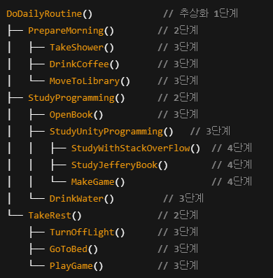

## :fire: 추상화는 '메서드 단계의 추상화(method level of abstraction)'와 '클래스 수준의 추상화(class level of abstraction)'가 있다.   다음 블록에 두 예제를 적어 놓았으니 코드를 필요시에 읽어라.
- **level == 단계**  ->  이해 쉬움

  

## :fire: [메서드 단계에서의 추상화]    크고 복잡한 메서드를 하나의 기능만 수행하는 작은 메서드 여러개로 쪼개면,   세부 구현들은 자연스럽게 안으로 감춰져 흐름이 단순해지고 명확해 진다.    이렇게 쪼개진 메서드들은 자연스럽게 추상화 수준의 차이를 가지게 되며,   클래스 안의 메서드들도 자연스럽게   "흐름을 보여주는 메서드(=상위 추상화 단계의 메서드)"와   "실제로 동작하는 메서드(=하위 추상화 단계의 메서드)"로 나뉘게 된다.

~~~c#
// 모든 메서드의 바디에는 구현이 있다고 가정한다.
void Main()
{
	DailyRoutinePlanner myDailyRoutinePlanner = new DailyRoutinePlanner();
	myDailyRoutinePlanner.DoDailyRoutine();
}

public class DailyRoutinePlanner
{
	public void DoDailyRoutine()
	{
		PrepareMorning();
		StudyProgramming();
		TakeRest();
	}
	public void PrepareMorning()
	{
		TakeShower();
		DrinkCoffee();
		MoveToLibrary();
	}

	public void TakeShower() { }
	public void DrinkCoffee() { }
	public void MoveToLibrary() { }
	
	public void StudyProgramming()
	{
		OpenBook();
		StudyUnityProgramming();
		DrinkWater();
	}

	public void OpenBook() { }
	
	public void StudyUnityProgramming()
	{
		StudyWithStackOverFlow();
		StudyJefferyBook();
		MakeGame();
	}

	public void StudyWithStackOverFlow() { }
	public void StudyJefferyBook() { }
	public void MakeGame() { }

	public void DrinkWater(){}
	
	public void TakeRest()
	{
		TurnOffLight();
		GoToBed();
		PlayGame();
	}
	
	public void TurnOffLight(){}
	public void GoToBed(){}
	public void PlayGame(){}
}
~~~
- 메서드가 짧다 → 하나의 기능을 한다 → 좋은 이름 짓기가 쉽고 빠르다 → 메서드를 이름만 보고 이해 가능
- :link: [비슷한 고민을 한 StackOverFlow](https://softwareengineering.stackexchange.com/questions/110933/how-to-determine-the-levels-of-abstraction)
> 큰 메서드를 작은 메서드 여럿으로 쪼개다 보면 종종 작은 클래스 여럿으로 쪼갤 기회가 생긴다.

  

## :fire: '클래스 수준의 추상화' : 클래스 쪼개기?????
~~~c#
void Main()
{
	MyDailyRoutine myDailyRoutinePlanner = new MyDailyRoutine();
	myDailyRoutinePlanner.DoDailyRoutine();
}

public class MyDailyRoutine
{
	private MorningRoutine morningRoutine;
	private StudyRoutine studyRoutine;
	private NightRoutine nightRoutine;
	
	public MyDailyRoutine()
	{
		morningRoutine = new MorningRoutine();
		studyRoutine = new StudyRoutine();
		nightRoutine = new NightRoutine();
	}
	
	public void DoDailyRoutine()
	{
		morningRoutine.DoRoutine();
		studyRoutine.DoRoutine();
		nightRoutine.DoRoutine();
	}
}

public abstract class Routine()
{
	public abstract void DoRoutine();
}

public class MorningRoutine : Routine
{
	public override void DoRoutine()
	{
		PrepareMorning();
	}
	
	public void PrepareMorning()
	{
		TakeShower();
		DrinkCoffee();
		MoveToLibrary();
	}

	public void TakeShower() { }
	public void DrinkCoffee() { }
	public void MoveToLibrary() { }
}

public class StudyRoutine : Routine
{
	public override void DoRoutine()
	{
		OpenBook();
		StudyUnityProgramming();
		DrinkWater();
	}
	public void OpenBook() { }

	public void StudyUnityProgramming()
	{
		StudyWithStackOverFlow();
		StudyJefferyBook();
		MakeGame();
	}

	public void StudyWithStackOverFlow() { }
	public void StudyJefferyBook() { }
	public void MakeGame() { }

	public void DrinkWater() { }
}

public class NightRoutine : Routine
{
	public override void DoRoutine()
	{
		TakeRest();
	}

	public void TakeRest()
	{
		TurnOffLight();
		GoToBed();
		PlayGame();
	}

	public void TurnOffLight() { }
	public void GoToBed() { }
	public void PlayGame() { }
}
~~~

  

## :fire: 참고 서적
- 클린 코드
- 객체 지향의 사실과 오해