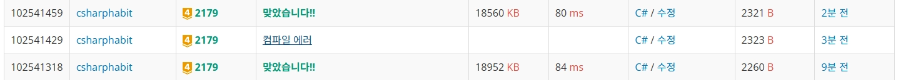

## 임시!

## String의 일부를 조회할 때 ReadonlySpan<Char>를 사용한다.
string 객체에 대해서 .AsSpan(startIdx , length)으로 생성한다.

---

- **Span을 사용하는 조건**
    - 연속된 메모리 데이터
    - 크기가 변하지 않는 데이터
    - 데이터가 immutable하면 ReadonlySpan<T>로 사용된다.
- **String과 Array는 위의 조건을 만족한다. List는 이를 만족하지 못한다.
하지만 String에 대해서만 AsSpan()을 사용해서 생성할 것 이다.**
    - Span<T> 또는 ReadonlySpan<T>에서 Slice(idx, len)를 사용한다. 이 메서드는 Span<T> 또는 ReadonlySpan<T>를 return 한다.
    - ToString()의 결과가 ReadonlySpan<Char>만 올바르게 나온다.
        - ReadonlySpan<Char>는 string의 AsSpan()의 return Type.
    
        
- **.AsSpan()으로 생성한 ReadonlySpan<T>와 문자열 비교하기 (코테에선 까먹을 듯…)**
    - 비교할 문자열도 AsSpan으로 ReadonlySpan<T>로 만든다.
    - public static bool SequenceEqual<T>(this ReadOnlySpan<T> span, ReadOnlySpan<T> other) where T : IEquatable<T>  을 이용한다.
    
    ```csharp
    var shortStr = "IOIOI";
    var shortStrSpan = shortStr.AsSpan();
    var shortStrLen = shortStr.Length;
    
    var longStr = "OOIOIOIOIIOII";
    var longStrLen = longStr.Length;
    
    var endIdx = longStrLen - shortStrLen;
    for (int idx = 0; idx <= endIdx; idx++)
    {
        var longStrSpan = longStr.AsSpan(idx, shortStrLen);
        if (shortStrSpan.SequenceEqual(longStrSpan))
        {
            Console.WriteLine($"{idx} 번째 : {longStrSpan}");
        }
    }
    
    // result
    2 번째 : IOIOI
    4 번째 : IOIOI
    ```
    
- **ToString()을 자주 사용하면 Span의 장점이 사라진다.**
    
    ```csharp
    foreach(var str in list)
    {
        int len = str.Length;
        var spanStr = str.AsSpan();
        for(int spanLen = 1; spanLen<=len; spanLen++)
        {
    		    //1. 아래 제출 결과
            var targetStr = spanStr.Slice(0,spanLen).ToString();
            
            //2. 위 제출 결과
            var targetStr = str.Substring(0, spanLen);
         }
     }
    ```
    
    
    
- **코드**
    
    ```csharp
    void Main()
    {
    	//1. String
    	string str = "abcd";
    	ReadOnlySpan<char> a = str.AsSpan();
    	a.Slice(2,2).ToString().Dump(); //cd를 출력
    	
    	//2. 
    	var arr = new int[6];
    	for(int i=0; i<6; i++)
    	{
    		arr[i] = i+1;
    	}
    	Span<int> b = arr.AsSpan();
    	b.Slice(3).ToString().Dump(); //System.Span<Int32>[3]를 출력
    	
    	foreach(var i in b.Slice(3))
    	{
    		// 가능하다.
    	}
    
    	List<int> list = new List<int>();
    	//list.AsSpan(); // 불가능
    }
    ```
    
    - List도 Static Method를 지원하지만 MS는 사용을 권고하지 않는다.
        - https://stackoverflow.com/questions/52476832/how-can-i-get-a-spant-from-a-listt-while-avoiding-needless-copies