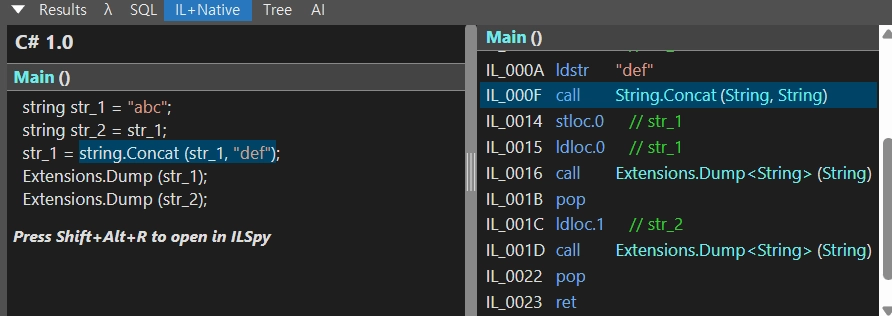

## :fire: String의 += 연산자는 Concat과 완전히 동일한 개념이다.   Concat은 문자열을 힙에 새로 생성한다.   그러므로 기존의 “abc”는 Immutable하다.
~~~c#
void Main()
{
    string str_1 = "abc";
    string str_2 = str_1;
    
    str_1 += "def";	
    
    str_1.Dump(); //abcdef
    str_2.Dump(); //abc
}
~~~

- str_1은 “def”를 concat 하면서 힙에 새로운 문자열 “abcdef”를 생성한다. 그 후 str_1의 참조를 “abcdef”로 변경한다.
- str_2는 여전히 “abc”를 참조하고 있기 때문에 immutable 하다. 만약 “abc”를 str_2가 참조하지 않았다면 GC대상이 된다.
> 다수의 string 객체가 하나의 문자열을 공유 할 수 있게 되어 시스템에서 필요로 하는 문자열의 개수를 줄여 메모리 사용량을 최소화할 수 있다*. (📔제프리)

  

## :bangbang: String 주의사항
#### :one: String과 string은 같다.

 

#### :two:$”{문자열 아닌 타입}”는 String.Format()과 동일하다.
- 내부에서 ToString()을 호출하기 때문에 O(n)이다.

 

#### :three: String은 new로 선언 하지 않는다.
> C#을 포함한 많은 프로그래밍 언어들이 String을 기본 타입으로 간주하는데, 컴파일러가 문자열 리터럴(literal)을 소스 코드상에서 직접 표현할 수 있도록 한다. 컴파일러는 리터럴 문자열을 모듈의 메타데이터 영역에 배치하고, 실행 시점에 이 메타데이터를 메모리에 로드한 후 참조하게 된다. C#에서는 String 객체를 만들기 위하여 리터럴 문자열을 생성자의 매개변수로 전달할 수 없다.

 

#### :four: 거의 모든 타입에 대해서 ToString()은 동작한다. 모든 수치 타입에 대해서는 Parse가 동작한다.
> Microsoft는 모든 타입들은 인스턴스의 값을 문자열로 나타내는 기능을 제공해야 했다. (📔제프리)
- System.Object에 정의되어 있고, System.ValueType → System.Object이므로 int나 char도 ToString()은 동작한다.
- Int32.Parse(string), Char.Parse(string)은 모두 동작한다. 다만, 타입의 수치 범위를 벗어나면 Exception이 발생한다.

  

## :fire: 문자열 인터닝 = 같은 문자열은 힙에 하나만 저장하고 해시테이블을 통해 하나만 존재하도록 관리한다.
~~~c#
void Main()
{
    // 같은 문자열이고, 컴파일러가 내부적으로 Intern을 호출한다.
    // Intern은 문자열 해시테이블에 있는지 확인하는 정적메서드
    string str1 = "abc";
    string str2 = "abc";
    
    if(str1.Equals(str2))
    {
        "same string".Dump();
    }
    
    if(object.ReferenceEquals(str1,str2))
    {
        "ref same string".Dump();
    }
}
    
// same string
// ref same string
~~~
> 메모리에 동일한 문자열이 여럿 있을 경우 문자열은 변경 불가능한 타입이므로 메모리 낭비가 된다. (📔제프리)