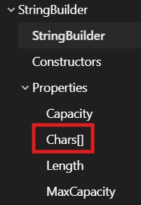
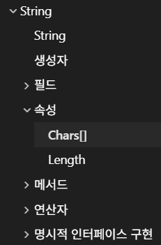

## :fire: 문자열 가공(추가, 삽입, 삭제, 덮어쓰기)은 StringBuilder를 사용하는 것이 적절하다.   :fire: 반복적인 가공 상황에서 메모리와 시간 측면 모두에서 StringBuilder가 효율적이다.
- String은 immutable이므로, 문자열을 가공할 때마다 새로운 문자열이 생성되고 이 과정에서 기존 문자열 길이만큼의 복사가 발생한다.
- 따라서 +=를 연속적으로 사용하면, 매 단계마다 누적된 길이만큼 다시 순회하게 되어 전체 시간 복잡도는 O(n²)이 된다.
- StringBuilder는 내부 버퍼를 유지하며 기존 결과를 반복해서 복사하지 않는다.
- 연속적인 append에서는 추가되는 문자 수만큼만 처리되므로 전체 시간 복잡도는 O(n)으로 유지된다.
  - :airplane:[Why StringBuilder.append time complexity is O(1)](https://stackoverflow.com/questions/56799064/why-stringbuilder-append-time-complexity-is-o1)
  - ✈️[Use always a stringBuilder!](https://steven-giesel.com/blogPost/480539f1-98ab-45bc-ba24-9ccec65b459a)

   

## :fire: String과 StringBuilder에서 각각의 element는 반드시 char 타입이다.   :fire: 둘의 Length도 같다.

  

## :bangbang: StringBuilder 주의사항
#### :one: StringBuilder 객체에 대해서 ToString()을 사용하면 O(n)의 복잡도를 갖는다.
> It varies between framework version; in older versions StringBuilder works on a string directly, so there is no additional cost in .ToString(): it just hands you the data directly (which can mean oversized, but it makes it work); so O(1).

> In newer framework version, it uses a char[] backing buffer, so now when you .ToString() it will probably need to copy 2 x Length bytes, making it O(N).
- 이 자료도 예전 내용이다. 어쨌든 Append()는 O(1)로 최적화가 되었고, 대신 ToString()은 O(n)이 되었다.  

 

#### :two: StringBuilder로 할 수 없는 문자열 정렬은 List<string>으로 변화해서 사용한다.
~~~c#
var nameList = new List<string>();
var sb = new StringBuilder();
        
foreach(var name in mySet_1)
{
    if(mySet_2.Contains(name))
    {
        nameList.Add(name);
    }
}
nameList.Sort();

foreach (var name in nameList)
{
    sb.AppendLine(name);
}
~~~

     

#### :three: 매우 긴 문자열을 가공하는 경우는 StringBuilder의 Capacity를 크게 초기화하고 시작한다.
- StringBuilder는 일정하게 메모리를 할당해서 실제보다 더 많은 메모리를 사용한다. 
- 이 때 들어가는 게 Capacity 개념이다.
~~~c#
StringBuilder sb1 = new StringBuilder("abc");
StringBuilder sb2 = new StringBuilder("abc", 16);

Console.WriteLine();
Console.WriteLine("a1) sb1.Length = {0}, sb1.Capacity = {1}", sb1.Length, sb1.Capacity)

// a1) sb1.Length = 3, sb1.Capacity = 16 
~~~
> Gets or sets the maximum number of characters that can be contained in the memory allocated by the current instance.

 

#### :four: StringBuilder는 IEnumerable Generic (및 IEnumerable)를 구현하지 않기 때문에   직접적인 foreach나 LINQ 사용이 불가능하다.   반면에, String은 IEnumerable<char>를 구현하고 있으므로   foreach와 LINQ 사용이 가능하다.**
> The string value of this instance is set to [String.Empty](https://learn.microsoft.com/en-us/dotnet/api/system.string.empty?view=net-9.0#system-string-empty), and the capacity is set to the implementation-specific default capacity.*

  

## :fireworks: StringBuilder 주요 메서드
- **Append(모든 타입)**
  - 문자열 뒤에 추가

 

- **AppendLine(string 만)은 string 타입이 아니면 사용하지 않는다.**
  - 개행이 필요하면 다음과 같이 사용한다.
~~~c#
int a = 3;
str.Append(a).Append('\n');  
~~~    

 

- **Insert(idx, 모든 타입)**
  - 원하는 인덱스에 문자 추가하고, 이는 자동으로 문자열화 된다. → 파싱이 필요없다.
    > Inserts the string representation of a specified 32-bit signed integer into this instance at the specified character position.

 

- **Remove(idx, 개수)**
  - 원하는 위치부터 원하는 만큼 문자 제거
  - List<T>의 RemoveAt과 비슷해서 헷갈리는데 만약 까먹으면 순회해서 추가하는 방식으로 해야지.

 

- **범위내의 Index를 통해 char를 덮어쓸 수 있다.**
  - 범위는 Capacity가 아닌 Length를 기준으로 한다.
~~~c#
void Main()
{
    var sb = new StringBuilder();
    sb.Append("abc");
    
    sb[1] = 'e';
    
    sb.Dump();	
}
~~~ 
