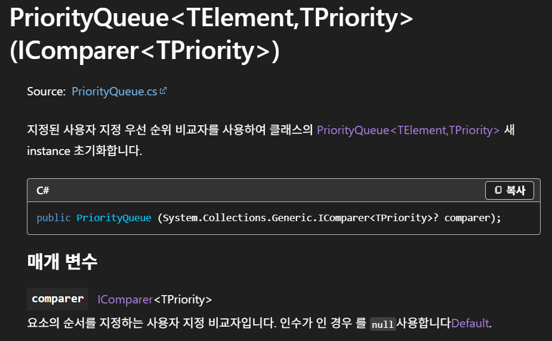
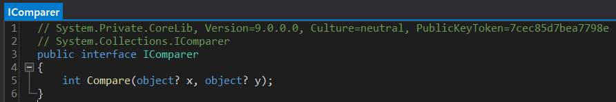

## :fire: PriorityQueue는 Custom Sorted Queue다.   :fire: 정렬된 Queue는 시간복잡도 성능이 좋아서 유용하게 사용된다.
- 시간 순서대로 정렬된 list와 priorityQueue를 비교해본다.
  - List는 맨 앞 원소를 사용하고 제거할 때 O(n)의 RemoveAt()을 사용한다.
  - PriorityQueue는 맨 앞 원소를 사용하고 제거할 때 O(log n)의 Dequeue()을 사용한다.
    - PriorityQueue는 트리 구조기 때문이다.
    - While(pq.Count > 0)을 이용하면 조건에 맞는 첫 원소를 계속 검사 할 수 있다.

  

## :fireworks: 아래에서 두 가지 PriorityQueue를 알아본다.

## :one: api 대신 List의 Sort와 Queue를 이용한 방식
- list.Sort() 이후, Queue에 넣기
- list.Sort()는 O(nlogn)이고, Queue에 넣는 것은 O(n)이므로 총 복잡도는 O(nlogn + n)이 된다.
- 그러나, 원소의 추가와 삭제에 대응하지 못한다.

 

## :two: System.Collections.Generic.PriorityQueue를 이용한 방식
#### [MSDN]

 

#### [TPriority Generic을 사용하는 Compare 메서드를 구현해야 한다.]
- PriorityQueue는 Custom Sorted Queue이다.
- 그러므로, IComparer가 부여한 Compare의 책임을 구현해야 한다. 

    ~~~c#
    // MSDN CODE

    // This class is not demonstrated in the Main method
    // and is provided only to show how to implement
    // the interface. It is recommended to derive
    // from Comparer<T> instead of implementing IComparer<T>.
    public class BoxComp : IComparer<Box>
    {
        // Compares by Height, Length, and Width.
        public int Compare(Box x, Box y)
        {
            if (x.Height.CompareTo(y.Height) != 0)
            {
                return x.Height.CompareTo(y.Height);
            }
            else if (x.Length.CompareTo(y.Length) != 0)
            {
                return x.Length.CompareTo(y.Length);
            }
            else if (x.Width.CompareTo(y.Width) != 0)
            {
                return x.Width.CompareTo(y.Width);
            }
            else
            {
                return 0;
            }
        }
    }
    ~~~
- Box가 TPriority가 된다.
- return 1 , return 0 , return -1로 구현해도 충분하다.