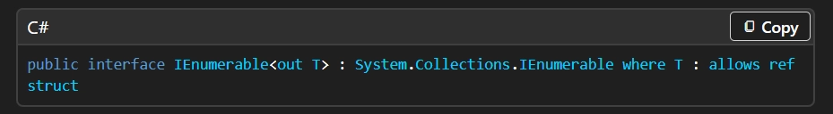
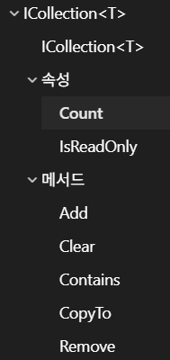

## :fire: Container는 7개만 알면 된다. 
1. **Array<T>**
2. **List<T> / HashSet<T> / Dictionary<T>**
3. **Stack<T> / Queue<T> / PriorityQueue<T>**
- 원래 6개였는데 priorityQueue도 추가 

  

## :fire: PriorityQueue를 제외한 6개의 Container는 모두 IEnumerable<T>를 구현한다.
- **foreach가 가능하다.**
    - IEnumerable<T> 타입으로 선언했다면 foreach로 순회하는 게 기본이다.
~~~c#
    // 1. foreach
    foreach (var x in collection)
    {
        // ...
    }
    
    // 2. 컴파일 된 foreach
    var enumerator = collection.GetEnumerator();
    while (enumerator.MoveNext())
    {
        var x = enumerator.Current; // ← 여기서 복사됨
    }
    
    // 3. 불가능 코드 (당연한)
    var list = new List<int>();
    list.Add(1);
    list.Add(2);
    
    foreach(var i in list)
    {
    	i += 1; // 컴파일 에러
    }
~~~

 

- **LINQ가 가능하다.**
  - LINQ는 IEnumerable<T>를 this로 하는 확장메서드의 집합이므로 IEnumerable<T>를 구현하는 모든 Container에 대해서 사용이 가능하다.
  - > The methods in this class provide an implementation of the standard query operators for querying data sources that implement [IEnumerable<T>](https://learn.microsoft.com/en-us/dotnet/api/system.collections.generic.ienumerable-1?view=net-10.0). The standard query operators are general purpose methods that follow the LINQ pattern and enable you to express traversal, filter, and projection operations over data in any .NET-based programming language.

  

## :fire: List<T> , HashSet<T> , Dictionary<K,V>는 ICollection<T>를 구현한다.   :fire: Stack<T> , Queue<T>는 IReadonlyCollection<T>를 구현한다.
- **ICollection 과 ICollection Generic는 서로 다르다.**
- **IEnumerable과 IEnumerable Generic은 계승 관계다.**
> ICollection<T> seems like ICollection, but it’s actually a very different abstraction. We found that ICollection was not very useful. At the same time, we did not have an abstraction that represented an read/write non-indexed collection. ICollection<T> is such abstraction and you could say that ICollection does not have an exact corresponding peer in the generic world; IEnumerable<T> is the closest.
- :airplane: [Why doesn't ICollection<T> implement ICollection?](https://stackoverflow.com/questions/2353346/why-doesnt-icollectiont-implement-icollection)

  

## :fireworks: IEnumerable 참고

~~~c#
public class List<T> : 
System.Collections.Generic.ICollection<T>, 
System.Collections.Generic.IEnumerable<T>, 
System.Collections.Generic.IList<T>, 
System.Collections.Generic.IReadOnlyCollection<T>, 
System.Collections.Generic.IReadOnlyList<T>, 
System.Collections.IList

public class Queue<T> : 
System.Collections.Generic.IEnumerable<T>, 
System.Collections.Generic.IReadOnlyCollection<T>, 
System.Collections.ICollection
~~~
    
  

## :fire: ICollection<T>를 구현해야 Count, Clear(), Contains(T), Add(T), Remove(T)를 사용 할 수 있다.

- Dictionary는 ContainsKey(T).
- HashSet 과 Dictionary는 Remove(key)인게 이 둘은 인덱스 개념이 없다.
- property로 저장하고 있기 때문에 O(1)이다.
