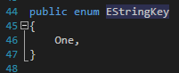
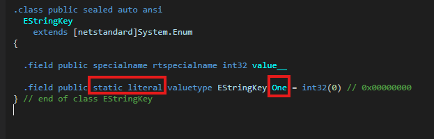

## :fire: Enum Type은 Class 밖에 선언하는 것이 일반적이다.
> Enums are types, just like classes. When you declare an enum inside a class, it's just a nested type. A nested enum just hides other enums with the same name that are declared in outer scopes, but you can still refer to the hidden enum through its fully qualified name (using the namespace prefix, in your example).

> The decision whether to declare a top level enum or a nested enum depends on your design and whether those enums will be used by anything other than the class. You can also make a nested enum private or protected to its enclosing type. :star:<ins>**But, top level enums are far more common.**</ins>
- Top level enums가 class 밖에 선언하는 것을 의미한다.

  

## :fire: Enum은 Static처럼 사용된다.   :fire: IL로 까보면 알 수 있다.
- 
- 