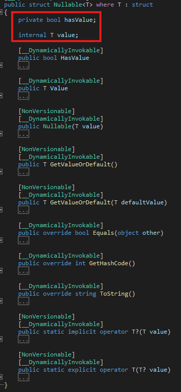
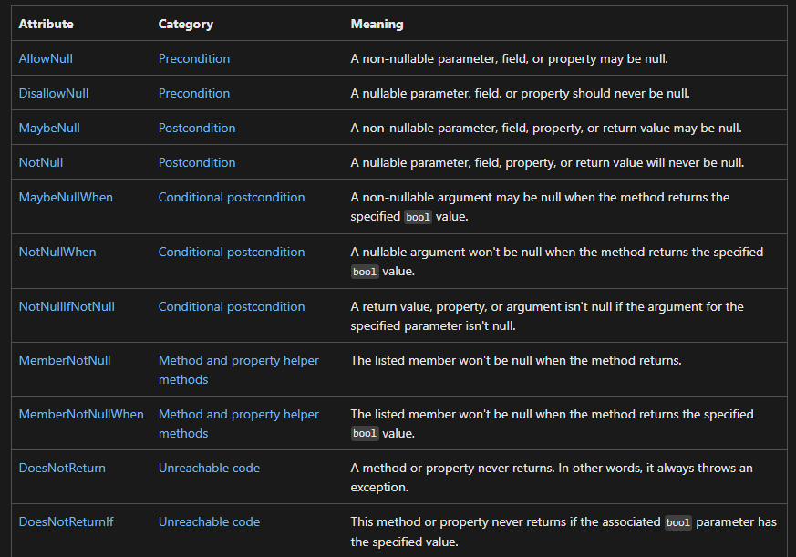

## :fireworks: Nullable Value Type 과 Nullable Reference Type은   모두 type에 ?을 붙이고, 이는 null을 허용함을 의미한다.

  

## :fire: Nullable Value Type은   2개의 필드 (bool hasValue 와 T value)를   들고 있는 struct다.

#### [실제 구현]

  
 :point_up_2: 누르면 코드가 나옵니다.  

- 

  

## :fire: int? == Int32? == Nullable<int> == Nullable<Int32> 

  

## :fire: MSDN Nullable Attribute
- 

  

## :fire: Nullable Reference Type은 NullReferenceException을 줄여준다.
> Nullable reference types are a group of features that minimize the likelihood that your code causes the runtime to throw System.NullReferenceException.
- 그러나 줄이는 게 과연 좋을까?

  

## :fire: UnityEngine.Object를 상속 받은 Instance는 무언가를 참조하고 있어도 C# 레벨에서는 ==null이 true일 수 있다.
> For types that inherit from <ins>UnityEngine.Object</ins>, Unity uses a custom version of the C# equality and inequality operators. This means the null check in the previous example (myGameObject == null) can evaluate true (and conversely myGameObject != null can evaluate false) even if myGameObject technically holds a valid C# object reference. This happens in two cases:
  - 보통 View에서 이용되는 UnityEngine.Object의 상속 객체에 대해 null을 생각해보아야 한다.
  -  
#### :one: Fake-null일 때
> The object can be a so-called “fake null” or placeholder object which Unity uses in the Editor only to populate uninitialized MonoBehaviour fields. These objects store useful debugging information to help you locate the source of these fields if you try to reference them.

#### :two: Destroy 시에 C++ 레벨의 객체는 즉시 파괴 되었지만 C# 레벨의 객체는 아직 남아서 GC 대기 상태다.
> The object can be a managed (C#) object which has not yet been garbage collected but which should be considered null because the unmanaged (C++) counterpart object has been destroyed.
~~~c#
//fieldObjectSparrow는 view 객체고, Monobehaviour를 상속 받기 때문에 UnityEngine.Object 계열이다.
Destroy(fieldObjectSparrow); 

Debug.Log(fieldObjectSparrow == null); 
~~~
- GameObject를 파괴 시키지만 fieldObjectSparrow == null이 True가 될 수 있다. 
- Unity의 공식 문서에 따르면, Destroy 직후 C++의 객체는 

