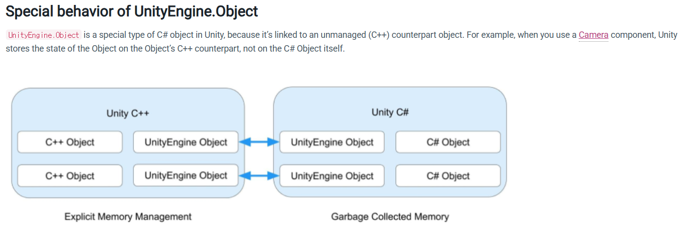
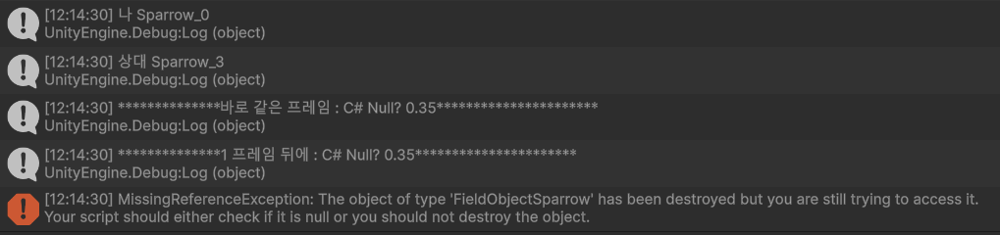

## :fireworks: Nullable Value Type 과 Nullable Reference Type은   모두 type에 ?을 붙이고, 이는 null을 허용함을 의미한다.

  

## :fire: Nullable Value Type은   2개의 필드 (bool hasValue 와 T value)를   들고 있는 struct다.

#### [실제 구현]

  
 :point_up_2: 누르면 코드가 나옵니다.  

- 

  

## :fire: int? == Int32? == Nullable<int> == Nullable<Int32> 

  

## :fire: MSDN Nullable Attribute
- 

  

## :fire: Nullable Reference Type은 NullReferenceException을 줄여준다.
> Nullable reference types are a group of features that minimize the likelihood that your code causes the runtime to throw System.NullReferenceException.
- 그러나 줄이는 게 과연 좋을까?

  

## :fireworks: Unity에서 UnityEngine.Object를 상속 받은 instance에서 발견할 수 있는   fake-null을 알아보자. 
#### :one: fake-null이란, Unity 내부(C++)에서는 이미 파괴되어 없지만 C# 객체는 살아 있는 상태를 말한다.   다시 말해, Unity에서 == null은 true인데 ?.은 false가 나오는 상태다.   :fire: 원인은 UnityEngine.Object를 상속 받는 instance에 대해 사용하는 '=='은 오버로딩 되어 있기 때문이다.
> For types that inherit from UnityEngine.Object, Unity uses a <ins>custom version</ins> of the C# equality and inequality operators. This means the null check myGameObject == null can evaluate true (and conversely myGameObject != null can evaluate false) even if myGameObject technically holds a valid C# object reference.

 

#### :two::fire:'==null'은 C++ Native Object 레벨의 null 검사고, '?.'은 C# 레벨의 null 검사다.  :fire: Destroy 하면 그 즉시(같은 프레임)는 '== null'이 false고   1 프레임 뒤에 '== null'은 true가 된다.  :fire: 하지만 GC.collect가 되기 전 까지 ?.은 계속 true로 통과된다.  :fireworks: 아래를 읽어봐야 한다.
~~~c#
// Unity API
public static bool operator ==(Object x, Object y) => Object.CompareBaseObjects(x, y);

private static bool CompareBaseObjects(Object lhs, Object rhs)
{

  // 1. 일단 null인지 검사
  bool flag1 = (object) lhs == null;
  bool flag2 = (object) rhs == null;

  // 2. 함수명 부터 IsNativeObjectAlive -> C++ Native Object의 생존 검사
  if (flag2 & flag1)
    return true;
  if (flag2)
    return !Object.IsNativeObjectAlive(lhs);
  return flag1 ? !Object.IsNativeObjectAlive(rhs) : lhs.m_InstanceID == rhs.m_InstanceID;
}
~~~
- 

 
- Destroy()는 1 프레임 뒤에 게임 오브젝트를 제거하므로 C++ 레벨에서는 null이 된다. 그래서 MissingReferenceException이 발생한다.
  > The object is not immediately destroyed. Actual object destruction is delayed until after the current Update loop, but before rendering.
- 하위 컴포넌트(script 포함)도 같은 프레임에 제거 된다.
  > If the object is a component, only that component is removed and destroyed. If the object is a GameObject, the GameObject, all its components, and all its transform children are destroyed together.

~~~c# 
//test
if (enumKey == 3)
{
  Debug.Log($"나 {name}");
  var otherSparrow = _fieldObjectManager.GetFirstSparrow(_instanceID);

  Debug.Log($"상대 {otherSparrow.name}");

  Destroy(otherSparrow.gameObject);

  // 바로 같은 프레임이라 아직은 native Object가 null이 아니다.  
  if (otherSparrow.gameObject == null)
  {
    Debug.Log("**************바로 같은 프레임 : Fake-Null?**********************");
  }
  Debug.Log($"**************바로 같은 프레임 : C# Null? {otherSparrow?.DefaultSparrowSpeed}**********************");

  // 1 프레임 뒤에 재호출
  Observable.TimerFrame(1).Subscribe(_ =>
  {
    Debug.Log($"**************1 프레임 뒤에 : C# Null? {otherSparrow?.DefaultSparrowSpeed}**********************");
    
    if (otherSparrow.gameObject == null) // MissingReferenceException
    {
      Debug.Log("**************1 프레임 뒤에 Fake-Null?**********************");
    }
  });
}
~~~
- 
- C# 레벨에서 null을 검사하는 ?.에서는 프레임 상관없이 모두 null이 아니라고 판정하고 있다. 그래서 otherSparrow?.DefaultSparrowSpeed가 출력되고 있다.
- :link:[= null'과 'unreachable'은 명백히 다른 개념이다.unreachable은 인스턴스에 대한 '모든' 참조가 null이 되어야 한다.참조가 100개 되어 있는데, 고작 1개를 null로 초기화 한다고 unreachable이 되지 않는다](https://github.com/pjw960316/Unity_Client_Programmer/blob/main/1.%20Unity%20Programming/C%23%20Ver_2/21%EC%9E%A5_The%20Managed%20Heap%20and%20Garbage%20Collection.md#fire--null%EA%B3%BC-unreachable%EC%9D%80-%EB%AA%85%EB%B0%B1%ED%9E%88-%EB%8B%A4%EB%A5%B8-%EA%B0%9C%EB%85%90%EC%9D%B4%EB%8B%A4--unreachable%EC%9D%80-%EC%9D%B8%EC%8A%A4%ED%84%B4%EC%8A%A4%EC%97%90-%EB%8C%80%ED%95%9C-%EB%AA%A8%EB%93%A0-%EC%B0%B8%EC%A1%B0%EA%B0%80-null%EC%9D%B4-%EB%90%98%EC%96%B4%EC%95%BC-%ED%95%9C%EB%8B%A4--%EC%B0%B8%EC%A1%B0%EA%B0%80-100%EA%B0%9C-%EB%90%98%EC%96%B4-%EC%9E%88%EB%8A%94%EB%8D%B0-%EA%B3%A0%EC%9E%91-1%EA%B0%9C%EB%A5%BC-null%EB%A1%9C-%EC%B4%88%EA%B8%B0%ED%99%94-%ED%95%9C%EB%8B%A4%EA%B3%A0-unreachable%EC%9D%B4-%EB%90%98%EC%A7%80-%EC%95%8A%EB%8A%94%EB%8B%A4)