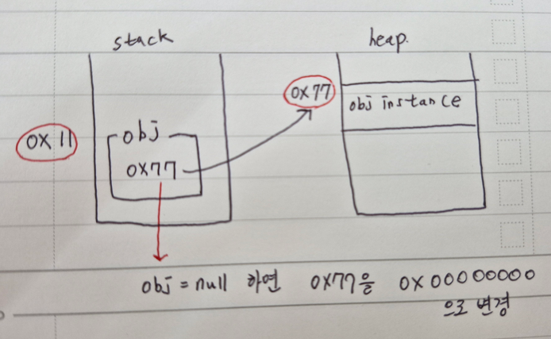

## :fire: 결론부터 적으면, C#은 Managed Code기 때문에   GC를 개발자가 컨트롤 하기 쉽지 않다고 생각한다.   GC 친화적인 코딩 방식 정도만 알고 넘어가자.
- null로 끊는다고 메모리가 확보되지는 않는다는 것
- GC 친화적인 방법 코딩이 그나마 내가 실천할 수 있다
  - object pooling 
  - [LINK](https://www.reddit.com/r/dotnet/comments/1b95sam/how_to_write_c_to_avoid_any_gc_pauses/)

  

## :fire: Managed Heap을 CLR이 관리하는 기법을 알면 GC의 필요성을 이해할 수 있다.   :fire: GC가 죽여야 할 객체를 판단하는 근거.
- **구시대 방식 : Reference Counting**
  > 객체는 자신이 참조 되는 횟수를 기록하는 필드를 가지고 있어서 프로그램 내에 <ins>얼마나 많은 부분이 해당 객체를 참조</ins>하고 있는지를 기록한다.
  - 자식 클래스의 멤버로 부모 클래스를 갖고 있으면 참조가 +1이 되므로 0이 되지 않아 Circular Reference가 일어나서 메모리에서 해제되지 않는 문제가 있다
- **C# 방식 : Reference Tracking**
  - Root
    - GC가 객체 생존 여부를 판단하는 최초의 기준점이 되는 Reference Type의 변수.
    - 무조건 reference Type이다.
    - 새로운 변수가 아닌 내가 작성한 코드에 있는 Reference Type 변수이다.
  - Mark
    - 아래의 예제에서 unreachable을 이해하면 된다.

  

## :fire: Heap Memory에서 해제되는 정밀한 시점 : GC가 동작했을 때
#### [예제]
~~~c#
class Test
{
	public int num;
}

class Program
{
	static void Main()
	{
		Test obj = new Test();
		obj.num = 10;

		obj = null;  //1번 시점 : 참조 끊기
		
		GC.Collect(); //2번 시점 : GC 동작
	}
}
~~~
- Test obj = new Test()에서 주소는 사실 2개가 존재한다.
  - 첫 번째 주소 = heap 주소 : obj의 인스턴스가 실제로 저장된 Heap 메모리의 주소값. (예제의 0x77)
  - 두 번째 주소 = stack 주소 : 첫 번째 주소의 값을 stack의 변수에 저장하는 데, 이 때 stack에 생기는 주소 저장 필드의 주소값. (예제의 0x11)
  -  
- 예제 코드의 1번 시점에 obj는 **unreachable(=접근 불가)** 상태가 되지만, 아직 managed heap에 obj의 인스턴스 정보가 저장되어 있다. 
- 예제 코드의 2번 시점이 되면 heap에서 해제된다. 

  

## :fire: '= null'과 'unreachable'은 명백히 다른 개념이다.   unreachable은 인스턴스에 대한 '모든' 참조가 null이 되어야 한다.   참조가 100개 되어 있는데, 고작 1개를 null로 초기화 한다고 unreachable이 되지 않는다.
#### [참조가 2개인 힙에 올라간 1개의 AAA 인스턴스]
~~~c#
void Main()
{
	AAA obj_1 = new AAA();
	AAA obj_2 = obj_1; //프로젝트에서는 협업이므로 이렇게 직관적으로 참조가 보이지 않는다. 
	
	obj_1 = null; // Dispose() 방식을 쓰지 않은 예제
}

public class AAA
{
	public int a;
	
	public AAA()
	{
		a = 12;
	}
}
~~~
- :bangbang: obj_1의 참조를 끊었으니 힙에 있는 AAA인스턴스는 GC가 수집되어 메모리가 해제되겠다고 생각하지만, 절대 그렇지 않다.
- AAA 인스턴스는 아직 obj_2로 reachable 하기 때문에 개발자가 'obj_1 = null'을 한다고 힙에서 AAA 인스턴스가 GC로 인해 해제 되지는 않는다.

  

## :fire: GC는 Managed Heap에 있는 ReferenceType만 관리한다.   :fire: 하지만... Class의 멤버로 있는 ValueType도 함께 관리된다.
  - ReferenceType인 인스턴스가 제거되면 당연히 인스턴스 전체가 메모리에서 사라지기 때문에, 내부의 valueType 멤버들(int, struct)도 **같이 제거** 된다.
    - Class의 valueType 멤버들도 managed heap에 있다.
  - 다시 말해, 클래스의 valueType 멤버가 독립적으로 제거되는 경우는 알 수 없으나, 인스턴스가 삭제될 때 valueType 멤버는 당연히 같이 해제된다.
  
  

## :fireworks: 본문도 읽어야 한다.   :fire: Factory Manager를 통해 Instance들의 생성 및 해제를 관리한다.   :fire: 그렇게 하면, 명시적으로 Instance를 Terminate하여 Instance의 생명주기를 관리하고, GC를 유도 시킬 책임만 갖는 Manager를 사용할 수 있다.
~~~c#

// [Presenter Manager -> Factory Singleton Manager]
public void CreatePresenter<TPresenter>(IView view) where TPresenter : PresenterBase, new()
{
    var presenter = new TPresenter();
    presenter.Initialize(view);

    _livedPresenterHashSet.Add(presenter);
}

public void TerminatePresenter(PresenterBase presenter)
{
    if (_livedPresenterHashSet.Contains(presenter))
    {
        _livedPresenterHashSet.Remove(presenter);
    }
}

// [PresenterBase -> 모든 Presenter가 상속 받는 Base Class]
public void TerminatePresenter()
{
    _disposable?.Dispose();
    
    //refactor
    //_view와 _model의 null처리도 해줘야 하는가?
    
    _presenterManager.TerminatePresenter(this);
}
~~~

- Presenter가 아무에게도 참조되지 않는다면 Presenter는 GC 대상자가 된다. 그러므로 Presenter의 Field에 대해서 memory 해제를 시작한다.
- Presenter 자체가 GC 결과 Unreachable이 되면 메모리에서 해제된다. 그러나 Presenter 내부의 어떤 필드가 1개라도 외부에서 참조가 된다면 그 필드는 살아 남는다. 대신 Presenter의 Field로 메모리에 존재하는 게 아니라 그냥 독립적인 녀석으로 메모리에 존재하게 된다.즉, Instance가 삭제되면 내부의 모든 Reference Type의 필드는 메모리가 해제된다는 틀린 개념이다.
- :star: 그러므로, 개발자는 구현 단계에서 필드를 캡슐화로 숨겨서 외부 참조를 막아야 하며, 외부에서 Getter를 통해 참조될 때, 이 녀석은 Instance가 해제되어도 살아 남을 수 있다는 생각을 해야 한다. 
- this = null 같은 코드는 애당초 불가능하고, 자신을 직접 null로 하는 코드는 C# GC 정책이 지원하지도 않는다. 그러므로, :star:자신은 자신이 들고 있는 필드에 대한 정리를 최선을 다해서 진행해야 한다.  

  

## :fire: unsafe 코드 블록 안에서는 C#의 안전한 메모리 관리 환경을 벗어나   C++과 비슷하게 포인터를 사용하여 메모리 주소를 직접 다룰 수 있다.   :fire: fixed 키워드를 이용하면 GC에 의해 인스턴스가 이동되지 않도록 고정한다.
- > unsafe 컨텍스트에서 코드는 포인터를 사용하고, 메모리 블록을 할당 및 해제하고, 함수 포인터를 사용하여 메서드를 호출할 수 있습니다.
- Static Utill Class에서 valueType의 주소를 찾을 때 두 키워드를 사용했다. 
