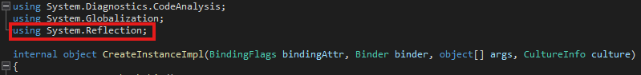
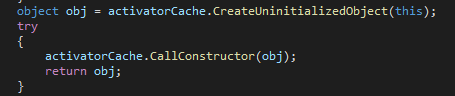

## :fire: Activator.CreateInstance로 Type을 Reflection으로 알게 되면   Type에 맞는 Instance를 생성할 수 있다.   :fire: 이 때 생성된 Instance는 내부적으로 생성자를 호출한다.   :fire: 하지만 Instance Property를 호출하지 않기 때문에 반드시 명시적으로 연결해준다.  
> 'Activator.CreateInstance' is a standard .NET reflection method used to create instances of types dynamically
- 
- 

~~~c#
// Note
// 공통로직을 담는 메서드가 굳이 IManager를 상속 받을 필요 없다.
public abstract class ManagerBase<T> where T : class, new()
{
    private static T _instance;

    public static T Instance
    {
        get
        {
            if (_instance == null)
            {
                _instance = new T();
            }

            return _instance;
        }
    }

    // Note
    // Activator를 통해 만든 Instance를 Singleton Instance에 초기화 시켜준다.
    public void ConnectInstanceByActivator(IManager instance)
    {
        _instance = instance as T;
    }
}
~~~