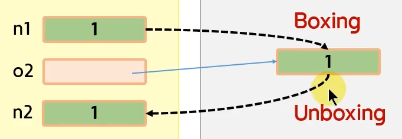

## :fire: Boxing & Unboxing 도식화 
#### [예제]
~~~c#
void Main()
{
	int n1 = 1;
	
    object o2 = n1; //boxing
	
    int n2 = (int)o2; //unboxing
}
~~~

## :fire: arrayList에 대한 오해
- The Value types can be converted to Object type, the most basic of types in C# or as the Microsoft states it as

## :fire: Boxing 된 녀석의 GetType()를 하면 UnBoxing 된 타입이 나온다.
#### [arrayList로 확인]
~~~c#
void Main()
{
	ArrayList arrayList = new ArrayList();
	int a = 1;
	int b = 2;
	int c = 3;
	arrayList.Add(a); //boxing
	arrayList.Add(b); //boxing
	arrayList.Add(c); //boxing
	
	arrayList[2].GetType().Dump();
}
//Int32
~~~

#### [참고만 하자 : Native C++의 .Net 런타임에서 Boxing을 확인하는 코드]

- Unbox 라는 키워드를 확인 할 수 있다.

> The answer is easy to spot. Prior to calling GetType() method, the boxing of the value type occurs (while the exact type is known to the compiler). Boxing operation allocates a new object on the heap, which layout is known to us already. In particular, it contains a proper MethodTable pointer.

 

> Hence GetType() is processed as usual. Since boxed object has a typical layout, we can use the standard Object.GetType() method which get object’s MethodTable and returns the :star:corresponding(상응하는) Type object.

- 

