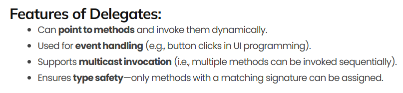

## :fire: Action은 delegate, Func도 delegate, lambda Expression도 delegate이다.   :fire: Instance 관점에서 method와 delegate는   행동이란 키워드로 같은 그룹에 묶을 수 있다. 
> A delegate is a type that represents **references to methods** with a particular parameter list and return type.

> 코드에서 람다 표현식을 사용하면 컴파일러는 자동으로 이를 델리게이트로 인지한다.

  

## :fire: Lambda Expression은 단 한 번만 호출되어야 하는 method일 때 사용하고,   그 외에는 method로 만든다.
- Lambda expression은 Delegate가 맞다.
  - > MSDN : Any lambda expression can be converted to a delegate type.
- 그러나 책에서 <ins>만약 해당 코드를 소스 코드에서 단 한 번만 참조하는 경우라면 메서드로 만드는 대신, 람다 표현식을 이용한다</ins> <-와 같이 약간의 혼용을 하고 있다. 
- 이는 결국 Lambda Expression은 delegate만 동작하는 느낌으로는 1회성 method로 생각해도 무방하다고 지금은 판단한다.
  - 그래서 위에서 method와 delegate를 행동이란 관점에서 묶는 것 이다.
- 당장 Lambda Expression을 컴파일러가 확인하면 Anonymous Function을 private method로 추가한다.
> Lambda Expression은 소스 코드 내에서 간접적인 접근 수준을 최소화 할 수 있는 장점이 있다.
  - private로 생성되는 이유도 일회성의 method로 사용하고, 외부에서 접근하거나 변경하지 않길 기대하는 것 이다.   

  

## :fire: Delegate를 사용하는 핵심 이유는   1. 다른 메서드의 인자로 사용하기 위함이다.   2. 여러 개의 메서드를 한 번에 호출하기 위함이다.
- Delegates are used to pass methods as arguments to other methods
- Delegate Chain
- 

  

