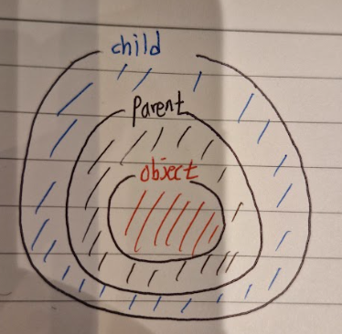

## :fire: 용어정리  :fire: Base Type - Derived Type : 상위 타입과 하위 타입  :fire: Declared Type - Instance Type : Complie Type & Runtime Type  :fire: () : Explicit Casting

  

## :fire: 컴파일 시점에는 타입 검사시에 Declared Type으로 한다. :fire: 런타임 시점에는 타입 검사시에 Instance Type으로 한다.
~~~c#
void Main()
{
	Fruit fruit = new Fruit();
	Fruit fruit2 = new Apple(); //Fruit = Declared Type , Apple = Instance Type
	Apple apple = new Apple();
	GreenApple greenApple = new GreenApple();
	Animal animal = new Animal();
	
	//Test(fruit); //InvalidCastException
	//Test(animal); //InvalidCastException
	Test(fruit2); //Success
	Test(apple); //Success
	Test(greenApple); //Success
}

public static void Test(object o)
{
	Apple apple = (Apple) o;
	apple.GetType().Dump();
}

public class Fruit{}
public class Apple : Fruit{}
public class GreenApple : Apple{}
public class Animal{}
~~~
- **컴파일 단계**
  - 컴파일러는 <ins>컴파일 단계에서 명시적 캐스팅이 성공할지 실패할지를 검증하지 않는다.</ins> 대신, 이 책임을 런타임에 넘긴다.
  - 컴파일러는 "캐스팅 구문이 문법적으로 유효하다"고 판단하여 에러 없이 컴파일을 허용합니다.
- **런타임 단계**
  - 런타임 단계에서 Test 메서드에 있는 Apple apple = (Apple) o;이 성공하려면, <ins>instance type이 Apple 타입이거나 Apple의 derived Class</ins>이어야 한다.
  - 그러므로 fruit2와 apple은 instance type이 Apple 타입이고, greenApple은 Apple 타입의 Dervied Class이므로 캐스팅에 성공한다.

  

## :fire: Is는 런타임 시점에  :fire: 검사 대상의 Instance Type과 검사 타겟의 Instance Type을 비교한다.  :fire: 검사 타겟의 Instance Type이 멤버와 메서드가 같거나 많으면 TRUE를 리턴한다.
~~~c#
void Main()
{
	Fruit fruit = new Fruit();
	Fruit apple_1 = new Apple();
	Apple apple_2 = new Apple();
	GreenApple apple_3 = new GreenApple();
	
	Test(fruit);
	Test(apple_1);
	Test(apple_2);
	Test(apple_3);
}

static void Test(Fruit inputObj)
{
	//inputObj(=검사 대상)가 Apple(=검사 타겟)과 같은 타입이거나
	//Apple의 Derived Type이면 TRUE를 리턴한다.
	if(inputObj is Apple) 
	{
		(inputObj.ToString() + " is Apple").Dump();
	}
	else
	{
		(inputObj.ToString() + " is not Apple").Dump();
	}
}

class Fruit {}
class Apple : Fruit{}
class GreenApple : Apple{}

/*
UserQuery+Fruit is not Apple
UserQuery+Apple is Apple
UserQuery+Apple is Apple
UserQuery+GreenApple is Apple
*/
~~~
- 제목에 적은 '검사 타겟의 Instance Type이 멤버와 메서드가 같거나 많으면 TRUE를 리턴한다.'은 '검사 타겟의 Instance Type과 같거나 검사 타겟의 Derived Instance Type이면 TRUE를 리턴한다.'와 같다.

  

## :fire: Declared Type <= Instance Type일 때만 암시적 할당 가능하다.  :fire: Declared Type > Instance Type인 경우, 명시적 캐스팅 필요하다.

- Object(Super Base Type) - Parent(Base Type) - Child (Derived Type)
- Parent는 Object의 모든 멤버와 메서드를 갖고, Child는 Parent의 모든 멤버와 메서드를 갖기 때문에 크기 비교를 다음의 그림과 같이 정리 가능하다.
~~~c#
void Main()
{
	Object o1 = new Base(); // SUCCESS
	//Parent o2 = new Object(); // Compile ERROR : cannot implicitly convert type 'object' to 'Base'
	Object o3 = (Base) o1; // SUCCESS -> 명시적 캐스팅 (Explicit Casting)
	
	if(o3 is Base) {"TRUE".Dump();} // TRUE
	if(o3 is Object) {"TRUE".Dump();} // TRUE
}

class Base { }
~~~
  

## :fire: Instance Type이 Base Type인 객체를 :fire: Derived Type으로 Explicit Casting을 시도할 때 :fire: Runtime Exception과 함께 실패한다.

#### [예외 발생 코드]
~~~c#
void Main()
{
    Object obj1 = new Object();
	Base obj2 = (Base)obj1; //Invalid_Cast_Exception
	Object obj3 = (Base)obj1; //Invalid_Cast_Exception
}

public class Base { }
public class Derived : Base { }
~~~
- Base Type 객체는 Dervied Type에서 정의한 고유 멤버를 포함하지 않으므로, Derived Type으로 변환 할 수 없다.
- 그러므로 is 또는 as를 이용해서 검사해야 한다.
  
#### [예외 처리 코드]
~~~c#
void Main()
{
    Object obj1 = new Object();
	
	if(obj1 is Base)
	{
		Base obj2 = (Base)obj1;
	}
	else
	{
		Base obj2 = null;
	}
}

public class Base { }
public class Derived : Base { }
~~~

  

## :fire: Explicit 3총사(is, as, 괄호) 중 나는 is만 사용할 것 이다.
- 가독성이 as 보다 좋다.
- 예외처리에서 is가 가장 안전하다고 판단한다.

  

## :fire: namespace는 큰 게임 프로젝트 안에 존재하는  :fire: 미니게임 프로젝트에서 독립성을 위해 사용하기 좋다고 생각한다.  :star: 또한, 모호성을 해결하기 위해 명시적으로 using OOOOO = OOOOO;로 적어주자. 

#### [Ambiguous Code]
~~~c#
using MiniGame; // 내가 2024년에 이렇게 적어놓고 사용했다고 가정하자. 아래 코드(using BigGame)가 없다면 잘 돌아간다.
using BigGame; // 2025년에 새로 들어온 개발자가 여기다가 이렇게 적으면 ambiguous가 발생한다. 

void Main()
{
	// 아래의 타입은 MiniGame.MusicController인지 BigGame.MusicController인지 알 수 없다.
	// CS0104: 'MusicController' is an ambiguous reference between 'MiniGame.MusicController' and 'BigGame.MusicController'
	MusicController musicController = new MusicController();
	musicController.Play();
}

namespace BigGame
{
	class MusicController
	{
		public void Play(){"BigGame".Dump();}
	}
}

namespace MiniGame
{
	class MusicController
	{
		public void Play(){"MiniGame".Dump();}
	}
}
~~~

#### [Explicit Code]
~~~c#
using MusicController = MiniGame.MusicController; //Explicit

void Main()
{
	MusicController musicController = new MusicController();
	musicController.Play();
}

namespace BigGame
{
	class MusicController
	{
		public void Play(){"BigGame".Dump();}
	}
}

namespace MiniGame
{
	class MusicController
	{
		public void Play(){"MiniGame".Dump();}
	}
}
//MiniGame
~~~

  

## :fire: using과 namespace 안에 직접 선언한 클래스의 우선순위는 직접 선언이 이긴다.
#### [System.String Class 와 내가 만든 String Class의 싸움]
~~~c#
using System;

void Main()
{
	char[] charArray = { 'H', 'e', 'l', 'l', 'o' };
	String str = new String(charArray);
	
	if(str.GetType() == typeof(System.String))
	{
		//str.Any();
		"My Custom class's priority is higher than using System".Dump();
	}
	else
	{
		str.Test();
	}
}

public class String
{
	public String(char[] param) {}
	
	public void Test()
	{
		"My Custom String's Test Method Called".Dump();
	}
}
// My Custom String's Test Method Called
~~~
  

## :question: using을 쓰면 컴파일러가 모든 using을 매번 검사하는 건 아니지만,  :question: 어쨌든 불필요한 검사가 있을 거임.

## :question: nullable
- 좀 더 깊게 공부할 것 5장~6장 보면서
~~~ c#
void Main()
{
	Test obj = new Test();
	
	int a = default;
	// psuedo : a = Func(Read Xml) 
	// Xml을 읽어오는 코드는 잘 구현했지만 기획 데이터가 null이라면 a = null이 된다.
	// 이를 방지하기 위해 받는 부분에서 ?를 이용해서 null이 올 수 있음을 적어준다.
	 		
	obj.CheckNullable(a);
}

public class Test
{
	public void CheckNullable(int? param){}
}
~~~
- 1. 그러면 언제나 ?를 써도 되는가? -> 성능? -> 콜이 많다면 고려해야 하지만, 콜이 적은 메서드면 굳이?
- 2. 받는 메서드의 매개변수에서 ?로 null 처리를 하는 게 맞지 않는가?
- 공부하고 제목 바꾸고 -> 그래서 ?를 이때 쓰자. 이렇게.