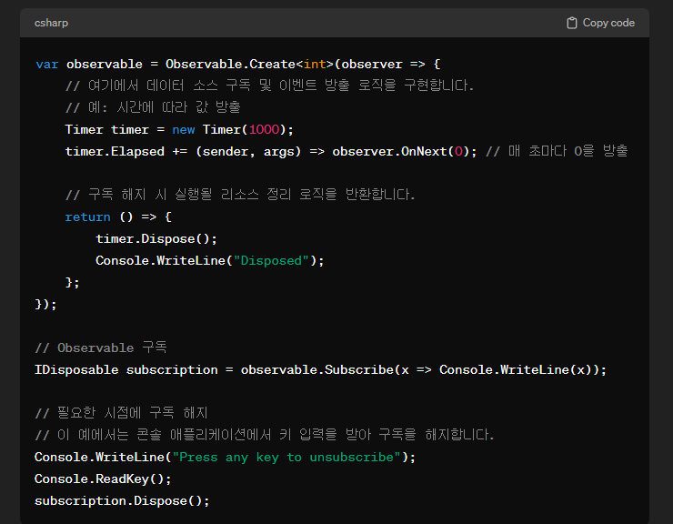
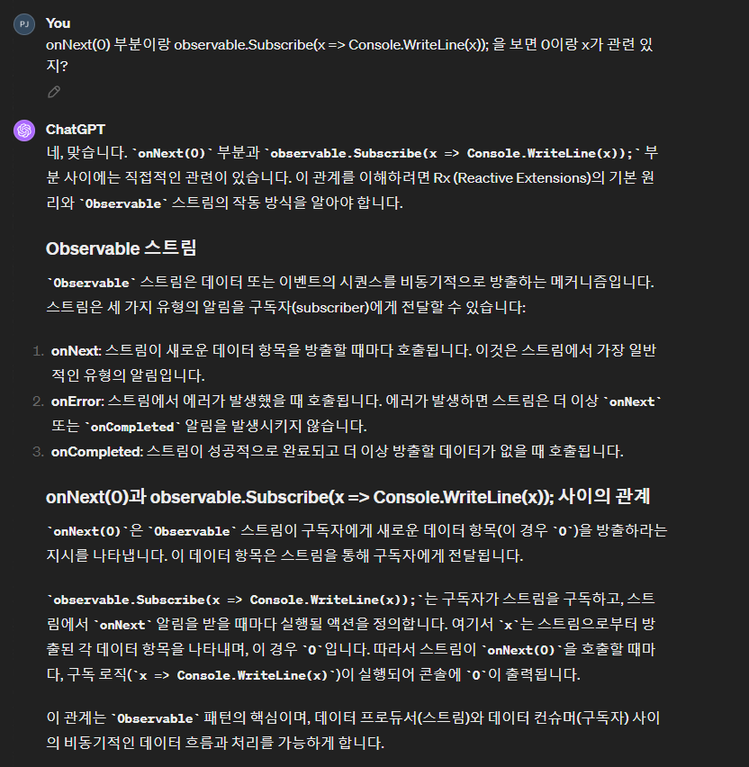
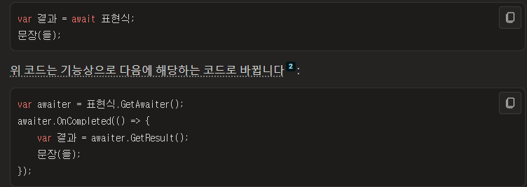

# 목차
- [목차](#목차)
- [이전에 이해하기 어려웠던 이유는 용어 때문이었다!](#이전에-이해하기-어려웠던-이유는-용어-때문이었다)
- [왜 Observable.Create 같은 Observable을 만들고 Subscribe를 했을 때 리턴타입은 IDisposable 인가?](#왜-observablecreate-같은-observable을-만들고-subscribe를-했을-때-리턴타입은-idisposable-인가)
- [Subscribe안에 넣은 인자가 Observable.Create() 뭐시기의 콜백이 되는 거 (머리로는 대충 이해했는데 정리 필요)](#subscribe안에-넣은-인자가-observablecreate-뭐시기의-콜백이-되는-거-머리로는-대충-이해했는데-정리-필요)
- [Observable 원리](#observable-원리)
- [Await 걸면 Observable.Create() 같은 메서드에서 Subscribe()를 걸지 않아도 작업이 완료 되면 호출이 된다.](#await-걸면-observablecreate-같은-메서드에서-subscribe를-걸지-않아도-작업이-완료-되면-호출이-된다)

   

# 이전에 이해하기 어려웠던 이유는 용어 때문이었다!
- $\bf{\large{\color{#ff0000}구독해\ 놓은\ 스트림\ ==\ 바인딩\ 해\ 놓은\ 이벤트}}$

   

# 왜 Observable.Create 같은 Observable을 만들고 Subscribe를 했을 때 리턴타입은 IDisposable 인가?
- 내가 바인딩해 놓은 이벤트를 내가 원하는 순간에 구독을 해제하고 싶은 순간은 개발을 하다 보면 정말 많다.
- 예시 : 예를 들어 어떤 아이템을 구매하고 다음 구매 까지 남은 시간을 나타내 주는 UI를 구성해보자. 
  - Observable.Interval을 만들고 계속 동작시키다가 다음 날이 되면 더 이상 남은 시간을 표시할 필요가 없기 때문에 구독한 이벤트를 해제 해야 한다.
  - 이 때 해당 순간에 Subscribe 해 놓은 이벤트를 구독 해제 해야 한다. 
  - 정리하면 Subscribe(구독)를 한 모든 이벤트는 언제든지 내가 Dispose(해제) 할 수 있다! 그러므로 Idisposable을 상속 받는다.

~~~c#
class Program
{
    static void Main()
    {
        
        IDisposable _timerDisposable_ = Observable.Interval(TimeSpan.FromSeconds(1))
                        .Subscribe(x => Console.WriteLine(x));

        Console.WriteLine("Press any key to unsubscribe");
        Console.ReadKey();

        // 구독 해지
        _timerDisposable_?.Dispose();
    }
}
~~~
- 구독한 이벤트를 언제든지 해제 할 수 있도록 IDisposable로 _timerDisposable을 만든다. 
  - 멤버 변수로 만들어도 좋고, 로컬 변수로 만들어도 좋지만 범위는 해당 클래스로 잡는 게 좋다.
- Dispose()하기 전에 ?를 붙여 null을 검사해준다.
   

# Subscribe안에 넣은 인자가 Observable.Create() 뭐시기의 콜백이 되는 거 (머리로는 대충 이해했는데 정리 필요)
- 
- 
- 대충 이런 느낌 
- 다시 공부

   

- 밑에는 과거에 적은 거라 다시 보고 필요 없으면 날려
   

# Observable 원리
- 

   

# Await 걸면 Observable.Create() 같은 메서드에서 Subscribe()를 걸지 않아도 작업이 완료 되면 호출이 된다.
- 
- > Observable.Create() 부류의 메서드가 완료될 때까지 기다린 다음, 그 결과를 변수(var a = await ...)에 할당합니다. 그 과정에서 Subscribe()의 호출이 필요하지 않습니다.

