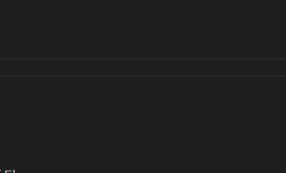

# overall
- 

# await 걸면 Observable.Create() 같은 메서드에서 Subscribe()를 걸지 않아도 작업이 완료 되면 호출이 된다.
- 
- > Observable.Create() 부류의 메서드가 완료될 때까지 기다린 다음, 그 결과를 변수(var a = await ...)에 할당합니다. 그 과정에서 Subscribe()의 호출이 필요하지 않습니다.
