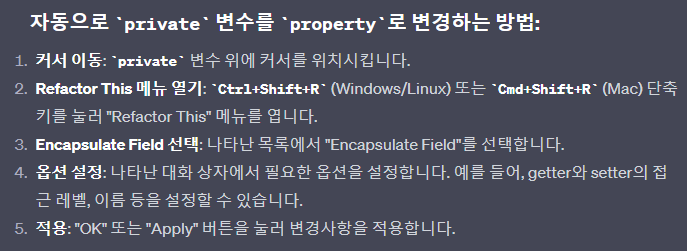
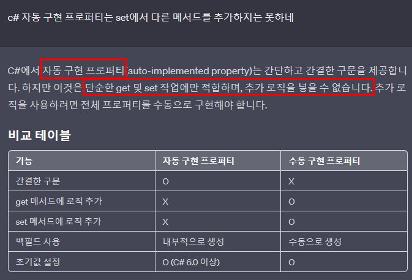

# 목차
- [목차](#목차)
- [Property를 사용해야 하는 이유](#property를-사용해야-하는-이유)
- [:star:자동완성:star:](#star자동완성star)
- [자동 프로퍼티의 단점](#자동-프로퍼티의-단점)
- [:star:캡슐화 : 멤버 변수(특히 데이터 필드)는 public이 아닌 private으로 사용해야 한다.](#star캡슐화--멤버-변수특히-데이터-필드는-public이-아닌-private으로-사용해야-한다)
- [기초 문법](#기초-문법)

   

# Property를 사용해야 하는 이유
- Property를 이용하면 F12를 통해 get 과 set의 호출 위치를 쉽게 알 수 있다.
  - 일반 변수로 선언하면 set 하는 부분을 찾기가 불편하다. 

   

# :star:자동완성:star:
- Rider에서는 private 멤버에 대해서 필요하면 Alt+Enter를 통해 Property로 만들어라.
- 아래에 문법은 정리했지만 자동완성을 하는 것이 가장 큰 테크닉이다.
- 

   

# 자동 프로퍼티의 단점
- 

   

# :star:캡슐화 : 멤버 변수(특히 데이터 필드)는 public이 아닌 private으로 사용해야 한다. 
- public으로 사용하면 '외부에 잘못된 사용'으로 객체의 상태가 잘못될 수 있다.
  - 접근이 간편하여 생기는 오류다.
  - '객체지향의 사실과 오해'를 읽으면 바로 이해할 수 있다.
    - 필드는 private로 하고 public 메서드(행동)로 해당 필드를 관리한다.
- 그래서 우리는 private로 선언하고 property를 이용한다.

   

# 기초 문법
- 
~~~c#
p.Age = 10; //좌변식이므로 자동으로 set이 호출.
int n2 = p.Age //우변식이므로 자동으로 get이 호출.
~~~
- 실제로는 메서드 이지만 사용시에는 필드처럼 보인다.
- 
- getter와 setter 중에 하나만 있어도 상관은 없다.
- 접근지정자를 지정해서 사용할 수 있는 위치를 지정할 수 있다.