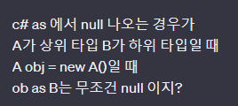
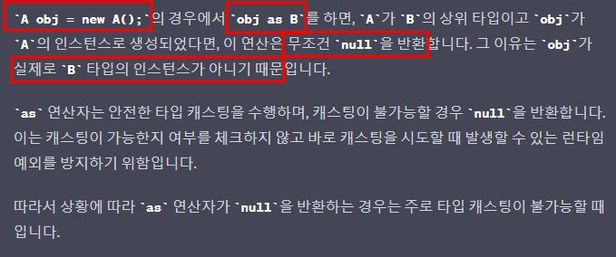
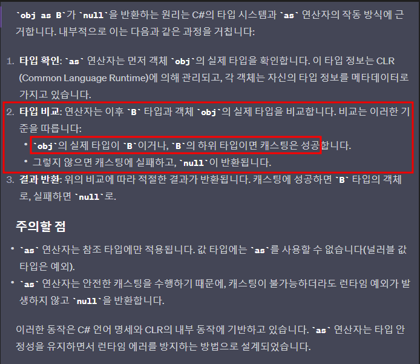
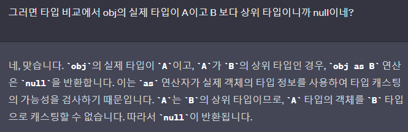
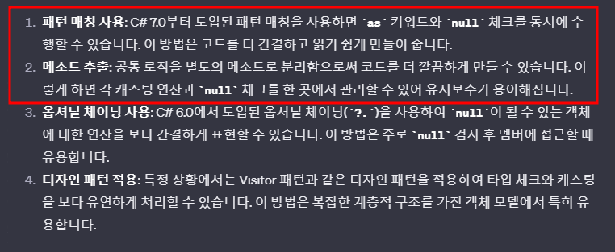

# 목차
- [목차](#목차)
- [As의 동작 요약](#as의-동작-요약)
- [As의 동작](#as의-동작)
- [:star::star:As의 내부 동작 및 결론](#starstaras의-내부-동작-및-결론)
- [As Casting을 연속으로 하는 경우](#as-casting을-연속으로-하는-경우)
- [업 캐스팅 vs 다운 캐스팅](#업-캐스팅-vs-다운-캐스팅)

\documentclass{article}
\usepackage{xcolor} 
\begin{document}
{\Huge
\color{red}
A\ B \\
C\ D
}
\end{document}

   

# As의 동작 요약
~~~c#
// 상속구조는 Animal -> Dog -> Pomeranian
//Animal과 Dog은 아래 예제를 보면 클래스다.
Animal obj = new Pomeranian();
obj as Dog; // 캐스팅 성공
~~~
- Animal : 타입
- Pomeranian : 인스턴스 타입 (=실제 타입)
- 나만의 용어로 앞으로 이렇게 설명 할 것 이다.
- $\bf{\large{\color{#ff0000}As는\ 비교\ 대상의\ 인스턴스\ 타입과\ 캐스팅을\ 하려는\ 타입이\ 동일하거나\ 캐스팅을\ 하려는\ 타입의\ 하위\ 타입이면\ 캐스팅에\ 성공한다.}}$
- $\bf{\large{\color{#ff0000}obj의\ 인스턴스\ 타입은\ Pomeranian이고,\ 캐스팅을\ 하려는\ 타입은\ Dog다.}}$
- obj 인스턴스 타입인 Pomeranian은 캐스팅을 하려는 타입인 Dog과 동일하지는 않지만, 하위 타입이므로 캐스팅에 성공한다.
   

# As의 동작
~~~c#
class Animal
{
	public int Age = 1;
	
	public void Eat()
	{
		Console.WriteLine("Animal is eating.");
	}
}

class Dog : Animal
{
	public int DogValue = 2;
	public void Bark()
	{
		Console.WriteLine("Dog is barking.");
	}
}

class Program
{
	static void Main(string[] args)
	{
		Animal a = new Animal();
		Animal b = new Dog();
		
		//a의 경우 타입은 Animal이고 인스턴스 타입은 Animal 타입이다.
		var c = a as Dog; 

		//b의 경우 타입은 Animal이고 인스턴스 타입은 Dog 타입이다.
		//인스턴스가 Dog 타입이고 이건 Dog 타입으로 캐스팅이 된다. (as Dog;에서 Dog의 타입과 같거나 Dog의 하위 타입이니까)
		var d = b as Dog;
		
		c.Dump(); //null
		d.Dump();	
	}
}
/* Result
c는 null이 된다.
d는 다운 캐스팅에 성공한다.
*/
~~~
- 
- 
> **new로 객체를 생성할 때 타입과 인스턴스를 구분해서 생각하는 것은 좋은 습관** 입니다. 이런 분리를 통해 코드의 의미와 작동 원리를 더 정확하게 이해할 수 있습니다.
> 타입 안정성(Type Safety): 타입을 명확히 알고 있으면, 해당 타입의 메서드와 프로퍼티만을 사용하게 됩니다. 이는 런타임 에러의 가능성을 줄입니다.
> 오버로딩과 다형성(Overloading & Polymorphism): 특히 객체지향 프로그래밍에서는 같은 이름의 메서드가 다른 타입에 대해 다르게 동작할 수 있습니다. 타입을 명확히 알고 있으면, 어떤 메서드가 호출될지 예측하기 쉽습니다.

   

# :star::star:As의 내부 동작 및 결론
- 
- 
- **이것만 기억하자.**
- 싱글턴의 어떤 메서드를 이용해서 객체를 생성할 수 있다. 
  - 예시 : Animal obj = 싱글턴 코드
- 그러면 이게 타입은 Animal이지만 인스턴스 타입은 싱글턴 코드를 봐야 한다.
- 이 때 obj as Dog를 했을 때 성공하면 싱글턴 코드에서 Dog 타입이나 Dog의 하위 타입으로 받아 온 것 이다!!!
- 실패 했으면 싱글턴 코드에서 상위 타입으로 받거나 다른 타입인 것이고. 그러면 null로 리턴 한다.

   

# As Casting을 연속으로 하는 경우
- As를 사용하여 연속적으로 캐스팅을 하는 경우 매 번 null을 검사하는 방어 코드를 작성하게 된다.
  - 연속적으로 if문에서 null을 체크하는 것이 보기 좋지는 않다.
- 해결 방법
  - 
    - as를 이용하는 구문에 대해서 라이더의 Alt+Enter를 이용하면 Pattern Matching으로 간결하게 바꾸어 준다.
    - Depth가 깊은 연속적인 캐스팅의 경우 따로 메서드로 만들면 가독성이 향상 된다.

   

# 업 캐스팅 vs 다운 캐스팅
- 
~~~c#
class Program
{
    class Animal
{
	public int Age = 1;
	
	public void Eat()
	{
		Console.WriteLine("Animal is eating.");
	}
}

class Dog : Animal
{
	public int DogValue = 2;
	public void Bark()
	{
		Console.WriteLine("Dog is barking.");
	}
}

class Program
{
	static void Main(string[] args)
	{
		//1. 다운 캐스팅 (일반적으로 캐스팅을 할 때 쓰는 것)
		Animal animal = new Dog();

		if (animal is Dog dog)
		{
			dog.Age.Dump();
			dog.DogValue.Dump();
			
			dog.Bark();  // 'dog'는 Dog 타입으로 캐스팅되었으므로 Dog 클래스의 메서드 사용 가능
			dog.Eat();   // 'dog'는 Animal 타입도 되므로 Animal 클래스의 메서드 역시 사용 가능
		}

		Console.WriteLine("==========================================");
		
		//2. 업 캐스팅 (평소에 잘 사용하지 않았다.) 
		Dog dog2 = new Dog();
		if (dog2 is Animal animal2)
		{
			animal2.Age.Dump();
			//animal2.DogValue.Dump(); // Dog Class의 DogValue는 사용 불가능.
			
			//animal2.Bark(); //결국에 animal2는 Animal 타입이므로 Dog Class의 Bark를 사용할 수 없다.
			animal2.Eat();
		}
	}
}

/* Result
1
2
Dog is barking.
Animal is eating.
==========================================
1
Animal is eating.
*/
~~~