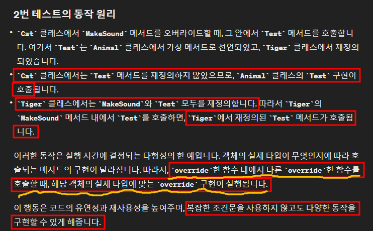
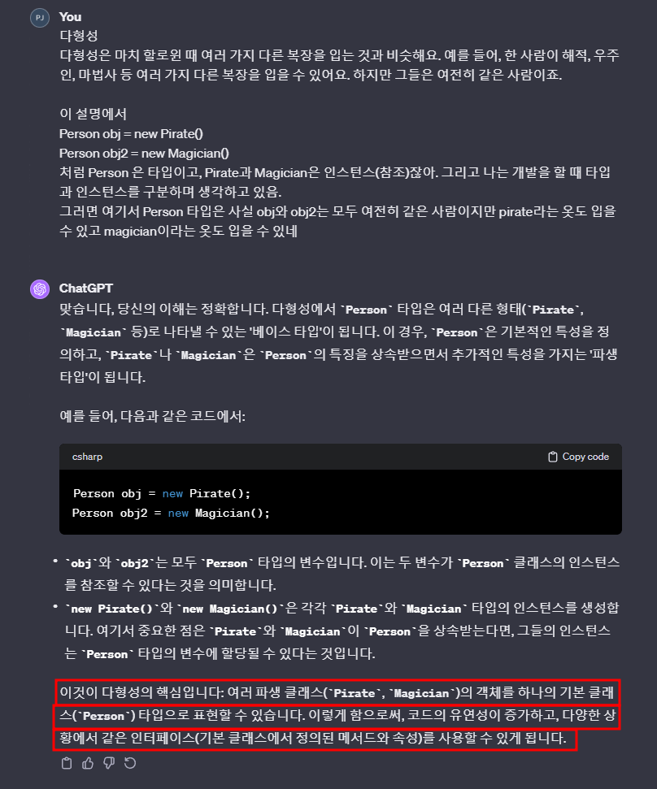
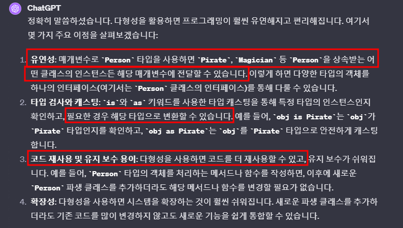

# 목차
- [목차](#목차)
- [If-Else 대신에 다형성과 Virtual Method로 코드를 깔끔하게 분기할 수 있다.](#if-else-대신에-다형성과-virtual-method로-코드를-깔끔하게-분기할-수-있다)
    - [1번 테스트 결과 : 다형성을 이용한 아름다운 분기](#1번-테스트-결과--다형성을-이용한-아름다운-분기)
    - [2번 테스트 결과 : Tiger의 MakeSound()에서 override 한 Test()를 호출하면 무엇이 호출되는지? 반대로 Cat은 어떤지?](#2번-테스트-결과--tiger의-makesound에서-override-한-test를-호출하면-무엇이-호출되는지-반대로-cat은-어떤지)
- [다형성 핵심 개념](#다형성-핵심-개념)
- [다형성과 느슨한 결합은 친구다.](#다형성과-느슨한-결합은-친구다)
- [종속성](#종속성)

   

# If-Else 대신에 다형성과 Virtual Method로 코드를 깔끔하게 분기할 수 있다.
~~~c#
public class Animal
{
	public int serialNumber; // 보통은 enumType 이겠지만 테스트 용으로!

  // 1. 다형성과 Virtual Method를 이용한 좋은 구조.
	public virtual bool GoodCode_CanDefeatMe()
	{
		return false;
	}

  // 2. 다형성으로 이미 타입을 분리했음에도 불구하고 Base Class에서 if-else로 구분하는 바보 같은 구조.
	public bool BadCode_CanDefeatMe()
	{
		if(serialNumber == 1)
		{
			return false;
		}
		if(serialNumber == 2)
		{
			return false;
		}
		if (serialNumber == 3)
		{
			return true;
		}
		if (serialNumber == 4)
		{
			return false;
		}
		
		//default
		return true;
	}

	public virtual void MakeSound()
	{
		Console.WriteLine("Some generic sound");
	}	

  public virtual void Test()
  {
    Console.WriteLine("Base Base Base");
  }
}

// 4개의 Derived Class
public class Dog : Animal
{
	public Dog()
	{
		serialNumber = 1;
	}
	
	public override void MakeSound()
	{
		Console.WriteLine("Mung Mung");
	}
}

public class Cat : Animal
{
	public Cat()
	{
		serialNumber = 2;
	}
	
	public override void MakeSound()
	{
		Console.WriteLine("Yaong");
    Test();
	}
}

public class Tiger : Animal
{
	public Tiger()
	{
		serialNumber = 3;
	}
	
  public override bool GoodCode_CanDefeatMe()
	{
		return true;
	}

	public override void MakeSound()
	{
		Console.WriteLine("u-heung");
    Test(); // 이건 어떻게 나올까?
	}
	
  public override void Test()
  {
    Console.WriteLine("Tiger Derive Tiger Derive");
  }
}

public class Sheep : Animal
{
	public Sheep()
	{
		serialNumber = 4;
	}
	
	public override void MakeSound()
	{
		Console.WriteLine("Meeeeeeeeee");
	}
}

public void Main()
{
	List<Animal> animals = new List<Animal>();
	
	Animal dog = new Dog();
	Animal cat = new Cat();
	Animal tiger = new Tiger();
	Animal sheep = new Sheep();

	animals.Add(dog);
	animals.Add(cat);
	animals.Add(tiger);
	animals.Add(sheep);

	// 좋은 구조 테스트
	foreach (var i in animals)
	{
		i.GoodCode_CanDefeatMe().Dump();
	}

	("\n").Dump();

	// 나쁜 구조 테스트
	foreach (var i in animals)
	{
		i.BadCode_CanDefeatMe().Dump();
	}

	// 1번 테스트 : 좋은 구조 테스트와 나쁜 구조 테스트의 결과는 둘 다 동일하게 아래와 같이 나온다.
	/*
	False
	False
	True
	False
	*/
	
	("\n").Dump();

  cat.MakeSound();
	tiger.MakeSound();

	// 2번 테스트 결과 : 
	/*
  Yaong
  Base Base Base
	
  u-heung
	Tiger Derive Tiger Derive
	*/
}
~~~
### 1번 테스트 결과 : 다형성을 이용한 아름다운 분기
- 좋은 구조
  - Base Class에서 GoodCode_CanDefeatMe를 Virtual로 선언하여 타입마다 override 된 메서드를 호출하도록 만들었다.
  - $\bf{\large{\color{#ff0000}Base\ Class는\ 공통\ 부분을\ 작성하면\ 된다!\ 공통적이지\ 않은\ 기능만\ Override해라!}}$
  - 대부분의 동물은 나를 이길 수 없다. 
    - 그러니까 base에서 만든 GoodCode_CanDefeatMe()에서는 Derive Type에서 override하지 않으면 false를 리턴하도록 구현했다.
    - 하지만 Tiger는 나를 이길 수 있으므로 override 해서 true를 리턴하도록 구현했다.
- 나쁜 구조
  - 간단한 예제에서는 누가 이렇게 구현할까? 라는 생각을 하겠지만 프로젝트가 커질 수록 Base Class에서 if-else 처리하는 경우가 많다.
  - **이게 최악인 이유는 이미 다형성을 이용해서 타입을 아름답게 분기했음에도 불구하고 또 다시 if-else로 분기한다.**
- $\bf{\large{\color{#ff0000}상속\ 구조에서\ 이미\ 타입별로\ 분기가\ 나누어져\ 있다면\ virtual\ method를\ 이용해서\ 코드를\ 분기하자!}}$

### 2번 테스트 결과 : Tiger의 MakeSound()에서 override 한 Test()를 호출하면 무엇이 호출되는지? 반대로 Cat은 어떤지?
- 

 

- 참고 : 리팩터링 10-4

   

# 다형성 핵심 개념
- 

 

- **실무에서 경험한 다형성의 장점**
  - 내 생각 : 메서드의 매개변수를 Person으로 선언해 놓는다. 인스턴스 타입이 pirate나 magician이어도 타입은 Person이니까 편하게 전달 할 수 있다. 그리고 is 또는 as로 캐스팅을 하면 메서드 내부에서 사용하기도 쉽다.
  - 

   

# 다형성과 느슨한 결합은 친구다.
> **종속성은 재사용을 감소시키기 때문에 좋지 않습니다.** 재사용 감소는 여러 가지 이유로 좋지 않습니다. 재사용은 개발 속도, 코드 품질, 코드 가독성 등에 긍정적인 영향을 미치는 경우가 많습니다.
> 종속성이 재사용에 어떤 영향을 미치는지 한 가지 예를 들어 설명해드리겠습니다:
> XML 파일에서 캘린더 이벤트 목록을 읽을 수 있는 CalendarReader 클래스가 있다고 가정해 보겠습니다. CalendarReader의 구현은 아래에 스케치되어 있습니다:

~~~c#
public class CalendarReader 
{
public List readCalendarEvents(File calendarEventFile){
//파일에서 InputStream을 열고 캘린더 이벤트를 읽습니다.
}
}
~~~
> readCalendarEvents 메서드는 File 객체를 매개변수로 받습니다. 따라서 이 메서드는 File 클래스에 종속됩니다. File 클래스에 대한 이러한 종속성은 캘린더 리더가 파일 시스템의 로컬 파일에서 캘린더 이벤트만 읽을 수 있음을 의미합니다. 네트워크 연결, 데이터베이스 또는 클래스 경로의 리소스에서 캘린더 이벤트 파일을 읽을 수 없습니다. CalendarReader는 File 클래스와 로컬 파일 시스템에 긴밀하게 결합되어 있다고 말할 수 있습니다.
> 덜 긴밀하게 결합된 구현은 아래 스케치한 것처럼 File 매개 변수를 InputStream 매개 변수와 교환하는 것입니다:

~~~c#
public class CalendarReader {
public List readCalendarEvents(InputStream calendarEventFile){
// InputStream에서 캘린더 이벤트 읽기
}
}
~~~
> 아시다시피 InputStream은 File 객체, 네트워크 Socket, URLConnection 클래스, Class 객체(Class.getResourceAsStream(String name)), JDBC를 통한 데이터베이스의 열 등에서 가져올 수 있습니다. 이제 캘린더 리더는 더 이상 로컬 파일 시스템에 연결되지 않습니다. 다양한 소스에서 캘린더 이벤트 파일을 읽을 수 있습니다.

> InputStream 버전의 readCalendarEvents() 메서드를 사용하면 CalendarReader의 재사용성이 더욱 향상되었습니다. 로컬 파일 시스템에 대한 긴밀한 결합이 제거되었습니다. 대신 InputStream 클래스에 대한 종속성으로 대체되었습니다. InputStream 종속성은 File 클래스 종속성보다 더 유연하지만 그렇다고 CalendarReader를 100% 재사용할 수 있다는 의미는 아닙니다. 예를 들어 여전히 NIO 채널에서 데이터를 쉽게 읽을 수 없습니다.

  

- 
- 
- 
  - 느슨한 결합 = 다형성으로
- [Dependency in Quara](https://www.quora.com/What-is-a-dependency-in-coding)

   

# 종속성
- 간단한 예시를 통해 종속성을 이해해 보겠습니다.
  - 앱을 만들었는데, 앱을 실행하기 위해서는 운영체제가 필요합니다. 따라서 여기서 운영체제는 의존성입니다.
- 다른 클래스의 동작을 위해 데이터를 넘겨줄 때 어떻게 넘겨주는 지에 따라 의존성을 관리할 수 있다.
- 내 생각 : 타입을 특정해버리면 그 타입만 올 수 있다. 이건 장단점이 있는 것.
  - 그 타입만 특정하는 게 의도 일 수도 있다.
  - 하지만 다른 타입을 받을 수 없기 때문에 당연히 재사용이 적어진다. 
  - 재사용이 적은 함수는 결국 람다로 빼버리는게 좋지 않을까?