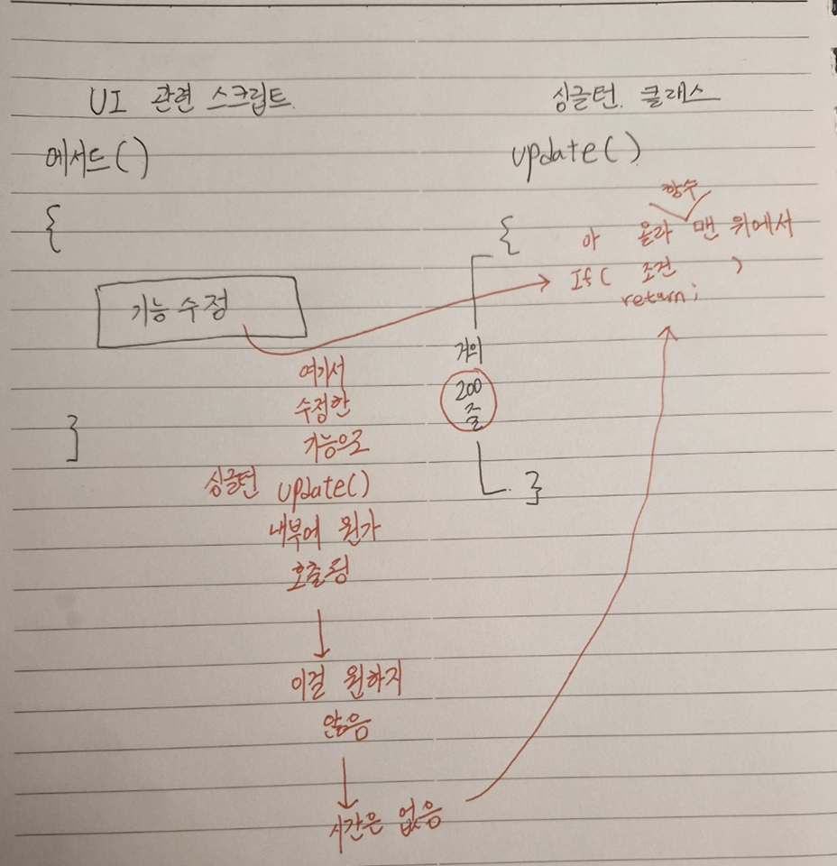

# 목차
- [목차](#목차)
- [이 문서를 적은 이유](#이-문서를-적은-이유)
- [:star:내가 타인의 코드를 수정하는 상황으로 인해 제어(=변경?)되는 부분을 적게 해야 한다.](#star내가-타인의-코드를-수정하는-상황으로-인해-제어변경되는-부분을-적게-해야-한다)
    - [1. 상황](#1-상황)
    - [2. 내가 잘못한 점](#2-내가-잘못한-점)
    - [3. **star**시간이 없을 때](#3-star시간이-없을-때)
    - [4. 시간이 많을 때](#4-시간이-많을-때)

   

# 이 문서를 적은 이유
- 개발을 하다보면 필연적으로 **버그가 발생하고 타인이 작성한 코드를 수정하게 된다.**
- 타인이 작성한 코드를 수정하는 경우에 지켜야 할 사항과 팁을 기록한다.
- 한정된 시간 속에서 버그를 효율적으로 수정할 수 있다.

   

# :star:내가 타인의 코드를 수정하는 상황으로 인해 제어(=변경?)되는 부분을 적게 해야 한다.
### 1. 상황
  - 
- return을 첫 줄에서 했는데 기능이 잘 돌아간다. -> 하지만 불안하다. -> 아래에 200줄이나 되는 메서드가 뭘 하고 있는 지 모르니까 -> 그러나 200줄안에 존재하는 다른 메서드와 걸려있는 모든 이벤트를 보기에는 시간이 부족하다.

### 2. 내가 잘못한 점
- 첫 줄 return으로 해당 버그는 수정할 지 몰라도 **잠재적인 버그**를 발생 시킬 가능성은 농후하다.
- 200줄의 코드를 제어할 자신도 없으면서 빨리 끝내려고 책임 없는 return을 수행한 점이 잘 못 되었다. 
  - 솔직히 해당 싱글턴의 Update()의 내부 동작 원리도 제대로 이해 못하고 있었다.

### 3. **star**시간이 없을 때 
- 첫 줄 return을 넣어 코드 수정을 하면 200줄이나 되는 부분을 내가 제어하게 된다. (기존에 콜 되던 부분을 내가 콜 되지 않게 했으니까)
- 하지만 100번 째 줄의 어떤 특정 함수 (예를 들어 CalcCameraPosition)만 변경해도 코드가 동작할 것 같으면 이 부분만 변경하면 된다.
  - 이렇게 되면  $\bf{\large{\color{#ff0000}내가\ 제어하는\ 부분은\ Update에서\ 1줄\ 정도\ 밖에\ 되지\ 않으니\ 제어의\ 양이\ 급격히\ 감소하게\ 된다.}}$
  - 또한 이해를 제대로 해야 하는 부분도 CalcCameraPosition 메서드 정도다.
- **정리하면, 언제나 내가 코드를 수정 했을 때 생기는 변경 사항으로 내가 제어(=캐어? =변경으로 발생하는 사이드 이펙트?)해야 하는 매서드의 양을 생각해야 한다.** 

### 4. 시간이 많을 때
- 해당 메서드와 클래스를 모두 공부하고 거기에 걸린 이벤트나 연관된 메서드의 기능을 모두 파악하면 된다!
- 가장 좋은 방법이지만 너무 이상적이다.
