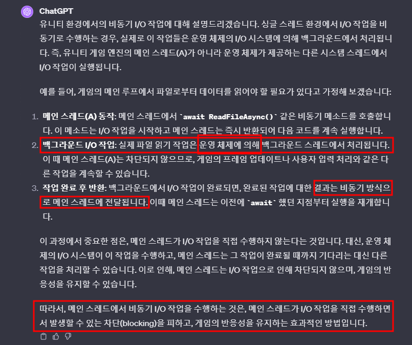
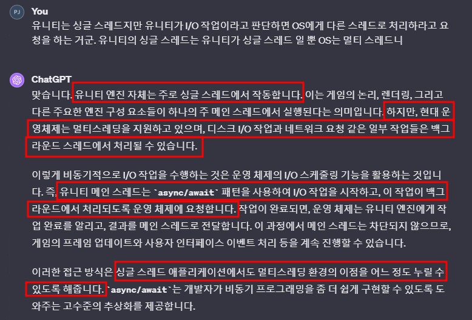
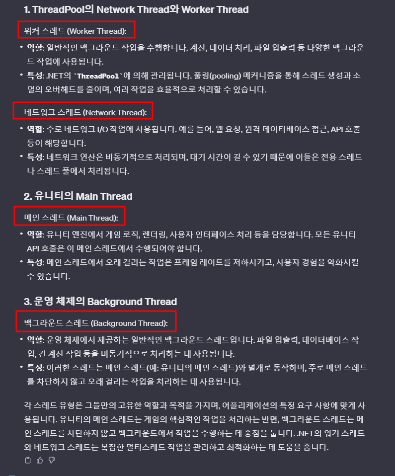
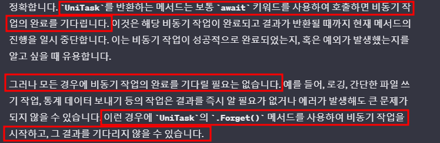
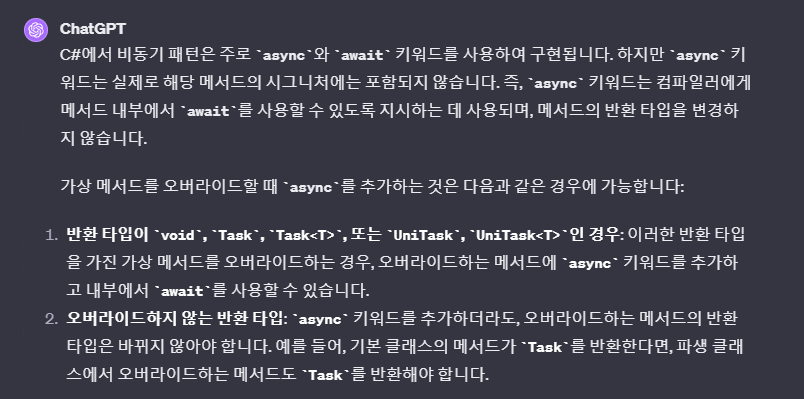

# 개요
- 스레드 개념과 Unitask를 같이 이해

   

# 유니티는 싱글스레드로 동작하기 때문에 비동기로 얻는 이득이 없는 것 아닌가? : 아니다!
- 
- 
  - async/await을 이용하면 OS에게 Main Thread에서 할 만큼 중요하지 않은 일은 Background Thread에서 처리하게 한다.

   

# Unity Main Thread vs OS Background Thread
> 유니티 개발자의 관점에서 스레드를 '유니티 메인 스레드'와 'OS 백그라운드 스레드'로 분류하는 것은 유용한 관점이 될 수 있습니다. 이 두 종류의 스레드는 유니티 개발에서 다루는 가장 일반적인 스레드 유형이며, 각각의 특성을 이해하는 것이 중요합니다
-  

   

# 좀 더 많은 Thread 개념
- 
- 직접적인 포함 관계는 없다.
- 

   
 
# fire-and-forget 방식
- 
- 
- 원래는 await을 붙여서 해당 함수의 결과를 기다렸다. 특히 Unitask<bool> 같이 리턴 값이 있으면
~~~c#
var result1 = await (Unitask<bool>를 리턴하는 함수)
var result2 = await (Unitask<bool>를 리턴하는 함수)
~~~
  - result1은 await 걸린 함수의 실행이 모두 완료 됨을 기다리고 결과를 초기화 한다.
  - 하지만 result2는 await이 걸려 있지 않기 때문에 기다리지 않고 초기화를 한다.
  - > 반환된 UniTask<bool>가 완료될 때까지 기다리지 않으면, 함수의 결과가 필요한 코드 부분에서 오류가 발생할 수 있습니다.

   

# 일반 virtual 함수를 Override했을 때 파생 함수는 async를 붙여서 비동기로 만들어도 된다. 
- 
