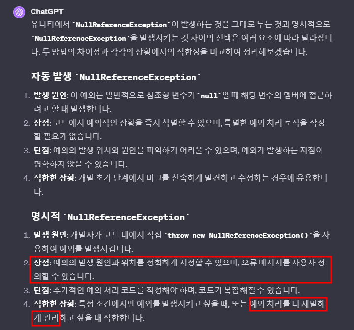

# 목차
- [목차](#목차)
- [다른 관점](#다른-관점)
- [Throw NullReferenceException](#throw-nullreferenceexception)
- [예외처리 관련 중요한 사항](#예외처리-관련-중요한-사항)
- [예외(Exception) vs 오류(ERROR)](#예외exception-vs-오류error)
- [예외 처리를 해야 하는 이유](#예외-처리를-해야-하는-이유)
- [Unity의 Warning 과 Error](#unity의-warning-과-error)
- [예외처리 방식\_1 : If문](#예외처리-방식_1--if문)
- [예외처리 방식\_2 : Out Parameter 활용](#예외처리-방식_2--out-parameter-활용)
- [예외처리 방식\_3 : try-catch-finally](#예외처리-방식_3--try-catch-finally)
    - [1. 키워드](#1-키워드)
    - [2. 장점](#2-장점)
    - [3. 정리](#3-정리)
- [try-catch 연습](#try-catch-연습)
- [try-catch 추가 내용](#try-catch-추가-내용)
- [3가지 방법 사용 시점](#3가지-방법-사용-시점)
- [Throw는 항상 try-catch와 함께 나오던데 이건 뭘까?](#throw는-항상-try-catch와-함께-나오던데-이건-뭘까)
- [try-catch 예외처리의 비용과 블록 스코프](#try-catch-예외처리의-비용과-블록-스코프)
- [예외 검사](#예외-검사)
- [:book:참고 문헌](#book참고-문헌)

# 다른 관점
- 예외는 일찍 알릴 수록 좋다고 생각
- 예외는 자세히 설명해 줄 수록 좋다고 생각

# Throw NullReferenceException
- 이거와 같이 try-catch를 사용하지 않고 상위 클래스에서도 catch 하지 않아 null referenceException이 발생하도록 하는 기법
- 

# 예외처리 관련 중요한 사항
- 테스트를 할 때 에러 때문에 진행이 안되는 경우 당장 에러를 일단 handle 해야 하긴 한다.
  - handle을 구현하지는 않고
- 하지만 개발 단계에서 테스트 진행에 문제가 없는 경우는 handle을 구현하지 않고 예외를 처리하는 방식은 문제가 된다.
  - 당장 아무것도 하지 않지만 handle을 구현했기 때문에 유니티의 크래시는 발생하지 않는다.
  - 하지만 handle을 구현하지 않았지만 유니티의 크래시는 발생하지 않으므로 팀원들은 해결되었다고 생각한다.

# 예외(Exception) vs 오류(ERROR)
- 같다고 봐도 무방하다.
  - 

# 예외 처리를 해야 하는 이유
- :star:프로그램 내에 적절한 catch 문이 포함되어 있지 않으면 예외가 발생했을 때 응용프로그램이 종료된다.
- 오류가 발생했음을 무시한다면 데이터가 손상된 상태로 응용프로그램이 수행될 것인데 이 경우 정상적으로 수행을 이어가기 어렵다.

# Unity의 Warning 과 Error
- 보통 Error만 키고 개발을 한다.
- 하지만 특수한 경우 Warning도 의심해 봐야 한다.
  - Ex : Dotween의 라이브러리 메서드 중 어떤 녀석은 Error를 Warning으로 처리해서 개발자에게 나타내준다!
    - 이 것 때문에 왜 에러가 나는지 몰랐다.
    - Warning까지 켜고 작업하는 개발자가 많은 지는 모르겠다.

# 예외처리 방식_1 : If문 
- 결론부터 말하면 좋지 않은 방식이다.
- 
  - 코드 -> 오류 처리 -> 코드 -> 오류 처리 
    - 코드가 너무 더러워진다.
    - 코드의 가독성이 매우 떨어진다.
  - return 값으로 -1을 적어주면 이 것이 오류인지 실제 반환 값을 의미하는 것인지 구분이 애매하다.
    - 다시 말해, 오류에 대한 자세한 정보를 알 수 없다.

# 예외처리 방식_2 : Out Parameter 활용 
- 리턴 값과 오류를 분리한다.
- 리턴 값은 메서드의 성공과 실패만 나타내고 out parameter로 연산의 결과를 이용합니다.  
  - 예시 
- 
  - :star: 내 생각 : 협업에서 예외를 반드시 처리하라는 강제성은 매우 중요할 것 이다.
  
# 예외처리 방식_3 : try-catch-finally
### 1. 키워드
- try 
  - 예외가 존재하는 지 검사하는 블록.
- catch
  - 예외가 발생하면 해당 예외를 처리해주는 키워드 (=예외 처리 핸들러)
    - try 블록 안에서 예외가 발생하면 catch 블록이 실행된다.
  - 매개변수가 있다.
- finally
  - Exception의 발생 여부와 상관 없이 마지막에 반드시 실행되는 블럭이다.
    - try 블록을 벗어나면 항상 실행된다.
    - try에서 return 문을 사용해도 finally는 호출 된다.
  - 파일과 네트워크 관련 객체는 gc가 처리해주지 않으므로 dispose를 해주어야 한다. 이 때 finally를 이용해서 dispose를 하면 항상 실행되므로 이용하기 좋다.
- 순서
  - catch에서 잡히면 catch 부터 실행 되고 finally가 실행 된다.

### 2. 장점
- 오류에 대한 정보를 자세하게 나타낼 수 있다.
  - 클래스 타입이므로 예외에 대한 많은 정보를 나타낼 수 있다.
- :star:**개발자는 에러를 발생시키는 위치와 에러를 처리하는 부분을 여러 수준에서 분리하여 개발할 수 있다.**
  - try-catch 방식은 콜 스택을 통해서 적절한 catch 문이 구성된 위치까지 콜스택을 통해 전파된다. 

### 3. 정리
- 

# try-catch 연습
- 
~~~c#
            try
            {
                int a = 3;
                int b = 0;
                int c = a / b;
            }
            catch (Exception e)
            {
                Console.WriteLine("에러다!" + e);
                throw;
            }
~~~
  - 콘솔에서 divide zero 예외 처리를 진행한다.

# try-catch 추가 내용
- System.Exception 클래스를 열심히 봐라.
- Exception 클래스는 최상위 부모 클래스이므로 모든 예외를 잡는다.
  - 그 결과 아래와 같은 문제가 발생한다.
  - 
    - 개발자는 WebException에서 예외를 처리하고 싶음에도 불구하고 Exception에서 처리할 것 이다.
    - 이를 해결하기 위해 C#에서는 Exception은 항상 마지막 catch 구문에 적도록 강제했다.
- 예시
~~~c#
        public string DownloadString(Uri address)
        {
            ThrowIfNull(address, nameof(address));

            StartOperation();
            try
            {
                WebRequest request;
                byte[] data = DownloadDataInternal(address, out request);
                return GetStringUsingEncoding(request, data);
            }
            finally
            {
                EndOperation();
            }
        }
~~~
  - Webclient 클래스의 메서드 DownloadString에 대한 예외처리다. 
    - 나는 String으로 매개변수를 받았지만 Uri로 또 변환하는 메서드 처리가 있으므로 위의 코드를 보는 게 맞다.
      - 이 말이 이해가 안 되면 그냥 당시에 검증 했으니 넘어가면 된다.
  - 라이브러리의 메서드에서 내부적으로 예외처리를 해주고 있다.
    - 그로 인해 address에 'http://www.naver.com'대신 'http://www.never.com'을 적어주면 예외를 받고 처리하게 되는 것 이다.

# 3가지 방법 사용 시점
- 중요하지 않은 사소한 오류
  - 예외처리 방식_1의 If문이나 예외처리 방식_2의 out parameter를 사용한다.
- 중요한 오류
  - 예외처리 방식_3의 try-catch를 이용한다. 
  - c#은 이걸 많이 사용.
  
# Throw는 항상 try-catch와 함께 나오던데 이건 뭘까?
- catch에서 처리하는 예외에 대해서 다시 던지는?
- 예를 들어, 서브 메서드가 있고 메인 메서드가 있다. 서브 메서드에서 예외를 catch를 통해 잡아서 처리를 했고 이 정보를 다시 메인 메서드로 보내고 싶을 때 throw 키워드를 사용한다.
- 일단은 언제 throw가 필요한 지 느낌이 오지 않으므로 추후에 공부하고 try-catch 먼저 사용한다.
- throw e 보다는 throw가 훨씬 좋은 코드이므로 반드시 throw를 이용한다.

# try-catch 예외처리의 비용과 블록 스코프
- 예외를 처리하는 작업은 일반적인 메서드 호출보다 훨씬 더 시간이 많이 걸린다.
- [Real Test](https://m.blog.naver.com/PostView.naver?isHttpsRedirect=true&blogId=hermet&logNo=104819461)
  - Try-Catch가 좋은 구문이지만 if로 예외처리 하는 것 보다 비용이 많이 든다.

# 예외 검사
- 예외 검사를 메서드의 앞부분에 한다.
- 당연히 그래야 예외 나면 뒤에 코드를 돌리지 않을 것.

# :book:참고 문헌
- 도서 : Clean Code
  - 아직 조금 어렵다.
- 도서 : Effective C#
  - 많이 참고했다.