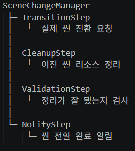

## :fireworks: 회사와 직원들의 구조로 만드는 클래스

- **회사**
  - 싱글턴이고 외부에서 접근이 가능해야 한다. 하지만 싱글턴을 많이 만들고 싶지는 않다.   그러므로 하나의 싱글턴 아래에 여러가지 직원을 둔다.
  - SceneChangeManager는 씬이 전환되는 책임만 다하는 회사다.
- **직원들**
  - 외부에서 접근이 가능하면 안 된다. 이직한다. 그러므로 내부에서 관리해야 한다.
  - Scene을 전환시키기 위해 다양한 직원이 각자의 일을 한다.
  - 항상 느끼는 거지만 class는 작아야 한다. 그러므로 이런 구조를 선호한다.

   

## :fire: 이 구조의 장점은 책임을 쪼개는 것.   그리고 책임의 계층이 있는 것. 
> I typically nest a class if the nested class doesn't serve a purpose outside the context of the outer class.
> It could be a parameter class or something.
> Nesting it helps keeping the namespace cleaner ¯\_(ツ)_/¯
- :airplane:[reddit](https://www.reddit.com/r/csharp/comments/1lgfa6i/purpose_of_nested_classes/)

  

## :fire: 이게 결국 Facade Pattern   과연 인터페이스로 표면에 빼는 게 좋을까?