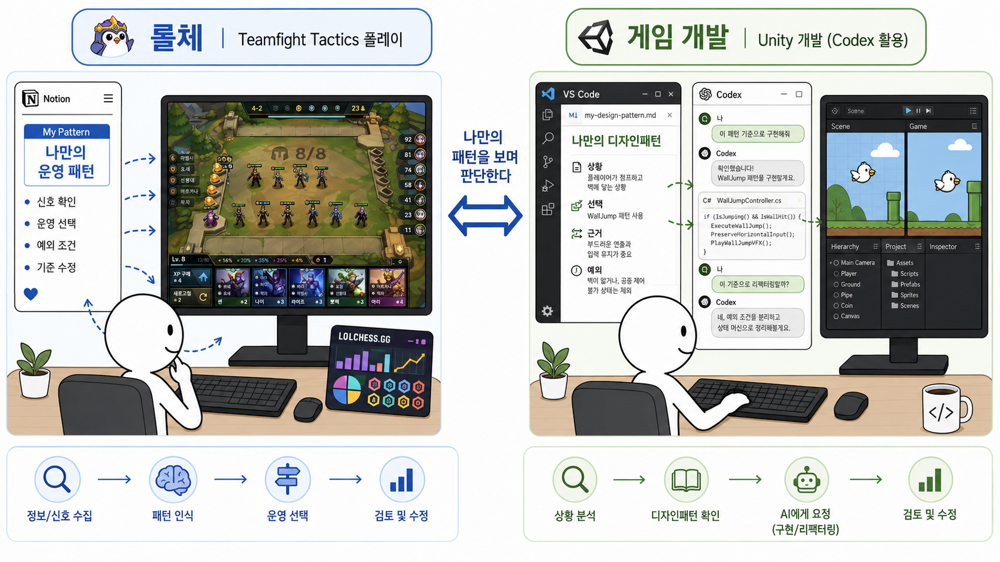

## :fireworks: 롤체를 통해 깨달은 것  :  나만의 디자인패턴을 만들어야 한다.

#### :white_check_mark:왜 롤체를 잘했을까?  :arrow_right:  나만의 패턴을 계속 연구하고 만들었다.
- 그 과정에서 통계, 다른 사람들의 패턴, 내 기록을 연구했고 나만의 법칙을 몇 가지 만들었다.
- 그 법칙을 자주보며 개선하고 수정했다.
- 무엇이 옳은 선택인지 고민하는 상대들과는 다르게 이미 무엇이 그나마 최적에 가까운 지 고민을 했고, 최소한의 판단 근거를 만들었다.

 

#### :white_check_mark:왜 개발을 오래했지만 어느 순간 발전하는 느낌이 적었는가?  :arrow_right:  롤체 같이 판단 근거 문서를 많이 만들지 못했다.
- '이 상황에서 이렇게 한다'를 많이 만들지 못했다. 어떤 판단에 대한 나만의 최소 근거가 없었다.
  - 그나마 MVP, 이전의 Design Pattern 문서들은 그 연구의 과정이다.
- AI 시대에 기초 기술력도 중요하지만, AI와 이야기 해 볼 나의 설계 패턴이 존재해야 한다.   그래야 계속 무엇이 최적인지 판단할 수 있게 된다.

 

#### :white_check_mark:롤체와 개발 설계의 공통점
많은 경험이 자동으로 실력이 되는 것은 아니다. 경험에서 반복되는 상황과 판단 근거를 추출해야 한다.
다른 사람의 정답을 그대로 외우는 것이 아니라, 왜 그 선택을 했는지 분석하고 내 상황에 맞게 다시 정리해야 한다.
패턴은 절대적인 정답이 아니다. 상황에 따라 적용하고, 결과가 좋지 않으면 수정하거나 버릴 수 있어야 한다.

 

#### :white_check_mark:앞으로의 방향
- 개발 중 고민했던 선택을 그냥 넘기지 않고, 상황 → 선택 → 근거 → 예외의 형태로 이 레포에 기록한다.
- 기존 디자인패턴과 AI의 의견을 참고하되, 최종적으로는 내 프로젝트 경험을 통해 검증한다.
- 이렇게 만들어진 판단 기준을 반복해서 확인하고 체화하여, 비슷한 문제를 만났을 때 처음부터 다시 고민하지 않도록 한다.

  

## :fireworks: 과거 회고
- 학교 다닐 때, 직장 다닐 때 디자인패턴 책은 항상 구매했었다. 잘 외운 것 같다.
- 그러나, 쉬운 패턴만 사용했고 강화했다. 새로운 디자인패턴은 읽어도 읽어도 전혀 체득을 하지 못했다.
- 과거에는 디자인 패턴의 개념을 읽고 이걸 예제로 구현해보거나 그냥 읽기만 했었다.

## :fireworks: 현재 디자인패턴을 바라보는 생각
- 최근에 알고리즘 문제풀이를 하다보니 문제를 풀 때 다양한 관점 그리고 최적화를 하게 되었다.
- 유니티 프로젝트를 리팩터링 하던 도중, 클래스의 설계와 구현방식이 확장성을 가지지 못한 다는 것을 알게 되었다.
- 알고리즘 문제풀이처럼 다양한 시도를 해보았다. 의존성도 바꿔보고, 자료구조도 바꿔보고, 상속 구조랑 다형성도 바꿔보았다.
- 그러다 보니 좀 더 좋은 구조는 뭘까? 계속 고민을 하게 되고 정답을 찾지 못하고 계속 빙빙 도는 느낌이 들었다.
- 그래서 무언가 설계와 구조 잡기의 정답을 알고 싶었다. 그리고 가장 최근에 내 설계를 기반으로 어떤 자료와 비교하다 보니 그게 디자인패턴이 었다.
- 혼자서 계속 삽질을 하면서 구조를 잡은 시간 덕분에 그 디자인패턴은 바로 이해가 되었다.
- 왜 개발자들이 이렇게 구현을 했는지도 이해가 갔고, 이 패턴의 장점과 단점도 보였다. 
- 회사에서 시니어분들이 디자인패턴은 이론적으로 공부하는 게 아니라, 구현하다보면 어느덧 사용하고 있는 자신을 바라보는 거라고 했다. 조금은 이해가 된다.
