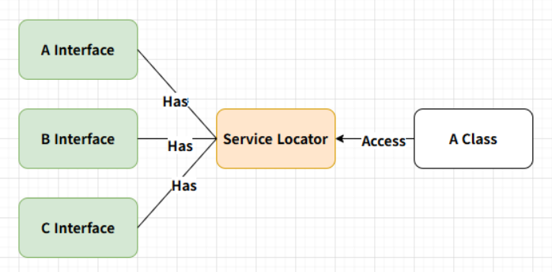

## :fire: Service Locator 구조도

- Service Locator 는 다른 클래스에서 사용될 클래스 객체들을 전역 접근이 가능한 중앙 등록소에 미리 등록하여, 클래스가 해당 객체들을 사용할 때 중앙등록소에서 가져와서 사용하는 방법이다.

  

## :fire: Controller 와 Manager는 서로 의존된다.   하지만 둘 다 서로를 들고 있어 강한 결합을 만들 필요는 없다. 즉, 양방향 의존성을 없애고 싶었다.

#### :one: 사고의 흐름
- InputController가 InputManager보다 나중에 생성되는 게 보장된다.
- InputController는 MonoBehaviour Script이므로 Awake시에 자신의 탄생을 Service Locator에게 알릴 수 있다.
- Service Locator로 GameManager를 다른 객체들도 사용하면 방대해 지겠지만 우선 GameManager의 책임으로 넣었다.
- GameManager의 GetManagerByType에게 InputController가 일대일 대응 할 Manager 타입을 컴파일 타임에 확정할 수 있어서 Generic을 사용했다.
- 그러면 InputController는 GameManager를 통해 알맞은 targetManager를 가져온다. 

  

#### :two: 문제점
- InputManager를 local scope를 통해 생명주기를 짧게 가져가서 약한 의존을 갖는다.
- 양쪽 모두가 서로를 들고 있다면 2 DI지만 이렇게 하면 1.5 DI 정도가 된다. 
  - 개인적으로는 이를 “1.5 DI”에 가깝다고 표현했지만, 정확히는 DI라기보다는 Service Locator를 제한적으로 사용해 지속 참조 방향을 줄인 구조다.
- 지금 중요하게 필요한 동작은 두 객체를 연결하는 것 이다. 
- 이 단순한 기능을 위해 1 DI를 위해 interface, 외부 Service를 구현하는 건 과설계다.
  - 실제로도 설계와 고민만 하다가 구현을 못 하고 있었다. 
  - YAGNI ( You Ain't Gonna Need It )
    - 지금 당장 필요하지 않은 기능은 만들지 말라. 미래에 필요할 것 같다고 미리 구현하지 말고, 정말 필요할 때 구현하라.
    - 언젠가 다시 설계해야 할 날이 올까? 안 올걸?
- 그러나, Manager - controller 구조가 많아진다면 abstract class 또는 interface를 통해 중복을 줄이기 위한 설계가 필요해 보인다. 

  

#### :three: 코드
~~~c#
//1. InputController.cs
private void Awake()
{
    ConnectManagerAndController();
    
    InitializeInputActionDictionary();
    
    _playerInput.onActionTriggered += OnHandleInput;
}

private void ConnectManagerAndController()
{
    //refactor : 이거 자체가 위험한지에 대해 고민해라.
    // 내가 필요한 건 사실 시스템이 아니다.
    // controller가 manager랑 연결하는 게 다야! 
    // 물론 이거 보다 더 좋은 구조가 있겠지만 계속 삽질만 하고 진전이 없다.
    
    var gameManager = GameManager.Instance;
    var targetManager = gameManager.GetManagerByType<InputManager>();
    targetManager.RegisterController(this);
}

//2. GameManager.cs
public TManager GetManagerByType<TManager>() 
where TManager : class, IManager
{
    if (_managerDict.TryGetValue(typeof(TManager), out var manager))
    {
        return manager as TManager;
    }
    throw new KeyNotFoundException($"Manager not found: {typeof(TManager)}");
}

//3. InputManager.cs
public void RegisterController(InputController controller)
{
    _inputController = controller;
}